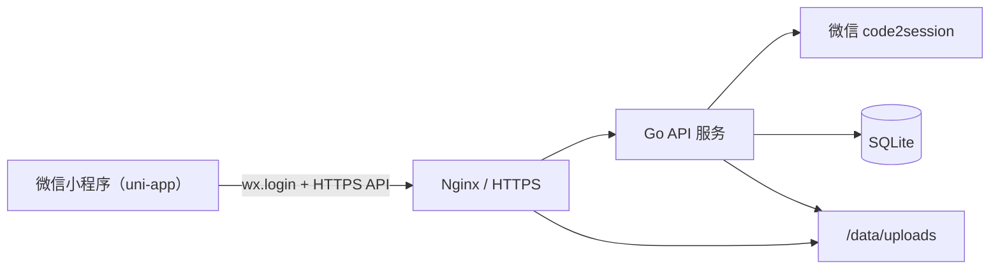

# caipu-miniapp Go Backend Start Doc

这份文档用于指导 `caipu-miniapp` 的 Go 后端项目从 0 到 1 落地。目标不是一次性覆盖所有未来需求，而是提供一套足够稳、足够清晰、能够尽快开工的后端骨架和实现边界。

适用范围：

- 当前前端为 `uni-app` 微信小程序
- 业务目标为“共享空间”模式
- 后端部署在自有云服务器
- 第一版数据库使用 `SQLite`
- 第一版暂不深挖高并发、复杂冲突合并、消息推送

## 1. 目标与原则

### 1.1 本期目标

- 支持微信小程序登录
- 支持用户创建和加入空间
- 支持不同微信号共享同一个空间
- 支持菜谱的增删改查和状态切换
- 支持菜品图片上传
- 支持本地部署、低运维成本、后续可平滑演进

### 1.2 设计原则

- 先把业务闭环跑通，再逐步增强
- 保持目录和模块边界清晰，避免一开始就全塞进 `main.go`
- 业务模型以 `Kitchen` 为中心，而不是以 `User` 为中心
- 前后端接口稳定优先，内部实现可替换
- 允许将来从 `SQLite` 迁移到 `MySQL/PostgreSQL`
- 允许将来把本地文件上传迁移到对象存储

## 2. 推荐技术栈

### 2.1 栈选择

- 语言：`Go 1.24+`
- Router：`github.com/go-chi/chi/v5`
- Middleware：`chi/middleware` + 自定义鉴权中间件
- 配置：环境变量 + `.env`
- 日志：标准库 `log/slog`
- 数据库访问：`database/sql`
- SQLite 驱动：
  - 默认推荐：`modernc.org/sqlite`
  - 备选：`github.com/mattn/go-sqlite3`
- ID 生成：`github.com/oklog/ulid/v2` 或自定义前缀 ID
- Token：`github.com/golang-jwt/jwt/v5`
- 文件上传：标准库 `mime/multipart`
- 时间格式：统一使用 RFC3339

### 2.2 为什么推荐 `chi`

- 轻量，足够适合当前项目
- 中间件组合自然
- 目录和路由组织清晰
- 比起更重的框架，更容易控制代码边界

### 2.3 为什么第一版继续选 `SQLite`

- 单机部署简单
- 不需要单独维护数据库服务
- 对当前共享空间场景完全够用
- 方便备份、迁移和本地开发
- 后续可以通过 repository 层平滑替换底层数据库

## 3. 系统上下文



## 4. 业务边界

### 4.1 核心业务对象

- `User`
  - 一个微信用户对应一条用户记录
- `Kitchen`
  - 一个共享空间
- `KitchenMember`
  - 用户和空间之间的成员关系
- `KitchenInvite`
  - 邀请链接令牌
- `Recipe`
  - 某个空间下的一道菜

### 4.2 当前不做的能力

- 实时协同编辑
- 聊天、评论、通知中心
- 群 ID 自动绑定空间
- 图片审核
- 后台管理系统
- 多环境复杂发布流水线

## 5. 项目骨架

推荐直接在仓库下新建 `backend/` 目录，结构如下：

```text
backend/
├── cmd/
│   └── server/
│       └── main.go
├── configs/
│   ├── example.env
│   └── local.env
├── internal/
│   ├── app/
│   │   ├── app.go
│   │   ├── router.go
│   │   └── server.go
│   ├── auth/
│   │   ├── handler.go
│   │   ├── service.go
│   │   ├── repository.go
│   │   ├── model.go
│   │   └── token.go
│   ├── kitchen/
│   │   ├── handler.go
│   │   ├── service.go
│   │   ├── repository.go
│   │   ├── model.go
│   │   └── dto.go
│   ├── invite/
│   │   ├── handler.go
│   │   ├── service.go
│   │   ├── repository.go
│   │   ├── model.go
│   │   └── token.go
│   ├── recipe/
│   │   ├── handler.go
│   │   ├── service.go
│   │   ├── repository.go
│   │   ├── model.go
│   │   ├── dto.go
│   │   └── validator.go
│   ├── upload/
│   │   ├── handler.go
│   │   ├── service.go
│   │   └── path.go
│   ├── db/
│   │   ├── db.go
│   │   ├── tx.go
│   │   └── pragma.go
│   ├── middleware/
│   │   ├── auth.go
│   │   ├── request_id.go
│   │   ├── logger.go
│   │   └── recover.go
│   ├── wechat/
│   │   ├── client.go
│   │   ├── dto.go
│   │   └── errors.go
│   ├── config/
│   │   └── config.go
│   ├── common/
│   │   ├── response.go
│   │   ├── errors.go
│   │   ├── ids.go
│   │   ├── time.go
│   │   └── json.go
│   └── bootstrap/
│       ├── providers.go
│       └── migrations.go
├── migrations/
│   ├── 001_init.sql
│   ├── 002_seed_dev.sql
│   └── README.md
├── scripts/
│   ├── dev.sh
│   ├── migrate.sh
│   └── backup.sh
├── data/
│   ├── app.db
│   └── uploads/
├── go.mod
├── go.sum
└── README.md
```

## 6. 模块职责

### 6.1 `cmd/server`

- 项目入口
- 读取配置
- 初始化数据库、服务、路由、HTTP Server
- 处理优雅关闭

### 6.2 `internal/app`

- 应用组装层
- 把配置、DB、service、handler 装配起来
- 管理路由挂载和 HTTP server 生命周期

### 6.3 `internal/auth`

- 微信登录
- 用户查找/创建
- 登录 token 签发和解析
- 当前用户上下文恢复

### 6.4 `internal/kitchen`

- 空间创建
- 空间列表查询
- 当前用户与空间关系校验
- 成员概要信息输出

### 6.5 `internal/invite`

- 生成邀请 token
- 邀请预览
- 接受邀请加入空间
- 校验使用次数和过期时间

### 6.6 `internal/recipe`

- 菜谱列表查询
- 菜谱详情查询
- 菜谱创建/更新/删除
- 状态切换
- 权限校验

### 6.7 `internal/upload`

- 图片接收
- 文件类型校验
- 文件路径生成
- URL 返回

### 6.8 `internal/wechat`

- 封装对微信接口的调用
- 当前只需要 `code2session`
- 与业务层解耦，方便测试 mock

### 6.9 `internal/common`

- 通用响应结构
- 通用错误码
- JSON 编解码
- ID 和时间辅助函数

## 7. 请求处理链路

一次典型的业务请求建议按以下顺序流转：

```text
HTTP Request
-> Router
-> Middleware
-> Handler
-> Service
-> Repository
-> SQLite
-> Service
-> Handler
-> JSON Response
```

职责边界建议：

- `Handler`
  - 解析参数
  - 调用 service
  - 返回 HTTP 响应
- `Service`
  - 业务规则
  - 权限判断
  - 事务组织
- `Repository`
  - 只做数据库访问
  - 不承载业务规则

## 8. 配置设计

建议所有配置通过环境变量注入，第一版不引入复杂配置中心。

### 8.1 配置项

```env
APP_NAME=caipu-miniapp-backend
APP_ENV=local
APP_ADDR=:8080

JWT_SECRET=replace-me
JWT_EXPIRE_HOURS=720

WECHAT_APP_ID=wx123456
WECHAT_APP_SECRET=replace-me

SQLITE_PATH=./data/app.db
SQLITE_BUSY_TIMEOUT_MS=5000

UPLOAD_DIR=./data/uploads
UPLOAD_PUBLIC_BASE_URL=https://api.example.com/uploads
UPLOAD_MAX_IMAGE_MB=10

INVITE_DEFAULT_EXPIRE_HOURS=72
INVITE_DEFAULT_MAX_USES=10

LOG_LEVEL=info
```

### 8.2 配置加载建议

- `config.Load()` 统一读取环境变量
- 启动时校验必填项
- 将配置结构体传入各模块

示例结构：

```go
type Config struct {
    AppName             string
    AppEnv              string
    AppAddr             string
    JWTSecret           string
    JWTExpireHours      int
    WechatAppID         string
    WechatAppSecret     string
    SQLitePath          string
    SQLiteBusyTimeoutMS int
    UploadDir           string
    UploadPublicBaseURL string
    UploadMaxImageMB    int64
    InviteExpireHours   int
    InviteMaxUses       int
    LogLevel            string
}
```

## 9. 数据库设计

### 9.1 总体说明

数据库沿用主 README 中的业务模型，但这里补充实现层建议：

- 时间统一存 `TEXT`，格式为 RFC3339
- `recipes.id` 使用字符串主键，便于未来迁移和前端兼容
- 删除采用软删除
- 所有列表查询默认过滤 `deleted_at IS NULL`

### 9.2 表结构

#### `users`

| 字段 | 类型 | 说明 |
| --- | --- | --- |
| `id` | `INTEGER PRIMARY KEY AUTOINCREMENT` | 主键 |
| `openid` | `TEXT NOT NULL UNIQUE` | 微信 openid |
| `nickname` | `TEXT` | 昵称 |
| `avatar_url` | `TEXT` | 头像 |
| `created_at` | `TEXT NOT NULL` | 创建时间 |
| `updated_at` | `TEXT NOT NULL` | 更新时间 |

#### `kitchens`

| 字段 | 类型 | 说明 |
| --- | --- | --- |
| `id` | `INTEGER PRIMARY KEY AUTOINCREMENT` | 主键 |
| `name` | `TEXT NOT NULL` | 空间名称 |
| `owner_user_id` | `INTEGER NOT NULL` | 创建者 |
| `created_at` | `TEXT NOT NULL` | 创建时间 |
| `updated_at` | `TEXT NOT NULL` | 更新时间 |

#### `kitchen_members`

| 字段 | 类型 | 说明 |
| --- | --- | --- |
| `id` | `INTEGER PRIMARY KEY AUTOINCREMENT` | 主键 |
| `kitchen_id` | `INTEGER NOT NULL` | 空间 ID |
| `user_id` | `INTEGER NOT NULL` | 用户 ID |
| `role` | `TEXT NOT NULL` | `owner` / `admin` / `member` |
| `joined_at` | `TEXT NOT NULL` | 加入时间 |

唯一约束：

- `UNIQUE(kitchen_id, user_id)`

#### `kitchen_invites`

| 字段 | 类型 | 说明 |
| --- | --- | --- |
| `id` | `INTEGER PRIMARY KEY AUTOINCREMENT` | 主键 |
| `kitchen_id` | `INTEGER NOT NULL` | 空间 ID |
| `inviter_user_id` | `INTEGER NOT NULL` | 邀请人 |
| `token` | `TEXT NOT NULL UNIQUE` | 邀请 token |
| `status` | `TEXT NOT NULL` | `active` / `used` / `expired` / `revoked` |
| `max_uses` | `INTEGER NOT NULL DEFAULT 1` | 最大使用次数 |
| `used_count` | `INTEGER NOT NULL DEFAULT 0` | 已使用次数 |
| `expires_at` | `TEXT NOT NULL` | 过期时间 |
| `created_at` | `TEXT NOT NULL` | 创建时间 |

#### `recipes`

| 字段 | 类型 | 说明 |
| --- | --- | --- |
| `id` | `TEXT PRIMARY KEY` | 菜谱 ID |
| `kitchen_id` | `INTEGER NOT NULL` | 所属空间 |
| `title` | `TEXT NOT NULL` | 菜名 |
| `ingredient` | `TEXT` | 主要食材 |
| `link` | `TEXT` | 外部链接 |
| `image_url` | `TEXT` | 图片地址 |
| `meal_type` | `TEXT NOT NULL` | `breakfast` / `main` |
| `status` | `TEXT NOT NULL` | `wishlist` / `done` |
| `note` | `TEXT` | 备注 |
| `ingredients_json` | `TEXT NOT NULL` | 食材 JSON |
| `steps_json` | `TEXT NOT NULL` | 步骤 JSON |
| `created_by` | `INTEGER NOT NULL` | 创建人 |
| `updated_by` | `INTEGER NOT NULL` | 更新人 |
| `created_at` | `TEXT NOT NULL` | 创建时间 |
| `updated_at` | `TEXT NOT NULL` | 更新时间 |
| `deleted_at` | `TEXT` | 软删除时间 |

### 9.3 SQLite 启动参数建议

数据库初始化后建议执行：

```sql
PRAGMA journal_mode = WAL;
PRAGMA foreign_keys = ON;
PRAGMA busy_timeout = 5000;
PRAGMA synchronous = NORMAL;
```

说明：

- `WAL`：提升读写并行体验
- `foreign_keys`：避免脏关系数据
- `busy_timeout`：减少短时锁冲突直接报错
- `synchronous=NORMAL`：在可靠性和性能之间平衡

## 10. 迁移策略

建议不要把建表 SQL 硬编码在 Go 代码里，统一放在 `migrations/`。

### 10.1 推荐方式

- `001_init.sql`
  - 创建核心表和索引
- `002_seed_dev.sql`
  - 本地开发可选初始化测试数据
- 后续新增变更用新的迁移文件递增编号

### 10.2 迁移执行方式

第一版可以很简单：

- 启动时检查 `schema_migrations` 表
- 逐个执行未执行的 SQL 文件

后续如果你更偏好成熟方案，也可以切换到：

- `golang-migrate`
- `goose`

## 11. 鉴权设计

### 11.1 登录流程

1. 小程序调用 `wx.login`
2. 前端把 `code` 传给 `POST /api/auth/wechat/login`
3. 后端调用微信 `code2session`
4. 拿到 `openid`
5. 查找或创建用户
6. 若该用户还没有空间，则创建一个默认空间并写入 `kitchen_members`
7. 签发应用侧 token
8. 返回 token、用户信息、空间列表、当前空间 ID

### 11.2 Token 方案

第一版建议直接用 JWT：

- 优点：
  - 实现快
  - 无状态
  - 适合当前体量
- Claims 建议：
  - `sub`: 用户 ID
  - `exp`: 过期时间
  - `iat`: 签发时间

### 11.3 鉴权中间件

中间件职责：

- 读取 `Authorization: Bearer <token>`
- 校验 token
- 解析出用户 ID
- 将当前用户信息注入 `context.Context`

建议提供辅助函数：

```go
func CurrentUserID(ctx context.Context) int64
```

## 12. 权限设计

### 12.1 角色

- `owner`
  - 创建空间者
  - 默认拥有全部权限
- `admin`
  - 预留
  - 第一版可与 `member` 权限一致
- `member`
  - 可查看、创建、编辑、删除菜谱

### 12.2 第一版权限约束

- 登录用户只能访问自己加入的空间
- 只有空间成员可以查询该空间下的菜谱
- 只有空间成员可以创建邀请
- 只有加入该空间的成员才能修改和删除该空间的菜谱

### 12.3 权限实现方式

不要把权限逻辑散在每个 handler 里，建议统一封装在 service：

- `EnsureKitchenMember(userID, kitchenID)`
- `EnsureRecipeAccessible(userID, recipeID)`

## 13. API 设计

统一约定：

- Base Path：`/api`
- Content-Type：`application/json`
- 成功返回：

```json
{
  "code": 0,
  "message": "ok",
  "data": {}
}
```

- 失败返回：

```json
{
  "code": 40001,
  "message": "invalid token",
  "data": null
}
```

### 13.1 错误码建议

| code | 含义 |
| --- | --- |
| `0` | 成功 |
| `40000` | 请求参数错误 |
| `40001` | 未登录或 token 无效 |
| `40003` | 无权限 |
| `40400` | 资源不存在 |
| `40900` | 资源冲突 |
| `42200` | 业务校验失败 |
| `50000` | 服务器内部错误 |

### 13.2 登录

#### `POST /api/auth/wechat/login`

请求：

```json
{
  "code": "wx-login-code"
}
```

响应：

```json
{
  "code": 0,
  "message": "ok",
  "data": {
    "token": "jwt-token",
    "user": {
      "id": 1,
      "openid": "o_xxx"
    },
    "currentKitchenId": 1,
    "kitchens": [
      {
        "id": 1,
        "name": "海哥的空间",
        "role": "owner"
      }
    ]
  }
}
```

### 13.3 空间

#### `GET /api/kitchens`

返回当前用户加入的空间列表。

#### `POST /api/kitchens`

请求：

```json
{
  "name": "周末空间"
}
```

#### `GET /api/kitchens/{id}`

返回空间详情和成员摘要。

### 13.4 邀请

#### `POST /api/kitchens/{id}/invites`

请求：

```json
{
  "maxUses": 10,
  "expireHours": 72
}
```

响应：

```json
{
  "code": 0,
  "message": "ok",
  "data": {
    "token": "invite_xxx",
    "expiresAt": "2026-03-15T10:00:00+08:00",
    "sharePath": "/pages/invite/index?token=invite_xxx"
  }
}
```

#### `GET /api/invites/{token}`

返回邀请预览：

- 空间名
- 邀请人
- 是否过期
- 是否还能使用

#### `POST /api/invites/{token}/accept`

当前登录用户接受邀请并加入空间。

### 13.5 菜谱

#### `GET /api/kitchens/{id}/recipes`

查询参数：

- `mealType`
- `status`
- `keyword`

返回该空间下的菜谱列表。

#### `POST /api/kitchens/{id}/recipes`

请求：

```json
{
  "title": "番茄滑蛋牛肉",
  "ingredient": "牛肉",
  "link": "https://www.xiachufang.com/recipe/107000001/",
  "imageUrl": "https://api.example.com/uploads/2026/03/a.jpg",
  "mealType": "main",
  "status": "wishlist",
  "note": "周末试试",
  "parsedContent": {
    "ingredients": ["牛肉 200g", "番茄 2个"],
    "steps": ["牛肉切片", "番茄下锅"]
  }
}
```

#### `GET /api/recipes/{id}`

返回单条菜谱详情。

#### `PUT /api/recipes/{id}`

更新完整菜谱。

#### `PATCH /api/recipes/{id}/status`

请求：

```json
{
  "status": "done"
}
```

#### `DELETE /api/recipes/{id}`

执行软删除。

### 13.6 上传

#### `POST /api/uploads/images`

- 请求：`multipart/form-data`
- 字段：`file`
- 返回：图片 URL

## 14. DTO 与领域模型建议

建议分开：

- DB Model
- API DTO
- Service Input

原因：

- 避免数据库结构直接泄漏给前端
- 避免 handler 直接操作数据库模型
- 便于未来扩字段和做兼容

示例：

```go
type Recipe struct {
    ID              string
    KitchenID       int64
    Title           string
    Ingredient      string
    Link            string
    ImageURL        string
    MealType        string
    Status          string
    Note            string
    IngredientsJSON string
    StepsJSON       string
    CreatedBy       int64
    UpdatedBy       int64
    CreatedAt       time.Time
    UpdatedAt       time.Time
    DeletedAt       sql.NullString
}

type RecipeResponse struct {
    ID          string              `json:"id"`
    KitchenID   int64               `json:"kitchenId"`
    Title       string              `json:"title"`
    Ingredient  string              `json:"ingredient"`
    Link        string              `json:"link"`
    ImageURL    string              `json:"imageUrl"`
    MealType    string              `json:"mealType"`
    Status      string              `json:"status"`
    Note        string              `json:"note"`
    ParsedContent ParsedContentDTO  `json:"parsedContent"`
    CreatedBy   int64               `json:"createdBy"`
    UpdatedBy   int64               `json:"updatedBy"`
    CreatedAt   string              `json:"createdAt"`
    UpdatedAt   string              `json:"updatedAt"`
}
```

## 15. 路由组织建议

```text
/healthz
/api/auth/wechat/login
/api/kitchens
/api/kitchens/{id}
/api/kitchens/{id}/invites
/api/kitchens/{id}/recipes
/api/invites/{token}
/api/invites/{token}/accept
/api/recipes/{id}
/api/recipes/{id}/status
/api/uploads/images
```

建议路由分组：

- 公共路由：
  - `/healthz`
  - `/api/auth/wechat/login`
- 需要鉴权的路由：
  - 其余全部

## 16. Handler 约定

建议每个 handler 只做四件事：

1. 解析 path/query/body
2. 调用 service
3. 映射成 response DTO
4. 输出统一格式 JSON

不建议在 handler 中：

- 写 SQL
- 做成员校验
- 做事务
- 操作文件系统核心逻辑

## 17. Service 约定

Service 负责核心业务逻辑，例如：

- 登录时自动创建默认空间
- 创建空间时自动创建成员关系
- 接受邀请时校验是否过期、是否已加入、是否超过次数
- 创建菜谱时校验空间权限和字段合法性
- 删除菜谱时执行软删除

如果某个操作跨多张表，优先在 service 中开启事务。

## 18. Repository 约定

Repository 建议每个领域各自维护，不做“大一统通用仓库”。

方法命名示例：

- `FindUserByOpenID`
- `CreateUser`
- `ListKitchensByUserID`
- `CreateKitchenWithOwnerTx`
- `FindInviteByToken`
- `IncrementInviteUsageTx`
- `ListRecipesByKitchenID`
- `CreateRecipe`
- `SoftDeleteRecipe`

## 19. 上传设计

### 19.1 第一版实现

- 文件保存到 `UPLOAD_DIR`
- 目录按年月分层，例如 `2026/03/`
- 文件名使用随机 ID
- 数据库存储公开访问 URL，不存本地绝对路径

### 19.2 上传限制

- 只允许图片类型
- 校验 MIME 和后缀
- 限制单张图片大小
- 生成缩略图不是第一版必须项

### 19.3 URL 设计

例如：

```text
本地保存路径: /data/uploads/2026/03/img_01HXYZ.jpg
公开访问 URL: https://api.example.com/uploads/2026/03/img_01HXYZ.jpg
```

## 20. 日志与观测

### 20.1 日志建议

统一使用 `slog`，每条日志尽量带：

- `request_id`
- `path`
- `method`
- `user_id`
- `kitchen_id`
- `latency_ms`
- `error`

### 20.2 健康检查

建议提供：

#### `GET /healthz`

返回：

```json
{
  "code": 0,
  "message": "ok",
  "data": {
    "status": "ok"
  }
}
```

### 20.3 后续可加

- 简单 metrics
- 慢查询日志
- 上传失败统计

## 21. 错误处理约定

建议区分三层错误：

- 参数错误
- 业务错误
- 系统错误

定义统一错误类型，例如：

```go
type AppError struct {
    Code       int
    Message    string
    HTTPStatus int
}
```

常见业务错误：

- `ErrInvalidToken`
- `ErrKitchenNotFound`
- `ErrKitchenAccessDenied`
- `ErrInviteExpired`
- `ErrInviteAlreadyUsedUp`
- `ErrRecipeNotFound`
- `ErrInvalidMealType`
- `ErrInvalidRecipeStatus`

## 22. 本地开发流程

### 22.1 初始化步骤

1. 创建 `backend/`
2. `go mod init`
3. 新建 `configs/local.env`
4. 初始化 `migrations/001_init.sql`
5. 创建 `cmd/server/main.go`
6. 实现 `healthz`
7. 接上数据库初始化
8. 接上微信登录接口
9. 再逐步实现空间、邀请、菜谱、上传

### 22.2 推荐启动顺序

```text
healthz
-> login
-> kitchen list/create
-> invite preview/accept
-> recipe CRUD
-> upload
```

## 23. 测试策略

第一版不需要铺满复杂测试体系，但至少建议有三层：

### 23.1 单元测试

- token 解析
- invite 过期判断
- recipe 参数校验
- JSON 编解码

### 23.2 repository 测试

- 使用临时 SQLite 数据库文件
- 校验建表、插入、查询、软删除

### 23.3 handler / integration 测试

- 使用 `httptest`
- 跑登录、建空间、加邀请、建菜谱等主流程

## 24. 安全与合规

### 24.1 基础安全项

- 所有线上请求必须 HTTPS
- JWT secret 不写死在仓库
- 上传文件大小和类型限制
- SQL 一律参数化
- 不信任前端传入的 `userId`、`kitchenId` 所属关系

### 24.2 微信小程序联动

上线前需要在小程序后台配置：

- `request` 域名
- `uploadFile` 域名
- `downloadFile` 域名

如果使用图片上传，隐私说明里也要真实声明用途。

## 25. 部署建议

### 25.1 目录建议

```text
/srv/caipu-miniapp/
├── backend/
├── shared/
│   ├── data/
│   │   └── app.db
│   └── uploads/
└── logs/
```

### 25.2 Nginx 建议

- `/api/` 反代到 Go 服务
- `/uploads/` 静态暴露上传目录
- 开启 HTTPS

### 25.3 systemd 建议

- Go 服务由 `systemd` 托管
- 配置自动重启
- 日志可先接到 journald

### 25.4 备份建议

- 每天备份一次 SQLite 数据库文件
- 每天备份上传目录
- 备份文件保留最近 7 到 14 天

## 26. 里程碑拆分

### M1：基础运行

- `healthz`
- 配置加载
- SQLite 初始化
- 路由和中间件

### M2：身份与空间

- 微信登录
- 自动创建默认空间
- 空间列表和详情

### M3：共享与邀请

- 生成邀请
- 邀请预览
- 接受邀请

### M4：菜谱主流程

- 菜谱列表
- 菜谱详情
- 新增/编辑/删除
- 状态切换

### M5：图片上传与联调

- 图片上传
- 小程序联调
- 真机验证

## 27. 后续演进路线

当这一版稳定后，可以按下面顺序继续演进：

1. 菜谱增量同步
2. 成员管理
3. 最近编辑记录
4. 版本号和冲突提示
5. 对象存储
6. 数据库迁移到 MySQL/PostgreSQL
7. 管理后台

## 28. 第一批建议创建的文件

如果马上开工，建议先创建这些文件：

```text
backend/
├── cmd/server/main.go
├── internal/config/config.go
├── internal/app/router.go
├── internal/db/db.go
├── internal/common/response.go
├── internal/common/errors.go
├── internal/middleware/auth.go
├── internal/auth/handler.go
├── internal/auth/service.go
├── internal/wechat/client.go
├── migrations/001_init.sql
└── configs/example.env
```

## 29. 实现建议总结

这套后端起步方案的重点不是“把 Go 工程做得多炫”，而是先把这些事做稳：

- 用户能登录
- 能看到自己的空间
- 能通过邀请加入别人的空间
- 能一起维护共享菜谱
- 数据能长期保存
- 后端结构不会在第二周就乱掉

如果后面要正式开工，最自然的下一步是：

1. 先按本文件创建 `backend/` 目录骨架
2. 落 `001_init.sql`
3. 实现 `healthz + login`
4. 再往空间、邀请、菜谱逐步推进
