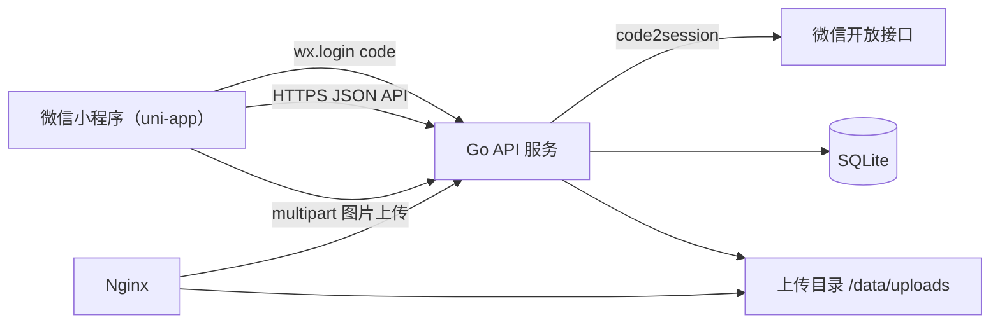

# caipu-miniapp

一个基于 `uni-app` 的微信小程序项目，面向“记录想吃和吃过的菜”的轻量型美食清单场景。

当前仓库同时包含：

- 微信小程序前端：`uni-app + Vue 3 + uview-plus`
- Go 后端：`backend/`
- PC 管理后台：`admin-web/`

## 当前状态

- 技术栈：`uni-app` + `Vue 3`
- UI：`uview-plus`
- 目标平台：微信小程序
- 当前 `AppID`：`wxafe7c4144c9c063e`
- 当前首页：`pages/index/index.vue`
- 当前详情页：`pages/recipe-detail/index.vue`
- 当前菜单详情页：`pages/meal-plan-detail/index.vue`
- 当前阶段：前后端联调阶段，已接入后端登录、菜谱同步、图片上传和邀请加入链路，并新增 AI 可观测性 / 动态配置 / 服务健康后台

## 已实现功能

- 首页按 `早餐 / 正餐` 两类进行一级分类展示
- 每类下支持 `全部 / 想吃 / 吃过` 二级状态筛选
- 列表支持搜索菜名、食材、备注和链接
- 每个菜品右侧提供轻量 switch 式状态切换控件，可在 `想吃 / 吃过` 间快速切换
- 首页新增入口已改为半屏以上抽屉式表单，支持录入：
  - 菜名
  - 链接
  - 成品图
  - 分类（早餐 / 正餐）
  - 状态（想吃 / 吃过）
  - 备注
- 新增时会根据当前一级分类和二级筛选自动带入默认值
- 菜名为空时保存按钮禁用
- 菜品详情页支持查看：
  - 成品图
  - 来源链接
  - 文字版做法（食材清单 / 制作步骤）
  - 备注
- 菜品详情页支持生成和查看“一图看懂”步骤图；后端支持按空闲策略自动补齐未生成步骤图（需开启后端配置）
- 菜品详情页支持编辑和删除：
  - 编辑菜名、主要食材、链接、成品图、分类、状态
  - 编辑食材清单、制作步骤和备注
  - 删除前二次确认
- 菜品数据已接入后端接口，并按 `kitchenId` 维度缓存到本地存储
- 已安排菜单支持独立详情页查看，并可从详情页继续修改、删除或回到点菜模式继续安排
- “我们的空间”页按 `早餐 / 正餐` 分组查看 `想吃 / 吃过` 统计和列表
- 首页支持查看当前空间，并在多个空间之间切换
- “空间”页支持查看当前空间成员列表
- “空间”页支持生成邀请并分享给微信好友
- 邀请分享给微信好友时，会展示专用邀请卡封面，不再默认截取当前页面
- 新增邀请页，支持预览邀请并加入共享空间

## 本地运行

### 方式一：使用 HBuilderX

1. 用 HBuilderX 打开项目目录
2. 运行到 `微信小程序`
3. 首次运行时，确保微信开发者工具已登录，并在 `设置 -> 安全设置` 中开启 `CLI/HTTP 调用功能`

### 方式二：使用微信开发者工具

1. 先通过 HBuilderX 编译，或使用项目生成后的微信小程序目录
2. 打开目录：`unpackage/dist/dev/mp-weixin`
3. 在微信开发者工具中导入并运行

### 命令行自动预览

- 项目已提供微信小程序自动预览脚本，可在 macOS 上串起
  `HBuilderX 编译 -> 微信开发者工具自动预览`
- 常用命令：
  - `npm run wx:auto-preview`
  - `npm run wx:auto-preview:skip-compile`
- 独立说明文档见 `docs/wechat-auto-preview.md`

### Admin Web

- 本地启动：
  - `npm run admin:dev`
- 生产构建：
  - `npm run admin:build`
- 本机构建并上传到服务器：
  - 脚本会优先从你本机 `~/.ssh/config` 自动识别
    `one-hub-server / oh-prod / my-cloud`，可直接执行：
    `DOMAIN=你的域名 bash scripts/upload-admin-web-dist.sh`
  - 或：`DOMAIN=你的域名 npm run admin:upload`
  - 如果后续你想切换到别的服务器，也可以显式覆盖：
    `SERVER_HOST=其他主机别名 DOMAIN=你的域名 bash scripts/upload-admin-web-dist.sh`
- 后台默认通过同域 `https://你的域名/admin/` 访问
- 后台 API 前缀通过 `VITE_API_BASE` 适配：
  - 本地开发默认走 `/api`
  - 当前生产构建默认走 `/caipu-api`，兼容现网 nginx 前缀，不影响根路径上的其他站点服务
- 后台依赖独立环境变量账号：
  - `ADMIN_USERNAME`
  - `ADMIN_PASSWORD_HASH`
  - `ADMIN_JWT_SECRET`（可选，不填时回退 `JWT_SECRET`）
- 当前后台页面：
  - `概览`
  - `AI Provider`
  - `服务健康`
  - `AI 任务`
  - `API 调用`
  - `配置中心`（含 `AI Provider 告警` 分组，可配置连续异常阈值、QQ SMTP 和收件邮箱）
- 线上小规格服务器若需要先判断本次拉码是否会触发真正发布，优先使用：
  - 如果你当前人在 **Mac 本地**，想通过 `ssh` 发起远端后端重部署，使用：
    `cd backend && SERVER_HOST=<ssh主机别名或user@host> ./scripts/deploy-server-build.sh`
  - 先做预检查、不真正构建和重启：
    `cd backend && SERVER_HOST=<ssh主机别名或user@host> PLAN_ONLY=1 ./scripts/deploy-server-build.sh`
  - 上面这个 `backend/scripts/deploy-server-build.sh` 会自动连到远端服务器，
    默认进入 `/srv/caipu-miniapp`，再在服务器上执行后端发布脚本
  - `SERVER_HOST` 可以写成 `root@117.72.159.252`，也可以写成你
    `~/.ssh/config` 里的主机别名；`my-cloud` 只是当前仓库里常用的示例别名
  - 如果你已经 **登录到服务器** 并位于仓库根目录，再使用下面这几个脚本：
  - `bash scripts/deploy-backend-on-server.sh`
  - `bash scripts/deploy-admin-web-on-server.sh`
  - `bash scripts/deploy-linkparse-sidecar-on-server.sh`
  - 三个脚本都支持 `PLAN_ONLY=1` 预检查模式，例如：
    `PLAN_ONLY=1 bash scripts/deploy-backend-on-server.sh`
  - 当前 `scripts/deploy-on-server.sh` 保留为聚合入口，只有在你明确需要
    同时处理 `backend + admin-web` 时再用
  - 对当前这台 `2 vCPU / 1.9 GiB RAM / 0 swap` 的线上机：
    - 默认允许 `backend` 单独构建
    - 默认拒绝 `admin-web` 构建
    - `linkparse-sidecar` 只有在 `npm install` 必须执行时才会被拦下
  - 真正需要在维护窗口硬跑前端或 sidecar 的依赖安装时，显式带：
    `ALLOW_LOW_RESOURCE_BUILD=1`
  - 对 `admin-web`，更推荐在你的 Mac 或 CI 上先构建 `dist`，再用
    `scripts/upload-admin-web-dist.sh` 上传到服务器，避免线上机参与前端编译

## 项目结构

```text
.
├── App.vue
├── README.md
├── admin-web/
├── main.js
├── manifest.json
├── package.json
├── pages.json
├── pages/
│   ├── index/
│   │   └── index.vue
│   ├── invite/
│   │   └── index.vue
│   ├── meal-plan-detail/
│   │   └── index.vue
│   └── recipe-detail/
│       └── index.vue
├── static/
├── utils/
│   ├── app-config.js
│   ├── auth.js
│   ├── http.js
│   ├── kitchen-api.js
│   ├── recipe-api.js
│   ├── recipe-store.js
│   ├── session-storage.js
│   └── upload-api.js
└── uni.scss
```

## 配置说明

- 微信小程序配置位于 `manifest.json` 的 `mp-weixin` 节点
- 路由和 `easycom` 配置位于 `pages.json`
- `uview-plus` 通过 npm 接入，主题和基础样式已完成全局接线
- 前端接口和登录配置位于 `utils/app-config.js`
- `utils/app-config.js` 里的 `inviteShareEnabled` 可控制“邀请成员”里是否展示“发送给微信好友”按钮
- `utils/auth.js` 负责登录态恢复、空间上下文和 token 持久化
- `utils/recipe-store.js` 负责菜品数据归一化、本地缓存和远端同步
- `admin-web/` 是独立的 Vue 3 + Vite 后台工程，默认构建到 `/admin/`
- `admin-web/.env.development` 与 `admin-web/.env.production` 分别约定后台 API 前缀
- `unpackage/` 是构建产物目录，默认不纳入 Git 管理

正式微信登录切换说明：

- 把 `utils/app-config.js` 里的 `apiBaseURL` 改成已配置到小程序后台的 `HTTPS` 域名
- 把 `utils/app-config.js` 里的 `authModeSetting` 改成 `wechat`，或保留 `auto` 并使用非 localhost 域名
- 后端 `WECHAT_APP_ID` 必须和 `manifest.json` 里的 `mp-weixin.appid` 一致
- 后端补齐 `WECHAT_APP_SECRET`
- 更完整的项目专用清单见 `docs/wechat-login-checklist.md`
- 菜名和步骤生成 `nano-banana-pro` 手绘流程图的调用说明见 `docs/nano-banana-recipe-flowchart.md`
- AI 多 Provider 配置与轮询 / 降级设计见 `docs/ai-multi-provider-routing-design.md`
- 后台 `配置中心 -> AI Provider 告警` 支持对多 Provider 路由配置连续异常邮件告警，
  默认阈值为 `3` 次，支持 QQ 邮箱 SMTP、授权码和收件邮箱
- 饮食管家默认直连 LongCat OpenAI-compatible `/chat/completions`，已接入
  function calling：当前支持查看当前空间菜谱数量、按菜名模糊查询菜谱，以及根据
  B 站 / 小红书链接解析并保存菜谱食材；工具执行阶段会通过 SSE 返回实时状态，
  最终回复继续通过 SSE 流式返回小程序
- 饮食管家聊天记录已按“当前用户 + 当前空间”保存到后端，重新打开弹层会同步最近历史，
  “清空会话记录”会同时清空当前空间下该用户的后端聊天记录
- 当前线上云服务器的实际服务、端口、路径路由和发布口径见 `docs/cloud-server-config-overview.md`

## 交互说明

- `早餐 / 正餐`：
  一级分类切换，决定当前展示哪一类菜品
- `想吃 / 吃过`：
  二级状态筛选，同时每条列表右侧可直接切换状态
- `随机`：
  从当前可选列表中随机抽取一道菜
- `添加`：
  通过底部中间按钮打开抽屉式表单新增菜品
- `详情`：
  点击菜谱卡进入菜品详情页；点击首页菜单安排卡进入菜单详情页
- `编辑 / 删除`：
  在菜品详情页或菜单详情页底部固定操作栏中进行

## 当前限制

- 当前默认使用 `utils/app-config.js` 里的本地后端地址和 `dev-login`
- 成员自退出已接入；管理员移除成员、角色调整、邀请撤销、邀请记录列表还未接到前端 UI
- B 站链接已经接入异步解析和 AI/规则总结，小红书图文链接已接入异步队列和 sidecar 预留链路
- 暂未提供菜品排序、自定义标签或批量管理能力

## 后续方向

- 接入 AI 或规则解析能力，自动生成食材和步骤摘要
- 支持详情页内更细粒度的补充能力，例如逐条编辑食材和步骤
- 增加菜品排序、自定义标签、收藏或归档能力
- 完善共享空间的成员管理、邀请撤销和邀请记录能力

## 共享空间版技术方案（V1）

本节用于指导当前项目从“本地单机存储”演进为“多微信账号共享一个空间”的第一版方案。

### 方案目标

- 支持同一微信号在多台设备查看同一份菜谱数据
- 支持不同微信号通过邀请加入同一个空间并共同维护
- 保留现有 `uni-app` 页面结构和交互，优先改造数据层
- 第一版先不处理复杂并发冲突，优先保证流程跑通
- 后端部署在自有云服务器上，数据库使用 `SQLite`

### 技术选型

- 前端：`uni-app` + `Vue 3` + `uview-plus`
- 登录：微信小程序 `wx.login`
- 后端：`Go` + HTTP 框架（推荐 `chi` 或 `gin`）
- 数据库：`SQLite`
- 图片存储：服务器本地磁盘目录 + `Nginx` 提供 HTTPS 访问
- 鉴权：服务端签发 `JWT` 或自定义 `Bearer Token`

### 总体架构



### 核心业务模型

第一版以“空间（Kitchen）”为共享容器，菜谱不再属于某个单独用户，而是属于一个空间。

- `User`：微信用户
- `Kitchen`：共享空间，一个空间下有多道菜
- `KitchenMember`：空间成员关系，表示谁加入了哪个空间
- `KitchenInvite`：空间邀请，用于通过分享链接加入
- `Recipe`：菜谱数据，归属某个空间

### 前后端交互设计

#### 1. 启动与登录流程

1. 小程序启动后，先从本地缓存读取最近一次的空间和菜谱列表，用于秒开页面
2. 如果本地没有登录态，调用 `wx.login`
3. 前端把 `code` 发送到 `POST /api/auth/wechat/login`
4. 后端调用微信 `code2session`，换取 `openid`
5. 后端根据 `openid` 查找或创建用户，并返回应用自己的登录 `token`
6. 前端保存 `token`、当前空间 `currentKitchenId`、空间列表摘要
7. 前端调用 `GET /api/kitchens/:id/recipes` 拉取最新数据，刷新本地缓存

#### 2. 菜谱读写流程

- 读取：
  前端先展示本地缓存，再用服务端结果覆盖本地
- 新增：
  前端先上传图片，再提交菜谱创建请求，成功后更新列表缓存
- 编辑：
  前端提交完整菜谱数据到服务端，成功后更新详情和列表缓存
- 删除：
  前端请求服务端删除，成功后移除本地缓存中的该条数据

#### 3. 邀请加入空间流程

1. 空间成员点击“邀请成员”
2. 前端请求 `POST /api/kitchens/:id/invites`
3. 服务端生成 `inviteToken`，返回可分享路径
4. 小程序把邀请页路径分享给其他微信用户
5. 被邀请人打开分享卡片后进入邀请页
6. 邀请页先调用 `GET /api/invites/:token` 显示空间名称和邀请人信息
7. 用户确认后调用 `POST /api/invites/:token/accept`
8. 服务端把该用户写入 `kitchen_members`
9. 前端切换当前空间并拉取共享菜谱

#### 4. 图片上传流程

1. 用户在新增或编辑页选择图片
2. 前端调用 `POST /api/uploads/images`
3. 服务端保存图片文件，返回 `imageUrl`
4. 前端在创建或编辑菜谱时提交该 `imageUrl`

### 前端改造建议

现有项目已经把大部分数据逻辑收口在 `utils/recipe-store.js`，适合从这里开始拆分为“本地缓存层 + 远端服务层”。

建议新增以下模块：

- `utils/http.js`：统一封装 `uni.request`
- `utils/auth.js`：处理 `wx.login`、token 保存和登录态恢复
- `utils/kitchen-api.js`：空间和邀请相关接口
- `utils/recipe-api.js`：菜谱增删改查接口
- `utils/upload-api.js`：图片上传接口
- `utils/recipe-cache.js`：按 `kitchenId` 维度缓存空间菜谱列表
- `pages/invite/index.vue`：处理邀请预览和加入逻辑

建议的前端数据分层：

- 页面层：负责展示和表单交互
- 远端 API 层：负责向服务端发请求
- 本地缓存层：负责离线缓存和首屏回显
- 会话层：负责当前登录用户、token、当前空间

### 后端模块设计

建议的后端目录结构如下：

```text
backend/
├── cmd/server/main.go
├── internal/app
├── internal/auth
├── internal/db
├── internal/kitchen
├── internal/invite
├── internal/recipe
├── internal/upload
└── migrations
```

各模块职责：

- `auth`：处理微信登录、用户识别、token 签发
- `kitchen`：处理空间创建、列表查询、成员管理
- `invite`：处理邀请生成、预览、接受加入
- `recipe`：处理菜谱增删改查
- `upload`：处理图片上传和文件路径生成
- `db`：数据库连接、建表、事务封装、通用查询

### SQLite 表设计

第一版建议使用以下 5 张核心业务表。

#### `users`

| 字段 | 类型 | 说明 |
| --- | --- | --- |
| `id` | `INTEGER PRIMARY KEY AUTOINCREMENT` | 用户主键 |
| `openid` | `TEXT NOT NULL UNIQUE` | 微信用户唯一标识 |
| `nickname` | `TEXT` | 用户昵称，第一版可为空 |
| `avatar_url` | `TEXT` | 头像地址，第一版可为空 |
| `created_at` | `TEXT NOT NULL` | 创建时间 |
| `updated_at` | `TEXT NOT NULL` | 更新时间 |

#### `kitchens`

| 字段 | 类型 | 说明 |
| --- | --- | --- |
| `id` | `INTEGER PRIMARY KEY AUTOINCREMENT` | 空间主键 |
| `name` | `TEXT NOT NULL` | 空间名称 |
| `owner_user_id` | `INTEGER NOT NULL` | 创建人 |
| `created_at` | `TEXT NOT NULL` | 创建时间 |
| `updated_at` | `TEXT NOT NULL` | 更新时间 |

#### `kitchen_members`

| 字段 | 类型 | 说明 |
| --- | --- | --- |
| `id` | `INTEGER PRIMARY KEY AUTOINCREMENT` | 关系主键 |
| `kitchen_id` | `INTEGER NOT NULL` | 所属空间 |
| `user_id` | `INTEGER NOT NULL` | 所属用户 |
| `role` | `TEXT NOT NULL` | `owner` / `admin` / `member` |
| `joined_at` | `TEXT NOT NULL` | 加入时间 |

约束建议：

- `UNIQUE(kitchen_id, user_id)`

#### `kitchen_invites`

| 字段 | 类型 | 说明 |
| --- | --- | --- |
| `id` | `INTEGER PRIMARY KEY AUTOINCREMENT` | 邀请主键 |
| `kitchen_id` | `INTEGER NOT NULL` | 被邀请加入的空间 |
| `inviter_user_id` | `INTEGER NOT NULL` | 邀请人 |
| `token` | `TEXT NOT NULL UNIQUE` | 邀请令牌 |
| `status` | `TEXT NOT NULL` | `active` / `used` / `expired` / `revoked` |
| `max_uses` | `INTEGER NOT NULL DEFAULT 1` | 最大使用次数 |
| `used_count` | `INTEGER NOT NULL DEFAULT 0` | 已使用次数 |
| `expires_at` | `TEXT NOT NULL` | 过期时间 |
| `created_at` | `TEXT NOT NULL` | 创建时间 |

#### `recipes`

| 字段 | 类型 | 说明 |
| --- | --- | --- |
| `id` | `TEXT PRIMARY KEY` | 菜谱 ID，建议服务端生成字符串 ID |
| `kitchen_id` | `INTEGER NOT NULL` | 所属空间 |
| `title` | `TEXT NOT NULL` | 菜名 |
| `ingredient` | `TEXT` | 主要食材 |
| `link` | `TEXT` | 外部链接 |
| `image_url` | `TEXT` | 成品图地址 |
| `meal_type` | `TEXT NOT NULL` | `breakfast` / `main` |
| `status` | `TEXT NOT NULL` | `wishlist` / `done` |
| `note` | `TEXT` | 备注 |
| `ingredients_json` | `TEXT NOT NULL` | 食材清单 JSON 数组 |
| `steps_json` | `TEXT NOT NULL` | 步骤清单 JSON 数组 |
| `created_by` | `INTEGER NOT NULL` | 创建人 |
| `updated_by` | `INTEGER NOT NULL` | 最后更新人 |
| `created_at` | `TEXT NOT NULL` | 创建时间 |
| `updated_at` | `TEXT NOT NULL` | 更新时间 |
| `deleted_at` | `TEXT` | 软删除时间，未删除时为空 |

#### 建表示例 SQL

```sql
PRAGMA journal_mode = WAL;

CREATE TABLE IF NOT EXISTS users (
  id INTEGER PRIMARY KEY AUTOINCREMENT,
  openid TEXT NOT NULL UNIQUE,
  nickname TEXT,
  avatar_url TEXT,
  created_at TEXT NOT NULL,
  updated_at TEXT NOT NULL
);

CREATE TABLE IF NOT EXISTS kitchens (
  id INTEGER PRIMARY KEY AUTOINCREMENT,
  name TEXT NOT NULL,
  owner_user_id INTEGER NOT NULL,
  created_at TEXT NOT NULL,
  updated_at TEXT NOT NULL
);

CREATE TABLE IF NOT EXISTS kitchen_members (
  id INTEGER PRIMARY KEY AUTOINCREMENT,
  kitchen_id INTEGER NOT NULL,
  user_id INTEGER NOT NULL,
  role TEXT NOT NULL,
  joined_at TEXT NOT NULL,
  UNIQUE(kitchen_id, user_id)
);

CREATE TABLE IF NOT EXISTS kitchen_invites (
  id INTEGER PRIMARY KEY AUTOINCREMENT,
  kitchen_id INTEGER NOT NULL,
  inviter_user_id INTEGER NOT NULL,
  token TEXT NOT NULL UNIQUE,
  status TEXT NOT NULL,
  max_uses INTEGER NOT NULL DEFAULT 1,
  used_count INTEGER NOT NULL DEFAULT 0,
  expires_at TEXT NOT NULL,
  created_at TEXT NOT NULL
);

CREATE TABLE IF NOT EXISTS recipes (
  id TEXT PRIMARY KEY,
  kitchen_id INTEGER NOT NULL,
  title TEXT NOT NULL,
  ingredient TEXT,
  link TEXT,
  image_url TEXT,
  meal_type TEXT NOT NULL,
  status TEXT NOT NULL,
  note TEXT,
  ingredients_json TEXT NOT NULL,
  steps_json TEXT NOT NULL,
  created_by INTEGER NOT NULL,
  updated_by INTEGER NOT NULL,
  created_at TEXT NOT NULL,
  updated_at TEXT NOT NULL,
  deleted_at TEXT
);

CREATE INDEX IF NOT EXISTS idx_kitchen_members_kitchen_id ON kitchen_members(kitchen_id);
CREATE INDEX IF NOT EXISTS idx_kitchen_invites_kitchen_id ON kitchen_invites(kitchen_id);
CREATE INDEX IF NOT EXISTS idx_recipes_kitchen_id ON recipes(kitchen_id);
CREATE INDEX IF NOT EXISTS idx_recipes_updated_at ON recipes(updated_at);
```

### API 设计

除登录接口外，其余接口都要求请求头携带：

```text
Authorization: Bearer <token>
```

统一返回结构建议：

```json
{
  "code": 0,
  "message": "ok",
  "data": {}
}
```

#### 1. 登录

##### `POST /api/auth/wechat/login`

用途：
通过微信 `code` 换取应用登录态。

请求体：

```json
{
  "code": "wx-login-code"
}
```

响应体：

```json
{
  "code": 0,
  "message": "ok",
  "data": {
    "token": "jwt-or-token",
    "user": {
      "id": 1,
      "openid": "o_xxx"
    },
    "currentKitchenId": 1,
    "kitchens": [
      {
        "id": 1,
        "name": "海哥的空间",
        "role": "owner"
      }
    ]
  }
}
```

#### 2. 空间

##### `GET /api/kitchens`

用途：
获取当前用户加入的空间列表。

##### `POST /api/kitchens`

用途：
创建一个新空间，并自动把当前用户加入为 `owner`。

请求体：

```json
{
  "name": "我们的空间"
}
```

##### `GET /api/kitchens/:id`

用途：
获取空间详情和成员概要信息。

##### `DELETE /api/kitchens/:id/members/me`

用途：
退出当前空间。创建者暂不允许直接退出；非创建者退出后，会同步撤销该用户在此空间创建的仍有效邀请码。

#### 3. 邀请

##### `POST /api/kitchens/:id/invites`

用途：
为某个空间生成邀请链接。

请求体：

```json
{
  "maxUses": 10,
  "expireHours": 72
}
```

响应体：

```json
{
  "code": 0,
  "message": "ok",
  "data": {
    "token": "invite_token_xxx",
    "expiresAt": "2026-03-15T10:00:00+08:00",
    "sharePath": "/pages/invite/index?token=invite_token_xxx"
  }
}
```

##### `GET /api/invites/:token`

用途：
邀请页预览，展示空间名、邀请人、是否过期。

##### `POST /api/invites/:token/accept`

用途：
接受邀请并加入空间。

响应体：

```json
{
  "code": 0,
  "message": "ok",
  "data": {
    "kitchen": {
      "id": 1,
      "name": "我们的空间",
      "role": "member"
    }
  }
}
```

#### 4. 菜谱

##### `GET /api/kitchens/:id/recipes`

用途：
获取指定空间下的菜谱列表。

查询参数建议：

- `mealType`
- `status`
- `keyword`

响应中的单条菜谱建议结构：

```json
{
  "id": "rec_01",
  "kitchenId": 1,
  "title": "番茄滑蛋牛肉",
  "ingredient": "牛肉",
  "link": "https://www.xiachufang.com/recipe/107000001/",
  "imageUrl": "https://api.example.com/uploads/recipe-1.jpg",
  "mealType": "main",
  "status": "done",
  "note": "下饭",
  "parsedContent": {
    "ingredients": ["牛里脊 200g", "番茄 2个"],
    "steps": ["牛肉切片", "番茄炒软"]
  },
  "createdBy": 1,
  "updatedBy": 1,
  "createdAt": "2026-03-12T10:00:00+08:00",
  "updatedAt": "2026-03-12T10:30:00+08:00"
}
```

##### `POST /api/kitchens/:id/recipes`

用途：
创建菜谱。

请求体：

```json
{
  "title": "番茄滑蛋牛肉",
  "ingredient": "牛肉",
  "link": "https://www.xiachufang.com/recipe/107000001/",
  "imageUrl": "https://api.example.com/uploads/recipe-1.jpg",
  "mealType": "main",
  "status": "wishlist",
  "note": "周末想试试",
  "parsedContent": {
    "ingredients": ["牛肉 200g", "番茄 2个"],
    "steps": ["牛肉切片", "下锅翻炒"]
  }
}
```

##### `GET /api/recipes/:id`

用途：
获取单条菜谱详情。

##### `PUT /api/recipes/:id`

用途：
更新完整菜谱信息。

##### `PATCH /api/recipes/:id/status`

用途：
只更新菜谱状态，适合首页快速切换“想吃 / 吃过”。
状态切换不会改写 `recipe.updated_at`，避免首页列表按更新时间排序时被轻操作打乱。

请求体：

```json
{
  "status": "done"
}
```

##### `DELETE /api/recipes/:id`

用途：
删除菜谱，服务端建议做软删除。

#### 5. 图片上传

##### `POST /api/uploads/images`

用途：
上传菜品成品图。

请求方式：

- `multipart/form-data`
- 文件字段名建议为 `file`

响应体：

```json
{
  "code": 0,
  "message": "ok",
  "data": {
    "url": "https://api.example.com/uploads/2026/03/recipe-abc.jpg"
  }
}
```

### 接口与页面的映射关系

- 首页列表加载：`GET /api/kitchens/:id/recipes`
- 首页状态切换：`PATCH /api/recipes/:id/status`
- 新增菜品：`POST /api/uploads/images` + `POST /api/kitchens/:id/recipes`
- 详情页加载：`GET /api/recipes/:id`
- 详情页编辑：`PUT /api/recipes/:id`
- 详情页删除：`DELETE /api/recipes/:id`
- 邀请页预览：`GET /api/invites/:token`
- 接受邀请：`POST /api/invites/:token/accept`

### 部署建议

- 域名建议：
  - API：`https://api.example.com`
  - 图片：第一版可复用 API 域名下的 `/uploads/`
- 小程序后台需配置：
  - `request` 合法域名
  - `uploadFile` 合法域名
  - `downloadFile` 合法域名
- 服务器建议：
  - `Nginx` 反向代理
  - `systemd` 托管 Go 服务
  - 定时备份 `SQLite` 数据库文件和上传目录

### 第一阶段开发顺序

1. 搭好 Go 服务、数据库初始化和登录接口
2. 完成空间、成员、邀请的后端接口
3. 完成菜谱 CRUD 和图片上传
4. 把前端 `recipe-store` 改造成本地缓存 + 远端 API
5. 新增邀请页和空间切换能力
6. 用两个微信号完成共享空间联调

### 后续演进方向

- 增加成员管理能力，例如管理员移除成员、角色调整
- 增加编辑记录和“最近更新人”展示
- 增加增量同步参数，例如 `updatedAfter`
- 图片从本机磁盘迁移到对象存储
- 数据库从 `SQLite` 平滑迁移到 `MySQL`
