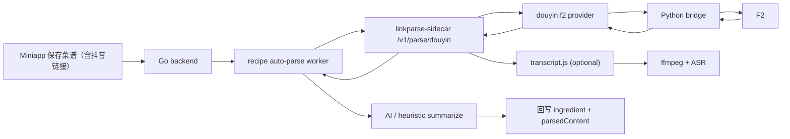

# 抖音 Provider POC 设计方案

这份文档面向当前 `caipu-miniapp` 的通用 `linkparse-sidecar`，
目标是在不推翻现有 B 站 / 小红书链路的前提下，补一版可落地的
`Douyin provider` POC。

核心判断先写在前面：

- 抖音“链接解析 / 视频直链 / 原声直链 / 文案提取”已经有可利用的开源能力
- 抖音“直接输出稳定文字稿”没有看到足够省事、足够稳定的主流开源方案
- 对当前仓库来说，最小成本路线不是替换总线，而是：
  `新增 douyin provider -> 复用现有 ffmpeg + ASR -> 继续走后端菜谱整理链路`

## 目标

第一期只解决当前最有价值的能力：

1. 识别抖音分享文案和常见抖音链接
2. 提取结构化内容：
   - `awemeId`
   - 标题候选 / 描述文案
   - 作者信息
   - 封面
   - 视频直链
   - 原声直链
3. 在请求 `includeTranscript=true` 时，复用现有 `transcript.js`
   完成：
   - 下载视频
   - `ffmpeg` 抽音频
   - 调 ASR 转写
4. 把结果继续喂给现有 Go 后端的 AI / 规则整理逻辑，最终回写菜谱

## 非目标

这版 POC 明确不做：

- 直播、图集合集、评论、作者主页全量抓取
- 小程序前端直接连抖音解析服务
- OCR、镜头分段、画面理解
- 无 Cookie 场景下追求“所有抖音链接都稳定成功”
- 把 sidecar 重构成新的 Python 主服务

## 当前仓库为什么适合这样接

当前仓库已经具备三块关键基础设施：

1. `linkparse-sidecar` 已经是“按平台分 provider 路由”的形态
2. `backend/internal/linkparse` 已经按 `/v1/parse/{platform}` 协议吃 sidecar
3. `sidecars/linkparse-sidecar/lib/transcript.js` 已经跑通：
   - 下载视频
   - `ffmpeg` 抽 `mp3`
   - 远端 ASR 转写

也就是说，抖音接入的关键工作不是“重做解析框架”，而是“补齐一个新的
platform/provider + 少量通用字段扩展”。

## 开源方案调研结论

### 候选 1：`F2`

仓库：

- <https://github.com/Johnserf-Seed/f2>
- 文档：<https://f2.wiki/en/guide/apps/douyin/overview.html>

判断：

- 更像“抖音专用工具箱”，不是单纯下载器
- 能力边界更贴近本项目需要的结构化提取
- 对 `video / music / desc / aweme detail` 这类字段更友好
- 需要运行时提供 `Cookie`

适合度：

- 作为抖音 provider 的第一实现，优先级最高

### 候选 2：`yt-dlp`

仓库：

- <https://github.com/yt-dlp/yt-dlp>

判断：

- 非常适合“下载视频 / 下载音频 / 做后处理”
- 更像通用下载器，而不是当前仓库需要的结构化 provider
- 对 Douyin 的长期稳定性和 Cookie 依赖有不确定性

适合度：

- 更适合作为补充兜底，不适合作为 POC 主路径

### 候选 3：`you-get`

仓库：

- <https://github.com/soimort/you-get>

判断：

- 更轻，但更偏下载
- 对“结构化文案 + 元数据 + 稳定服务化返回”帮助有限

适合度：

- 只适合作为调试工具，不建议作为主 provider

### 文字稿能力结论

“直接提字幕/文字稿”不建议指望某个 Douyin 开源下载器一次解决。

更现实的路线仍然是：

1. provider 先拿到 `videoUrl` 或 `musicUrl`
2. sidecar 复用现有 `ffmpeg + ASR`
3. 后端再做菜谱抽取与规整

如果后续要优化中文口播质量，可再单独评估：

- `faster-whisper`
- `FunASR`

但这属于 ASR 层增强，不属于 Douyin provider 本身。

## 推荐方案

推荐采用：

- `Douyin provider = F2`
- `文字版 = 复用 transcript.js`
- `后端结果整理 = 继续复用现有 ParseRecipeLink 流程`

### 为什么不直接上 `yt-dlp`

因为当前需求不是“把抖音视频下载下来”这么简单，而是要同时兼顾：

- 分享文案归一化
- 结构化字段提取
- 原声 / 视频直链
- 后端后续 AI/规则总结

`yt-dlp` 在下载层很强，但在“结构化平台 provider”这件事上并不是最顺手的工具。

### 为什么不单独再起一个 Python 服务

当前仓库已经有 Node sidecar 与 Go 主服务的稳定边界。

第一期更推荐：

- 保持 Node sidecar 不变
- 在 Node provider 内部调用轻量 Python bridge
- 让 Python bridge 只负责把 `F2` 输出转换成 sidecar 统一 JSON

这样部署成本和现有目录结构最接近。

## POC 范围

### P0 必做

- 支持识别常见抖音链接：
  - `v.douyin.com/*`
  - `www.douyin.com/video/*`
  - `www.iesdouyin.com/share/video/*`
- 支持从分享文案中提取第一条 URL
- sidecar 新增：
  - `POST /v1/parse/douyin`
- provider 返回：
  - `shareUrl`
  - `canonicalUrl`
  - `id`（这里复用为 `awemeId`）
  - `title`
  - `description`
  - `body`
  - `tags`
  - `videos`
  - `audioUrls`
  - `coverUrl`
  - `author`
  - `contentType`
- `includeTranscript=true` 时复用现有转写链路
- backend 新增 Douyin 平台识别、预览、异步解析入口

### P1 可选

- provider 增加 `yt-dlp` 兜底
- 对多图文内容做图片列表抽取
- 允许“原声优先转写，失败后回退视频抽音频”
- 在后台设置页增加 Douyin Cookie 维护入口

## 整体架构



## Sidecar 设计

### 新增接口

`POST /v1/parse/douyin`

请求体延续现有 sidecar 约定：

```json
{
  "input": "3.84 u@x.xxx 复制打开抖音，看看【xxx】 https://v.douyin.com/xxxx/",
  "provider": "auto",
  "includeDebug": false,
  "includeTranscript": true
}
```

第一期推荐支持的 provider 名：

- `auto`
- `f2`

其中：

- `auto`：当前先等价于 `f2`
- `f2`：强制走 F2 provider

### 返回结构

当前 sidecar 已有通用响应外壳，第一期尽量少改。

建议：

- `normalized.id` 复用为 `awemeId`
- 扩展 `content.audioUrls`

返回示例：

```json
{
  "ok": true,
  "platform": "douyin",
  "providerRequested": "auto",
  "providerUsed": "f2",
  "normalized": {
    "shareUrl": "https://v.douyin.com/xxxx/",
    "canonicalUrl": "https://www.douyin.com/video/7480000000000000000",
    "id": "7480000000000000000"
  },
  "content": {
    "title": "番茄牛腩",
    "description": "番茄牛腩这样做真的很稳",
    "body": "番茄牛腩这样做真的很稳\n牛腩 500g\n番茄 3个\n#家常菜",
    "transcript": "牛腩先冷水下锅焯水...",
    "transcriptStatus": "success",
    "transcriptError": "",
    "tags": ["家常菜"],
    "images": [],
    "videos": ["https://play.douyin.com/aweme/v1/play/..."],
    "audioUrls": ["https://music.douyin.com/obj/..."],
    "coverUrl": "https://p3-sign.douyinpic.com/...",
    "author": {
      "name": "作者昵称",
      "avatarUrl": "https://p3.douyinpic.com/..."
    },
    "contentType": "video",
    "likes": 1024,
    "comments": 88,
    "favorites": 320
  },
  "warnings": []
}
```

### 字段映射建议

| Sidecar 字段 | Douyin/F2 来源 | 说明 |
| --- | --- | --- |
| `normalized.shareUrl` | 原始分享链接 | 保留原始入口 |
| `normalized.canonicalUrl` | 视频详情页标准链接 | 给后端回写 |
| `normalized.id` | `awemeId` | 复用现有通用字段 |
| `content.title` | `desc` 清洗后的标题候选 | 用于预览标题 |
| `content.description` | 原始 `desc` | 尽量保留原文 |
| `content.body` | `desc + hashtag + 可见文案` | 给后端做总结 |
| `content.videos` | 视频播放链接数组 | 转写默认取第一个 |
| `content.audioUrls` | 原声 / music 链接数组 | 给下载原声或后续优化预留 |
| `content.coverUrl` | 视频封面 | 用于预览 |
| `content.author.*` | 作者信息 | 用于补充上下文 |
| `content.contentType` | `video / image / unknown` | 第一版以 `video` 为主 |

## Provider 实现建议

### Node provider 层

新增文件建议：

- `sidecars/linkparse-sidecar/providers/douyin.js`
- `sidecars/linkparse-sidecar/providers/douyin_f2_runner.py`

Node provider 负责：

- URL 归一化
- Provider 路由
- 调 Python bridge
- 把结果转成 sidecar 统一协议
- 在 `includeTranscript=true` 时调用现有 `enrichTranscriptIfNeeded`

### Python bridge 层

Python bridge 负责：

- 调 F2
- 拿到 `aweme detail`
- 标准化输出最小 JSON
- 屏蔽 F2 自身的字段噪音和版本波动

推荐输出最小 JSON：

```json
{
  "ok": true,
  "awemeId": "7480000000000000000",
  "shareUrl": "https://v.douyin.com/xxxx/",
  "canonicalUrl": "https://www.douyin.com/video/7480000000000000000",
  "desc": "番茄牛腩这样做真的很稳",
  "hashtags": ["家常菜"],
  "videoUrls": ["https://play.douyin.com/..."],
  "musicUrls": ["https://music.douyin.com/..."],
  "coverUrl": "https://p3-sign.douyinpic.com/...",
  "author": {
    "name": "作者昵称",
    "avatarUrl": "https://p3.douyinpic.com/..."
  },
  "stats": {
    "likes": 1024,
    "comments": 88,
    "favorites": 320
  },
  "contentType": "video",
  "warnings": []
}
```

### 为什么建议加一层 bridge

直接在 Node 里硬调 Python CLI 的原始输出，后续会有三个问题：

1. CLI 参数容易漂移
2. 输出结构不稳定时，Node 侧要写很多防御逻辑
3. 后面若想把 `f2` 换成别的 Douyin SDK，Node 层会被污染

加一层很薄的 Python bridge，可以把这些波动锁在 provider 内部。

## 转写链路设计

### 当前复用策略

当前 `transcript.js` 已经按“下载视频 -> `ffmpeg` -> ASR”的形态工作，
因此 Douyin POC 第一版不需要新写一条转写链路。

推荐策略：

1. 若 `content.audioUrls[0]` 存在，后续可考虑优先下载原声
2. POC 第一版先继续沿用 `videos[0]` 作为转写输入
3. 后续如果发现原声链路更稳定，再做“原声优先、视频兜底”

### 配置命名建议

当前 sidecar 转写配置使用的是 `XHS_TRANSCRIPT_*`，这对通用 sidecar 来说已经
不够自然。

推荐在做 Douyin POC 时顺手把这部分抽成平台无关配置：

```env
LINKPARSE_TRANSCRIPT_ENABLED=true
LINKPARSE_TRANSCRIPT_PROVIDER=siliconflow
LINKPARSE_TRANSCRIPT_API_KEY=
LINKPARSE_TRANSCRIPT_MODEL=TeleAI/TeleSpeechASR
LINKPARSE_TRANSCRIPT_ENDPOINT=https://api.siliconflow.cn/v1/audio/transcriptions
LINKPARSE_TRANSCRIPT_TIMEOUT_MS=120000
LINKPARSE_TRANSCRIPT_MAX_VIDEO_MB=80
LINKPARSE_TRANSCRIPT_KEEP_TEMP=false
FFMPEG_PATH=ffmpeg
```

兼容策略建议：

- 新代码优先读 `LINKPARSE_TRANSCRIPT_*`
- 如果新变量缺失，再回退读旧的 `XHS_TRANSCRIPT_*`

这样不会把现有小红书配置直接打断。

## Backend 设计

### 平台识别

`backend/internal/linkparse/platform.go` 需要新增：

- `SupportsDouyinURL`
- `isResolvableDouyinHost`
- `DetectParsePlatform` 的 `douyin` 分支

建议支持的 host：

- `v.douyin.com`
- `douyin.com`
- `www.douyin.com`
- `iesdouyin.com`
- `www.iesdouyin.com`

### 预览链路

`backend/internal/linkparse/service.go` 的 `PreviewLink` 建议新增：

- `PreviewDouyin`

目标与现有 B 站 / 小红书一致：

- 能在前端新增菜谱时先展示标题、封面、平台、providerUsed

### 解析链路

`backend/internal/linkparse` 需要新增：

- `douyin.go`

结构建议尽量贴近现有 `xiaohongshu.go`：

- `fetchDouyin`
- `PreviewDouyin`
- `ParseDouyin`
- `parseDouyin`
- `summarizeDouyinHeuristically`

这样后续维护成本最低。

### 手动调试入口

建议新增：

- `POST /api/link-parsers/douyin`

原因：

- 当前仓库已经为 B 站 / 小红书保留了平台级手动调试入口
- Douyin provider 第一版失败概率高于成熟平台，单独接口有利于联调

## 配置建议

第一期推荐新增：

```env
DY_PROVIDER_DEFAULT=auto
DY_PROVIDER_F2_ENABLED=true
DY_F2_PYTHON_BIN=python3
DY_F2_SCRIPT_PATH=
DY_F2_COOKIE_FILE=
DY_F2_COOKIE_HEADER=
DY_F2_TIMEOUT_MS=20000
DY_F2_KEEP_TEMP=false
```

说明：

- `DY_PROVIDER_DEFAULT`：当前支持 `auto | f2`
- `DY_F2_PYTHON_BIN`：Python 可执行文件
- `DY_F2_SCRIPT_PATH`：可选，自定义 runner 路径
- `DY_F2_COOKIE_FILE`：抖音 Cookie 文件
- `DY_F2_COOKIE_HEADER`：整段 Cookie 字符串
- `DY_F2_TIMEOUT_MS`：单次 F2 provider 超时
- `DY_F2_KEEP_TEMP`：调试期可保留中间文件

## 错误模型建议

Provider 失败时，尽量沿用现有 sidecar 错误风格。

建议重点区分：

- `invalid_url`
- `provider_unavailable`
- `login_required`
- `provider_timeout`
- `parse_failed`
- `transcript_failed`

降级规则建议：

1. 结构化字段拿到了，但视频/原声缺失：
   - `ok=true`
   - `quality=degraded`
2. 文案拿到了，但转写失败：
   - `ok=true`
   - `transcriptStatus=failed`
   - `warnings` 补明确信息
3. 连 `aweme detail` 都没拿到：
   - `ok=false`

## 代码改动建议

### sidecar

- `sidecars/linkparse-sidecar/server.js`
  - 新增 Douyin 配置读取
  - 新增 `providers.douyin`
  - 新增 `/v1/parse/douyin`
- `sidecars/linkparse-sidecar/providers/douyin.js`
- `sidecars/linkparse-sidecar/providers/douyin_f2_runner.py`
- `sidecars/linkparse-sidecar/lib/transcript.js`
  - 可选：把临时目录前缀从 `xhs-transcript-` 抽成更通用名字
- `sidecars/linkparse-sidecar/README.md`
  - 补 Douyin 运行说明

### backend

- `backend/internal/linkparse/platform.go`
- `backend/internal/linkparse/service.go`
- `backend/internal/linkparse/model.go`
  - 扩展 `audioUrls`
- `backend/internal/linkparse/handler.go`
  - 新增 `ParseDouyin`
- `backend/internal/app/router.go`
  - 注册 `POST /api/link-parsers/douyin`
- `backend/internal/recipe/auto_parse_worker.go`
  - 自动解析支持 `douyin`
- `backend/README.md`
  - 补充平台与配置说明

## 建议的迭代顺序

### 第 1 步：只打通预览

目标：

- `POST /api/link-parsers/preview`
- `POST /v1/parse/douyin`

先确认：

- URL 识别正常
- 标题 / 封面 / author / `providerUsed` 正常

### 第 2 步：打通异步解析

目标：

- `ParseRecipeLink` 能识别 `douyin`
- worker 可自动回写草稿

先不强依赖转写成功，允许先按文案总结。

### 第 3 步：打通转写

目标：

- `includeTranscript=true` 生效
- 失败时不影响主流程

### 第 4 步：补原声优化

目标：

- 如果 provider 能稳定返回原声链接，则优先原声转写

## 验证清单

### 单元测试

- 平台识别：
  - 短链
  - 详情页链接
  - 分享文案带 URL
- provider 输出归一化：
  - `shareUrl`
  - `canonicalUrl`
  - `awemeId`
  - `body`
  - `videos`
  - `audioUrls`
- 转写：
  - `disabled`
  - `skipped`
  - `failed`
  - `success`

### 联调验证

至少覆盖：

1. 标准视频详情页
2. 短链分享文案
3. Cookie 缺失
4. 转写超时
5. 视频直链可用但原声缺失

### 验收标准

- 前端可预览抖音链接标题与封面
- 保存带抖音链接的菜谱后能进入异步解析队列
- 纯文案场景可生成降级草稿
- 转写失败不会导致整条解析链路失败
- provider 错误信息足够区分“链接问题 / 登录态问题 / 转写问题”

## 风险与取舍

### 1. Cookie 依赖

这是抖音解析的核心现实问题。

本方案默认接受这个事实，不在 POC 第一版追求“免登录稳定解析”。

### 2. F2 运行时是 Python

这会引入一层 Python 依赖，但相比再起一套独立服务，成本仍然更低。

### 3. 原声链接未必始终可用

所以第一版不把“原声下载成功”作为主链路前提，仍然允许回退到
`视频 -> ffmpeg -> ASR`。

### 4. 文案对菜谱总结价值有限

很多抖音菜谱关键细节只在口播里，因此真正决定体验上限的还是 ASR 效果，
不是 provider 本身。

## 最终建议

对于当前仓库，最值得落地的方案是：

1. 先做 `douyin:f2` 单 provider POC
2. 先打通“文案 + 视频直链 + 转写兜底”
3. 保持 sidecar / backend 总线不变
4. 等真实样本跑通后，再决定要不要引入 `yt-dlp` 作为补充 provider

如果只允许做一版最小实现，这版 POC 已经足够支撑：

- 抖音链接预览
- 抖音链接异步解析
- 抖音口播转文字
- 后续菜谱整理回写
