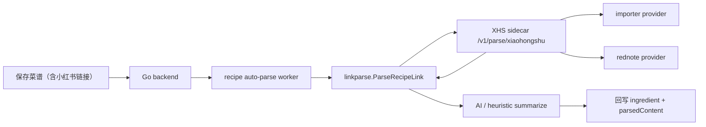

# 小红书图文解析接入说明

这份文档用于说明当前仓库里“小红书图文链接解析”相关改动、运行方式和验证步骤。

当前时间点的目标不是直接做成完全稳定的生产解析服务，而是先把下面这条链路跑通：

1. 用户保存带小红书链接的菜谱
2. 后端自动把菜谱加入异步解析队列
3. worker 根据链接平台路由到小红书 sidecar
4. sidecar 用 `importer` 或 `rednote` provider 提取结构化文本
5. Go 后端再用 AI 或规则总结出 `ingredient / ingredients[] / steps[]`
6. 结果自动回写菜谱

## 本次改动总结

### 1. 后端支持“小红书平台识别 + 异步解析”

新增或调整的核心位置：

- [platform.go](/Users/alexh/github_proj/caipu-miniapp/backend/internal/linkparse/platform.go)
- [xiaohongshu.go](/Users/alexh/github_proj/caipu-miniapp/backend/internal/linkparse/xiaohongshu.go)
- [service.go](/Users/alexh/github_proj/caipu-miniapp/backend/internal/linkparse/service.go)
- [auto_parse_worker.go](/Users/alexh/github_proj/caipu-miniapp/backend/internal/recipe/auto_parse_worker.go)
- [service.go](/Users/alexh/github_proj/caipu-miniapp/backend/internal/recipe/service.go)
- [repository.go](/Users/alexh/github_proj/caipu-miniapp/backend/internal/recipe/repository.go)

已经具备的能力：

- 可识别 `xiaohongshu.com`、`xhslink.com` 等链接
- 保存菜谱时，小红书链接会和 B 站一样进入自动解析队列
- worker 会按平台分发，不再只会解析 B 站
- 新增调试接口 `POST /api/link-parsers/xiaohongshu`
- 解析来源会写成 `xiaohongshu`、`xiaohongshu:ai`、`xiaohongshu:heuristic`

### 2. 增加统一的小红书 sidecar 协议

sidecar 目录：

- [xhs-sidecar](/Users/alexh/github_proj/caipu-miniapp/sidecars/xhs-sidecar)

当前已经定义并实现的接口：

- `GET /v1/health`
- `GET /v1/providers`
- `GET /v1/auth/rednote/status`
- `POST /v1/parse/xiaohongshu`

设计目标是：Go 主服务不直接依赖某一个开源项目，而是只依赖统一协议。后面可以替换 provider，但主服务协议不变。

### 3. 同时预留两种 provider

当前 sidecar 支持：

- `importer`
- `rednote`
- `auto`

含义：

- `importer`：轻量匿名抓取，优先参考 `xiaohongshu-importer` 思路
- `rednote`：浏览器登录态抓取，优先参考 `RedNote-MCP` 思路
- `auto`：先跑 `importer`，失败后再回退到 `rednote`

### 4. 详情页已兼容小红书解析状态

前端详情页已经能显示小红书解析来源文案，位置在：

- [index.vue](/Users/alexh/github_proj/caipu-miniapp/pages/recipe-detail/index.vue)

## 当前架构



## 配置说明

后端新增配置见：

- [example.env](/Users/alexh/github_proj/caipu-miniapp/backend/configs/example.env)
- [config.go](/Users/alexh/github_proj/caipu-miniapp/backend/internal/config/config.go)

当前相关环境变量：

```env
XHS_SIDECAR_ENABLED=true
XHS_SIDECAR_BASE_URL=http://127.0.0.1:8091
XHS_SIDECAR_TIMEOUT_SECONDS=25
XHS_SIDECAR_PROVIDER=auto
XHS_SIDECAR_API_KEY=
```

说明：

- `XHS_SIDECAR_ENABLED=false` 时，小红书链接不会真正去调 sidecar
- `XHS_SIDECAR_PROVIDER` 支持 `auto | importer | rednote`
- 如果 sidecar 配置了 `XHS_INTERNAL_API_KEY`，后端要同步填 `XHS_SIDECAR_API_KEY`

## Sidecar 使用说明

### 1. 安装依赖

```bash
cd /Users/alexh/github_proj/caipu-miniapp/sidecars/xhs-sidecar
npm install
```

### 2. 启动 sidecar

```bash
cd /Users/alexh/github_proj/caipu-miniapp/sidecars/xhs-sidecar
npm start
```

默认监听：

- `http://127.0.0.1:8091`

### 3. 推荐环境变量

```env
PORT=8091
XHS_PROVIDER_DEFAULT=auto
XHS_PROVIDER_IMPORTER_ENABLED=true
XHS_PROVIDER_REDNOTE_ENABLED=true
XHS_SIDECAR_STUB_MODE=echo
XHS_INTERNAL_API_KEY=
XHS_REDNOTE_COOKIE_PATH=
XHS_BROWSER_HEADLESS=true
XHS_REDNOTE_BROWSER_PATH=
XHS_REDNOTE_LOGIN_URL=https://www.xiaohongshu.com/
XHS_REDNOTE_TIMEOUT_MS=15000
```

## 两条 provider 的现实表现

### `importer`

优点：

- 依赖轻
- 启动快
- 不需要浏览器

当前能力：

- 归一化分享链接和分享文本
- 跟随跳转
- 尝试读取页面中的 `window.__INITIAL_STATE__`
- 提取 `title / content / tags / images / videos`

现实限制：

- 很容易命中小红书守卫页或 404 保护页
- 纯链接输入时命中率不高
- 当前更适合做 `auto` 模式的第一跳

### `rednote`

优点：

- 成功率更有上限
- 更接近真实浏览器行为
- 更适合处理登录态内容

当前能力：

- 读取 Cookie 文件
- 动态加载 `playwright`
- 打开真实页面并抓取 DOM
- 提取 `title / content / tags / images / videos / author / counters`

现实限制：

- 需要 Cookie
- 需要 `playwright` 包
- 需要 Chromium 浏览器二进制

## RedNote 初始化步骤

### 1. 安装浏览器

```bash
cd /Users/alexh/github_proj/caipu-miniapp/sidecars/xhs-sidecar
npx playwright install chromium
```

### 2. 初始化登录态

```bash
cd /Users/alexh/github_proj/caipu-miniapp/sidecars/xhs-sidecar
npm run rednote:init
```

这会：

- 打开一个可交互浏览器
- 让你手动完成小红书登录
- 把 Cookie 保存到默认路径 `~/.mcp/rednote/cookies.json`

### 3. 查看当前状态

```bash
cd /Users/alexh/github_proj/caipu-miniapp/sidecars/xhs-sidecar
npm run rednote:status
```

状态里重点看这几个字段：

- `playwrightAvailable`
- `browserInstalled`
- `loggedIn`
- `ready`
- `lastError`

只有当下面 3 件事都满足时，`ready` 才会是 `true`：

- Playwright 包已安装
- Chromium 浏览器已安装
- Cookie 文件已准备好

## 调试与验证

### 1. 检查 sidecar 健康状态

```bash
curl -s http://127.0.0.1:8091/v1/health
curl -s http://127.0.0.1:8091/v1/providers
curl -s http://127.0.0.1:8091/v1/auth/rednote/status
```

### 2. 直接测试小红书解析

```bash
curl -s -X POST http://127.0.0.1:8091/v1/parse/xiaohongshu \
  -H 'Content-Type: application/json' \
  -d '{
    "input": "【番茄牛腩】今天炖了一锅超下饭的番茄牛腩，牛腩500克。 https://www.xiaohongshu.com/explore/68b6e4f3000000001f03379f",
    "provider": "auto",
    "includeDebug": true
  }'
```

### 3. 验证后端是否真正接入

先确认后端已配置：

```env
XHS_SIDECAR_ENABLED=true
XHS_SIDECAR_BASE_URL=http://127.0.0.1:8091
XHS_SIDECAR_PROVIDER=auto
```

然后：

1. 新建一条带小红书链接的菜谱
2. 观察它先进入 `parseStatus=pending`
3. 等待 worker 处理
4. 查看菜谱详情中的 `parseStatus` 和 `parseSource`

如果走 AI 成功，通常会看到：

- `parseSource = xiaohongshu:ai`

如果 sidecar 只拿到分享文本，可能会看到：

- `parseSource = xiaohongshu:heuristic`

## 当前结论

截至目前，这条链路的工程结论是：

- 主服务接入方式已经可行
- sidecar 协议已经稳定
- `importer` 可以作为第一跳轻量尝试
- `rednote` 已经接到“真实浏览器 + Cookie”路线
- 真正影响稳定性的核心不在 Go 后端，而在小红书页面守卫、Cookie 和浏览器环境准备

所以当前最推荐的运行策略是：

1. 开启 `auto`
2. 让 `importer` 先尝试
3. 准备好 `rednote` 的浏览器和 Cookie，作为高成功率兜底

## 后续建议

下一阶段最值当的增强点：

1. 给 sidecar 增加更清晰的 provider 错误分类和重试策略
2. 增加图片 OCR，补足图文菜谱里“文字只在图片里”的场景
3. 把 sidecar 做成独立部署服务，而不是只跑本地
4. 补充端到端联调脚本，减少手工验证成本
