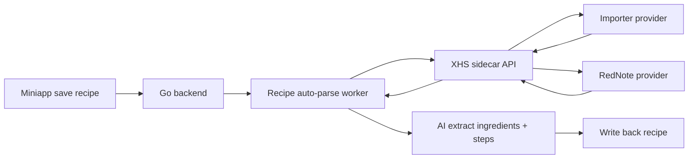

# 小红书 Sidecar API 方案

这份方案的目标不是马上选死某一个开源项目，而是先把 `caipu-miniapp` 和“小红书解析服务”之间的接口定稳。

这样后面可以同时支持两种策略：

- `xiaohongshu-importer`
- `RedNote-MCP`

并且主服务只依赖统一协议，不直接依赖某个具体实现。

## 目标

当前项目已经有一条成熟链路：

1. 用户保存菜谱
2. 后端把任务标成 `pending`
3. worker 异步解析链接
4. 解析结果回写 `ingredient + parsedContent.ingredients + parsedContent.steps`

小红书接入时，建议继续复用这条链路，不改任务模型，只补一个 sidecar。

目标拆成两层：

- **主服务层**：识别是小红书链接，调用统一 sidecar API，拿到结构化文本，再交给 AI 总结
- **sidecar 层**：负责 URL 归一化、provider 路由、登录态、浏览器、页面解析

## 为什么要支持两种策略

### `xiaohongshu-importer`

适合做：

- 轻量策略
- 低依赖策略
- 最快的匿名尝试

优点：

- 实现轻
- 不依赖浏览器
- 更适合做首层快速尝试

缺点：

- 对小红书网页结构变化非常敏感
- 遇到守卫页、登录页、空壳页时命中率低

### `RedNote-MCP`

适合做：

- 重量策略
- 登录态策略
- 高成功率兜底

优点：

- 支持带 Cookie / 登录态
- 直接通过浏览器访问真实页面
- 对当前小红书页面结构更稳一些

缺点：

- 依赖 Playwright
- 成本更高
- 部署更重

## 核心设计原则

### 1. 主服务只认统一协议

Go 主服务不关心当前到底是：

- `xiaohongshu-importer`
- `RedNote-MCP`
- 未来第三种 provider

主服务只知道：

- 我给 sidecar 一个链接
- sidecar 返回结构化内容

### 2. provider 可切换、可回退

建议 sidecar 支持三种 provider 模式：

- `importer`
- `rednote`
- `auto`

其中：

- `importer`：强制走轻量提取
- `rednote`：强制走浏览器登录态提取
- `auto`：先轻量，失败后兜底到浏览器方案

### 3. 主服务保持异步

不建议前端直接请求小红书 sidecar。

推荐继续沿用当前模型：

- 前端保存菜谱
- Go 后端异步调 sidecar
- sidecar 只对主服务开放

### 4. 先做“图文正文总结”，再补 OCR

第一期不把范围做太大。

先只要求 sidecar 返回：

- 标题
- 正文
- 图片列表
- 标签

主服务先吃这些数据做 AI 总结。

如果后面发现很多图文菜谱关键信息只在图片里，再加 OCR。

## 总体架构



## Sidecar 对外 API

建议 sidecar 只暴露 4 组接口。

### 1. 健康检查

`GET /v1/health`

用途：

- 主服务探活
- 运维检查

返回示例：

```json
{
  "ok": true,
  "service": "xhs-sidecar",
  "version": "0.1.0",
  "providers": {
    "importer": {
      "enabled": true
    },
    "rednote": {
      "enabled": true,
      "loggedIn": true
    }
  }
}
```

### 2. provider 能力查看

`GET /v1/providers`

用途：

- 主服务调试
- 设置页展示
- 观察当前 sidecar 支持哪些策略

返回示例：

```json
{
  "defaultProvider": "auto",
  "providers": [
    {
      "name": "importer",
      "enabled": true,
      "requiresLogin": false,
      "supportsImageNotes": true,
      "supportsVideoNotes": false
    },
    {
      "name": "rednote",
      "enabled": true,
      "requiresLogin": true,
      "supportsImageNotes": true,
      "supportsVideoNotes": true,
      "loggedIn": true
    }
  ]
}
```

### 3. 解析入口

`POST /v1/parse/xiaohongshu`

这是主服务真正依赖的核心接口。

请求建议：

```json
{
  "input": "1X3cT0... http://xhslink.com/a/xxxx 或 https://www.xiaohongshu.com/explore/xxxx",
  "provider": "auto",
  "includeImages": true,
  "includeRawHtml": false,
  "includeDebug": false
}
```

字段说明：

- `input`: 可以是分享文本、短链、完整链接
- `provider`: `auto | importer | rednote`
- `includeImages`: 是否返回图片列表
- `includeRawHtml`: 调试时可选
- `includeDebug`: 调试时可选

成功返回建议统一成：

```json
{
  "ok": true,
  "platform": "xiaohongshu",
  "providerRequested": "auto",
  "providerUsed": "rednote",
  "normalized": {
    "shareUrl": "http://xhslink.com/a/xxxx",
    "canonicalUrl": "https://www.xiaohongshu.com/explore/68abcd1234",
    "noteId": "68abcd1234",
    "xsecToken": "optional"
  },
  "note": {
    "title": "番茄土豆炖牛腩",
    "content": "牛腩先焯水，番茄炒出沙，再和土豆一起慢炖...",
    "tags": ["家常菜", "番茄牛腩", "炖菜"],
    "images": [
      "https://ci.xiaohongshu.com/xxx-1.jpg",
      "https://ci.xiaohongshu.com/xxx-2.jpg"
    ],
    "videos": [],
    "coverUrl": "https://ci.xiaohongshu.com/xxx-cover.jpg",
    "author": {
      "name": "某某厨房",
      "avatarUrl": "https://..."
    },
    "noteType": "image",
    "likes": 1203,
    "comments": 86,
    "favorites": 430
  },
  "warnings": [],
  "debug": {
    "attempts": [
      {
        "provider": "importer",
        "ok": false,
        "reason": "note content not found"
      },
      {
        "provider": "rednote",
        "ok": true
      }
    ]
  }
}
```

失败返回建议：

```json
{
  "ok": false,
  "platform": "xiaohongshu",
  "providerRequested": "auto",
  "providerUsed": "",
  "error": {
    "code": "note_unavailable",
    "message": "当前笔记暂时无法访问",
    "retryable": false
  },
  "warnings": []
}
```

错误码建议统一：

- `invalid_input`
- `unsupported_url`
- `resolve_failed`
- `note_unavailable`
- `login_required`
- `provider_unavailable`
- `rate_limited`
- `timeout`
- `internal_error`

### 4. 登录态与状态接口

如果 sidecar 使用 `RedNote-MCP` / Playwright 路线，建议预留这组接口。

#### `GET /v1/auth/rednote/status`

返回示例：

```json
{
  "ok": true,
  "provider": "rednote",
  "loggedIn": true,
  "cookieUpdatedAt": "2026-03-15T10:30:00+08:00",
  "lastCheckAt": "2026-03-15T11:00:00+08:00",
  "lastError": ""
}
```

#### `POST /v1/auth/rednote/login`

第一期可以不真的远程触发扫码，只预留接口描述。

更实用的做法是：

- sidecar 本地手动执行登录
- 主服务只读状态

所以第一期可以先不实现这个接口，只在文档里保留。

## provider 路由策略

建议 sidecar 内部按下面顺序处理。

### `provider=importer`

只走：

- URL 归一化
- 轻量 HTML 提取

失败就直接失败，不做浏览器兜底。

适合：

- 调试
- 对比两种策略命中率
- 低成本运行

### `provider=rednote`

只走：

- 浏览器打开真实页面
- 登录态提取

适合：

- 登录态已准备好
- 希望成功率更高

### `provider=auto`

建议默认顺序：

1. `importer`
2. `rednote`

原因：

- 先用最轻的方式试
- 命中就省掉浏览器成本
- 失败再走登录态兜底

## sidecar 内部 provider 接口

为了后续能同时接两种方案，建议 sidecar 内部也走统一接口。

建议抽象：

```ts
interface XHSProvider {
  name(): "importer" | "rednote";
  enabled(): boolean;
  requiresLogin(): boolean;
  parse(input: ParseInput): Promise<ProviderParseResult>;
}
```

`ProviderParseResult` 建议统一成：

```ts
type ProviderParseResult = {
  ok: boolean;
  normalized?: {
    shareUrl?: string;
    canonicalUrl?: string;
    noteId?: string;
    xsecToken?: string;
  };
  note?: {
    title: string;
    content: string;
    tags: string[];
    images: string[];
    videos: string[];
    coverUrl: string;
    noteType: "image" | "video" | "unknown";
    author?: {
      name: string;
      avatarUrl?: string;
    };
    likes?: number;
    comments?: number;
    favorites?: number;
  };
  warnings?: string[];
  errorCode?: string;
  errorMessage?: string;
}
```

这样 sidecar 层就能：

- 插件化 provider
- 做 fallback
- 做 provider A/B 对比

## Go 主服务如何接

主服务不要感知两个 provider 的细节，只接 sidecar。

### 推荐的 Go 层抽象

在 `internal/linkparse` 里新增一个 `XiaohongshuClient`：

```go
type XiaohongshuClient interface {
    Parse(ctx context.Context, input string) (XHSParseResult, error)
}
```

这里的 `XHSParseResult` 可以和后续统一的 `LinkParseResult` 对齐。

### worker 路由建议

当前逻辑大多写死在 B 站上，建议逐步抽成：

- `SupportsAutoParseURL(link string) bool`
- `DetectParsePlatform(link string) string`

返回：

- `bilibili`
- `xiaohongshu`
- `""`

worker 里再按平台分发：

- `bilibili -> ParseBilibili`
- `xiaohongshu -> ParseXiaohongshu`

### AI 总结建议

sidecar 不负责生成食材和步骤。

sidecar 只负责提供：

- 标题
- 正文
- 标签
- 图片列表

真正的 AI 总结仍放在 Go 主服务：

- 有利于统一 prompt
- 有利于统一回写模型
- 以后 B 站、小红书都能共用一套总结逻辑

## 建议的数据流

### 1. 保存菜谱

用户保存：

- 标题
- 小红书链接

Go 后端：

- 检测到是小红书链接
- `parseStatus = pending`
- `parseSource = xiaohongshu`

### 2. worker 处理

worker 到时扫描：

- `pending`
- `platform = xiaohongshu`

调用 sidecar：

- `POST /v1/parse/xiaohongshu`

### 3. AI 总结

Go 后端把 sidecar 返回的：

- `title`
- `content`
- `tags`

拼成 prompt，提炼：

- `ingredient`
- `parsedContent.ingredients`
- `parsedContent.steps`

### 4. 回写

成功：

- `parseStatus = done`
- `parseSource = xiaohongshu:ai`

失败：

- `parseStatus = failed`
- `parseError = ...`

如果只是拿到正文不完整，也可以记录：

- `parseSource = xiaohongshu:heuristic`

## 配置建议

建议给主服务增加这些环境变量：

```env
XHS_SIDECAR_ENABLED=true
XHS_SIDECAR_BASE_URL=http://127.0.0.1:8091
XHS_SIDECAR_TIMEOUT_SECONDS=25
XHS_SIDECAR_PROVIDER=auto
XHS_SIDECAR_API_KEY=
```

说明：

- `XHS_SIDECAR_ENABLED`: 是否启用小红书解析
- `XHS_SIDECAR_BASE_URL`: sidecar 地址
- `XHS_SIDECAR_TIMEOUT_SECONDS`: 单次请求超时
- `XHS_SIDECAR_PROVIDER`: 默认 provider，可选 `auto|importer|rednote`
- `XHS_SIDECAR_API_KEY`: 如果 sidecar 走内网认证，可加一个简单共享密钥

### sidecar 自己的配置建议

```env
PORT=8091
XHS_PROVIDER_DEFAULT=auto
XHS_PROVIDER_IMPORTER_ENABLED=true
XHS_PROVIDER_REDNOTE_ENABLED=true
XHS_REDNOTE_COOKIE_PATH=~/.xhs-sidecar/rednote-cookies.json
XHS_BROWSER_HEADLESS=true
XHS_INTERNAL_API_KEY=
```

## 安全建议

### 1. sidecar 不暴露到公网

更推荐：

- 只监听 `127.0.0.1`
- 或者只在 Docker 内网中可达

### 2. 不让前端直连 sidecar

小程序和 Web 前端不应该直接访问 sidecar。

原因：

- sidecar 可能持有登录态
- sidecar 的 provider 和调试信息都比较敏感

### 3. 浏览器 Cookie 只存在 sidecar

不要把小红书登录态直接放进 Go 主服务数据库的第一版方案里。

更稳的方式是：

- sidecar 自己管理 Cookie 文件
- Go 主服务只读“登录是否有效”

## 第一期建议实现范围

先把范围控住，只做这些：

1. `GET /v1/health`
2. `GET /v1/providers`
3. `POST /v1/parse/xiaohongshu`
4. `GET /v1/auth/rednote/status`
5. `provider=auto|importer|rednote`
6. 主服务 worker 能路由到 sidecar

第一期可以先不做：

- 远程触发扫码登录
- OCR
- 视频音频转写
- 评论抓取
- 批量搜索

## 我对当前项目的推荐

结合你当前仓库的形态，我推荐：

### 主服务层

- 预留支持两种 provider
- 但主服务不直接接其中任何一个
- 主服务只接 sidecar

### sidecar 层

- 第一期 provider 实现两个壳：
  - `importer`
  - `rednote`
- 默认策略用 `auto`
- 实际落地时优先把 `rednote` 做通
- `importer` 更多作为轻量尝试和 fallback 入口保留

换句话说：

- **协议层同时支持两种策略**
- **落地优先级上更偏向 RedNote 路线**

## 最终结论

可以同时支持 `xiaohongshu-importer` 和 `RedNote-MCP` 两种策略，而且非常适合现在就预留。

最稳的做法不是在 Go 后端里直接写死两套逻辑，而是：

1. 先定义统一 sidecar API
2. sidecar 内部实现多 provider
3. 主服务只依赖统一结构化结果

这样后面你可以：

- 保留 `importer` 作为轻量策略
- 用 `rednote` 作为高成功率兜底
- 后续再加第三种 provider，也不会改动主服务协议
