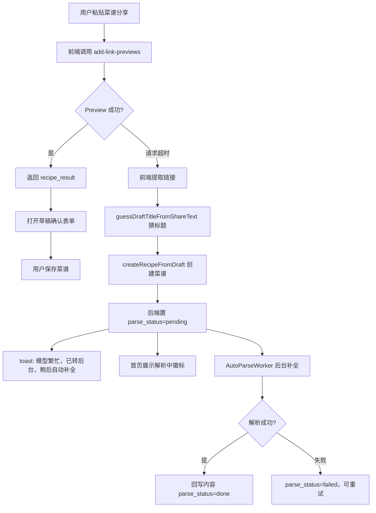

# 添加菜谱 Preview 超时转后台设计方案

更新时间：`2026-06-29 CST`

## 1. 背景

当前首页添加菜谱支持粘贴小红书 / B 站分享内容并实时解析。真实链路会经过
sidecar 抓取、标题清洗、AI 总结和规则兜底，前端当前为预览接口设置了 `45s`
超时，以便等待后端 `30s` 请求超时内的结果。

实际体验里，如果解析超过 `20s` 到 `30s`，用户已经会感知“卡住”。这类慢请求多数和
模型资源、上游网络、Provider 降级或 sidecar 抓取耗时相关，不适合只在前端弹一个
“解析失败”。

本方案采用前端优先的最小闭环：

1. Preview 请求仍先实时解析，成功时保持现有草稿确认体验。
2. Preview 请求超时或被识别为模型繁忙时，前端用“原始链接 + 猜测标题”先创建菜谱。
3. 后端创建菜谱后复用现有 `parse_status=pending` 自动解析队列，稍后补全食材、步骤和图片。

## 2. 现状链路

### 2.1 实时预览链路

当前菜谱分享识别链路：

1. 前端 `add-recipe-preview-panel.vue` / `add-link-preview-panel.vue` 调用
   `utils/add-preview-api.js`。
2. `POST /api/kitchens/{kitchenID}/add-link-previews` 根据内容识别地点或菜谱。
3. 菜谱内容进入 `addpreview.Service.previewRecipe`。
4. 后端同步调用 `linkparse.Service.ParseRecipeLink`。
5. 解析完成后返回 `recipe_result`，前端把 `recipeDraft` 带入添加表单。

特点：

- 用户能在保存前确认标题、图片、食材和步骤。
- 失败时只返回失败提示和原始链接兜底，不会自动保存菜谱。
- 整个请求受后端普通接口 `30s` 超时约束，前端当前等待 `45s`。

### 2.2 保存后自动解析链路

当前 `POST /api/kitchens/{kitchenID}/recipes` 已具备后台自动解析基础：

1. 创建菜谱时，如果链接支持自动解析且用户未提供有效结构化做法，后端将
   `parse_status` 置为 `pending`。
2. `AutoParseWorker` 按配置间隔扫描 `pending` 菜谱。
3. worker 调用 `ParseRecipeLink`，成功后回写食材、摘要、图片、步骤和
   `parse_status=done`。
4. 失败后标记 `parse_status=failed`，用户可在详情页手动重试。

当前默认配置：

- `RECIPE_AUTO_PARSE_ENABLED=true`
- `RECIPE_AUTO_PARSE_INTERVAL_SECONDS=30`
- `RECIPE_AUTO_PARSE_BATCH_SIZE=3`
- 单个自动解析任务超时约 `180s`

### 2.3 前端已有可复用能力

- `pages/index/draft-link.js` 已有 `guessDraftTitleFromShareText(input)`，可从分享文案里猜标题。
- `utils/recipe-store.js` 已有 `createRecipeFromDraft(draft)`，可创建菜谱并写入本地缓存。
- 首页卡片 `buildRecipeInfoLine` 已根据 `parseStatus` 输出 `整理中 / 待重试`。
- 详情页已有解析状态卡片、等待描述、轮询和手动重试能力。

### 2.4 已确认缺口

- Preview 超时分支当前会进入失败提示，用户需要重新手动保存。
- 首页菜谱卡片没有独立“解析中”徽标，只有信息行里的 `整理中`。
- 自动解析 worker 失败后直接进入 `failed`，缺少失败自动重试次数、退避和下次重试时间。
- 自动解析 worker 没有回收长时间卡在 `processing` 的任务。
- 异步占位菜谱创建后，如果标题只是前端猜测，当前模型结果不会回写标题。

## 3. 目标与非目标

### 3.1 目标

- Preview 成功时保留现有 `recipe_result` 草稿确认体验。
- Preview 超时时不再只弹错误，而是前端自动创建一条后台整理中的菜谱。
- 创建菜谱使用原始链接和 `guessDraftTitleFromShareText` 猜出的标题。
- 超时入库后提示：`模型繁忙，已转后台，稍后自动补全`。
- 首页列表立即出现占位菜谱，并显示独立“解析中”徽标。
- 复用现有 `recipes.parse_status` 队列，避免 P0 新增后端任务系统。
- 后续补齐后端自动重试和 processing 回收，降低偶发模型超时导致的最终失败率。

### 3.2 非目标

- P0 不引入 Redis、外部消息队列或独立任务服务。
- P0 不新增后端 `add-link-previews` 异步入队响应。
- P0 不要求服务端主动推送完成通知，先用列表刷新 / 详情轮询闭环。
- 本期不改变地点添加链路，地点 POI 识别仍按现有逻辑处理。

## 4. 总体方案

推荐分两阶段：

- **P0 前端兜底入库**：Preview 超时后，前端基于链接和猜测标题直接创建菜谱。
- **P1 后端可靠性补强**：自动解析 worker 增加重试、退避、processing 回收和标题覆盖策略。



P0 的关键点是：不等待后端新增软超时能力，先利用“创建菜谱即入队”的既有机制，把用户从
长等待中解放出来。

## 5. P0 前端设计

### 5.1 Preview 超时识别

落位：`utils/add-preview-api.js`、`add-recipe-preview-panel.vue`、
`add-link-preview-panel.vue`、`pages/index/index.vue`。

建议将 preview 请求超时从 `45s` 调整为 `20s` 到 `25s`。这样前端能在用户明显焦躁前
进入后台整理兜底。

超时判断建议集中在 API 层或组件 catch 分支归一化，例如：

```js
function isPreviewTimeoutError(error) {
  const message = String(error?.message || error?.errMsg || '').toLowerCase()
  return message.includes('timeout') || message.includes('超时')
}
```

处理原则：

- 只有明确是 preview 请求超时，才自动创建后台菜谱。
- 普通 4xx、内容类型不支持、鉴权失败，不自动创建。
- 地点识别链路不走该兜底，避免把餐厅分享误存成菜谱。

### 5.2 超时后创建菜谱

用户给出的前端逻辑作为 P0 标准：

> preview 超时分支不再只弹错误，而是用链接 + 猜的标题（已有
> `guessDraftTitleFromShareText`）创建菜谱，toast 提示“模型繁忙，已转后台，
> 稍后自动补全”。

推荐在父级 `pages/index/index.vue` 承接创建动作，原因：

- 父级已经管理当前餐别、状态筛选和菜谱列表缓存。
- 父级已导入 `guessDraftTitleFromShareText`。
- `createRecipeFromDraft` 会自动写入本地缓存，便于首页立即出现占位卡。

新增内部方法建议：

```js
async handleRecipePreviewTimeoutFallback(rawText) {
  const link = extractFirstSupportedRecipeLink(rawText)
  const guessedTitle = guessDraftTitleFromShareText(rawText)
  const title = guessedTitle || '菜谱整理中'

  const recipe = await createRecipeFromDraft({
    title,
    link,
    mealType: this.activeMealType,
    status: this.activeStatusFilter === 'done' ? 'done' : 'wishlist',
    parsedContent: {
      mainIngredients: [],
      secondaryIngredients: [],
      steps: []
    },
    parsedContentEdited: false
  })

  this.upsertRecipeToView(recipe)
  uni.showToast({
    title: '模型繁忙，已转后台，稍后自动补全',
    icon: 'none',
    duration: 2200
  })
}
```

说明：

- `parsedContent` 必须保持空，让后端 `shouldQueueAutoParse` 判断为需要自动解析。
- `parsedContentEdited=false`，避免被视为用户手动整理内容。
- 如果当前二级筛选是 `done`，可尊重用户上下文保存为 `done`；其他情况默认 `wishlist`。
- 如果无法提取可支持链接，则仍回到手动填写，不能创建无链接占位菜谱。

### 5.3 面板事件设计

`add-recipe-preview-panel.vue` 和 `add-link-preview-panel.vue` 当前只在成功时
`emit('parse-result')`，失败时自己 toast。

建议新增事件：

```js
emits: ['close', 'manual-entry', 'parse-result', 'preview-timeout']
```

超时 catch 分支：

```js
if (isPreviewTimeoutError(error)) {
  this.$emit('preview-timeout', { text })
  this.$emit('close')
  return
}
```

父组件绑定：

```vue
<add-recipe-preview-panel
  @preview-timeout="handleRecipePreviewTimeoutFallback"
/>
```

这样可以避免子组件直接依赖 `recipe-store`，组件职责仍然是“识别入口”，创建和列表刷新由
首页统一处理。

### 5.4 首页“解析中”徽标

用户要求：首页列表补一个“解析中”徽标，详情页已有，照搬。

当前 `pages/index/recipe-card.js` 已能根据 `parseStatus` 生成信息行，但
`recipe-card-item.vue` 没有独立徽标。建议：

1. 在 `buildRecipeCard(recipe)` 中补充：

```js
const parseStatus = String(recipe.parseStatus || '').trim()
const isParsing = parseStatus === 'pending' || parseStatus === 'processing'

return {
  ...recipe,
  parseBadge: isParsing
    ? { label: '解析中', tone: 'working' }
    : parseStatus === 'failed'
      ? { label: '待重试', tone: 'warning' }
      : null
}
```

2. 在 `recipe-card-item.vue` 的标题区或媒体角标处展示：

```vue
<view v-if="card.parseBadge" class="recipe-card__parse-badge">
  <text class="recipe-card__parse-badge-text">{{ card.parseBadge.label }}</text>
</view>
```

3. 样式参考详情页 `detail-parse--working` 的语气，但卡片上要更轻：

- `pending / processing`：浅琥珀背景、深棕文字。
- `failed`：浅红或浅橙背景、强调“待重试”。
- 不遮挡来源徽标和图片数量徽标。

推荐位置：

- 优先放在标题行右侧、状态 switch 左侧。
- 如果标题行空间不足，可放在摘要上方的小行内。
- 不建议放在图片左上角，因为当前图片区已有来源和数量角标。

### 5.5 刷新策略

超时入库后：

- 立即把 `createRecipeFromDraft` 返回的菜谱写入首页列表。
- `15s` 后触发一次 `syncRecipes`，用于拿到 worker 已完成的内容。
- 如果用户进入详情页，沿用详情页现有 `pending / processing` 轮询。
- 首页不需要高频轮询，避免列表页长期占用请求。

### 5.6 用户提示

统一 toast：

```text
模型繁忙，已转后台，稍后自动补全
```

如果创建占位菜谱失败：

```text
后台保存失败，请稍后重试
```

如果无法提取链接：

```text
解析超时，请手动填写
```

## 6. 后端现有能力与 P0 依赖

P0 不要求后端新增接口，但依赖当前创建菜谱行为：

- `POST /api/kitchens/{kitchenID}/recipes` 要求 `title` 必填。
- `link` 是小红书 / B 站支持链接，且 `parsedContent` 为空时，后端会置
  `parse_status=pending`。
- `AutoParseWorker` 会异步补全食材、摘要、图片和步骤。

需要保持：

- 前端创建占位菜谱时不要传默认 fallback 步骤，否则后端会误判为用户内容。
- `utils/recipe-store.js` 的 `buildRecipePayload` 已会把 fallback parsedContent 转为空；
  本次实现要确认传入超时占位 draft 时不会带入有效步骤。

## 7. P1 后端可靠性设计（已落地）

### 7.1 自动重试机制

当前后端已通过 `backend/migrations/022_add_recipe_auto_parse_retry.sql` 增加自动解析
重试字段，并在 `AutoParseWorker` 中支持退避重试：

| 字段 | 类型 | 说明 |
| --- | --- | --- |
| `parse_attempts` | INTEGER | 已尝试次数 |
| `parse_next_attempt_at` | TEXT | 下次允许执行时间 |
| `parse_last_error_type` | TEXT | 错误分类 |
| `parse_processing_started_at` | TEXT | 本轮 processing 开始时间，用于 stale 回收 |

worker 查询条件改为：

```sql
parse_status = 'pending'
AND (
  parse_next_attempt_at IS NULL
  OR parse_next_attempt_at = ''
  OR datetime(parse_next_attempt_at) <= datetime('now')
)
```

重试策略：

| 错误类型 | 是否重试 | 说明 |
| --- | --- | --- |
| `timeout` | 是 | 模型或 sidecar 超时 |
| `network` | 是 | 网络错误 |
| `rate_limit` | 是 | 上游限流 |
| `upstream` | 是 | 上游 5xx 或临时异常 |
| `invalid_response` | 是 | 最多自动重试 1 次 |
| `bad_request` | 否 | 链接不支持、参数错误 |
| `auth` | 否 | Key / 登录态错误，重试通常无效 |

默认最多尝试 `3` 次，可通过环境变量调整：

- 第 1 次失败：`+60s`
- 第 2 次失败：`+5min`
- 第 3 次失败：标记 `failed`

配置项：

- `RECIPE_AUTO_PARSE_MAX_ATTEMPTS`：默认 `3`
- `RECIPE_AUTO_PARSE_RETRY_BASE_SECONDS`：默认 `60`
- `RECIPE_AUTO_PARSE_STALE_SECONDS`：默认 `600`

### 7.2 processing 回收

已新增自动解析 stale 回收逻辑，避免进程重启或上游卡死导致任务永久 `processing`。

建议：

- 阈值：默认 `10min`，保持明显大于单任务正常超时 `180s`。
- 每轮 worker 开始时执行回收，阈值可通过 `RECIPE_AUTO_PARSE_STALE_SECONDS` 调整。
- 回收后重新置为 `pending`，并保留 `parse_attempts`。

### 7.3 标题覆盖策略

P0 使用 `guessDraftTitleFromShareText` 猜标题，短期可接受。但如果猜测标题不准，后台模型
成功后当前不会覆盖 `title`。

已新增内部标记，识别标题是否允许被模型覆盖。

可选实现：

| 方案 | 改动 | 评价 |
| --- | --- | --- |
| A. 新增 `title_source` 字段 | `manual` / `placeholder` / `parsed` | 最清晰，需迁移 |
| B. 新增 `parse_title_placeholder` 字段 | 布尔值，仅标记异步占位 | 改动较小 |
| C. 仅按标题文本判断 | 标题等于固定占位时覆盖 | 最省事但不够稳 |

已采用方案 A：新增 `recipes.title_source TEXT NOT NULL DEFAULT 'manual'`。

回写规则：

- `title_source=placeholder` 且模型返回标题非空时，更新 `title` 并置为 `parsed`。
- 用户编辑标题时，置为 `manual`。
- `title_source=manual` 时，worker 不覆盖标题。

注意：前端如需让“猜测标题”在后台解析成功后被模型标题覆盖，创建占位菜谱时需要显式传
`titleSource: 'placeholder'`。不传时后端默认按 `manual` 处理，以保护用户手写标题。

## 8. 数据模型变更

已新增迁移 `backend/migrations/022_add_recipe_auto_parse_retry.sql`：

```sql
ALTER TABLE recipes ADD COLUMN title_source TEXT NOT NULL DEFAULT 'manual';
ALTER TABLE recipes ADD COLUMN parse_attempts INTEGER NOT NULL DEFAULT 0;
ALTER TABLE recipes ADD COLUMN parse_next_attempt_at TEXT NOT NULL DEFAULT '';
ALTER TABLE recipes ADD COLUMN parse_last_error_type TEXT NOT NULL DEFAULT '';
ALTER TABLE recipes ADD COLUMN parse_processing_started_at TEXT NOT NULL DEFAULT '';

CREATE INDEX IF NOT EXISTS idx_recipes_parse_status_next_attempt
  ON recipes(parse_status, parse_next_attempt_at, parse_requested_at);
```

兼容策略：

- 存量菜谱 `title_source='manual'`，worker 不覆盖标题。
- 前端占位菜谱如果暂不传 `titleSource`，后端默认 `manual`，不会覆盖标题。
- 存量 `failed` 菜谱不自动重试，仍由用户手动触发，避免历史异常突然重跑。

## 9. 分阶段实施计划

### P0：前端兜底入库与首页徽标

前端：

- `previewAddLink` 请求超时调整到 `20s` 到 `25s`。
- 预览面板超时 catch 分支 emit `preview-timeout`，不再只 toast 失败。
- 首页用 `guessDraftTitleFromShareText(text)` 猜标题。
- 首页提取链接后调用 `createRecipeFromDraft` 创建占位菜谱。
- toast 提示 `模型繁忙，已转后台，稍后自动补全`。
- `recipe-card` 增加 `parseBadge`，`recipe-card-item.vue` 展示“解析中”徽标。
- 入库后延迟刷新一次菜谱列表。

后端：

- 无需新增接口或迁移。
- 保持 `POST /recipes` 的自动解析入队逻辑可用。

### P1：后台可靠性（后端已完成）

后端：

- 已新增 `title_source / parse_attempts / parse_next_attempt_at / parse_last_error_type /
  parse_processing_started_at`。
- 已支持可重试错误自动退避。
- 已支持 `processing` stale 回收。
- 暂未改管理后台 AI 任务页展示，后台观测扩展仍可后续单独做。

前端：

- 详情页失败态按错误类型展示更准确文案。
- 首页或详情页补充“后台整理预计等待”。

### P2：观测优化

后端：

- 管理后台 AI 任务页增加异步导入筛选维度。

前端：

- 占位标题完成后自动刷新为真实标题。
- 可选增加“解析完成后轻提示”，先不做强通知。

## 10. 验收标准

P0 功能验收：

- 小红书 / B 站链接 preview 成功时，现有实时确认体验不变。
- 模拟 preview 请求超时时，前端不再只弹错误。
- 超时后前端使用链接和 `guessDraftTitleFromShareText` 创建菜谱。
- toast 显示 `模型繁忙，已转后台，稍后自动补全`。
- 数据库生成 `parse_status=pending` 的菜谱。
- 首页立即出现该菜谱，并显示“解析中”徽标。
- worker 成功后，列表或详情刷新可看到食材、步骤、图片等补全内容。

P1 功能验收：

- 可重试错误会按退避策略自动重试，超过最大次数才进入 `failed`。
- 长时间 `processing` 的任务会被回收到 `pending`。
- 用户手动编辑过的标题或步骤不会被后台解析覆盖。

测试建议：

- 前端模拟 `previewAddLink` timeout，验证会调用 `createRecipeFromDraft`。
- 前端验证无法提取链接时不会误建菜谱。
- `recipe-card` 构造 `pending / processing / failed / done` 数据，验证徽标分支。
- 后端已新增 `backend/internal/recipe` 重试、退避、stale 回收、标题覆盖规则单测。
- 真机验证弱网 / 模型慢响应下的提示、返回首页、进入详情页体验。

## 11. 风险与取舍

| 风险 | 影响 | 缓解 |
| --- | --- | --- |
| 前端超时但后端稍后返回 | 可能出现用户已入库、原请求仍完成 | 超时后关闭面板并忽略原请求结果；后续可缩短 timeout 到后端 30s 以内 |
| 同一链接重复创建 | 用户多次点击可能生成重复菜谱 | 前端禁用重复提交；后续按 `kitchen_id + link + 近 5min pending/processing` 做后端幂等 |
| 猜测标题不准确 | 列表出现不理想标题 | P0 可接受；P2 用 `title_source` 支持模型标题覆盖 |
| 后台解析覆盖用户编辑 | 用户信任受损 | 依赖 `parsedContentEdited` 与后续 `title_source` 做保护 |
| 自动重试放大上游压力 | 模型资源紧张时更慢 | 限制最大次数和退避，后台配置可调整 |
| 地点分享误入菜谱兜底 | 打卡点被创建成菜谱 | 仅菜谱入口启用；提取链接时要求支持 B 站 / 小红书菜谱平台 |

## 12. 推荐结论

建议先落 P0：前端 preview timeout 兜底创建菜谱 + 首页“解析中”徽标。

这个方案不需要后端新增接口，也不需要数据库迁移，能最快解决“模型慢时用户只能等或失败”的
体验问题。后端已有的 `parse_status=pending` 自动解析队列可以直接承接后台补全。

第二阶段再补自动重试、processing 回收和标题覆盖，解决异步任务可靠性与最终质量问题。
