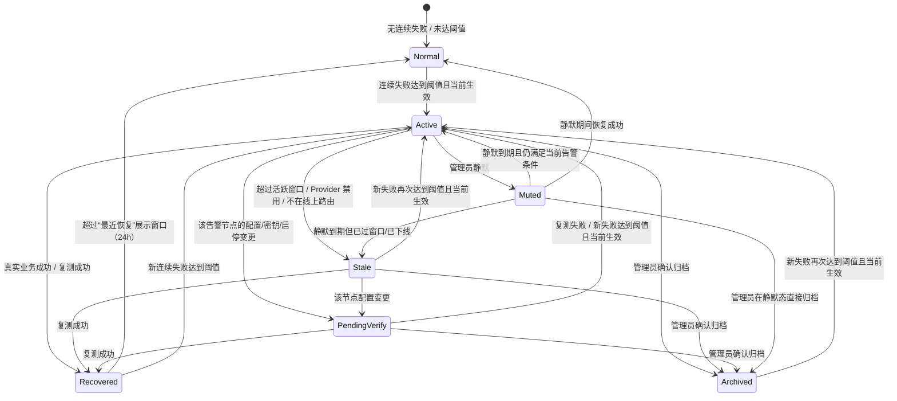

# Admin Web AI Provider 告警状态交互优化需求文档

> 修改时间：2026-07-06 15:40:00 +0800
> 适用范围：`admin-web` 的 `AI Provider` 页面、后端 `aialert` 告警状态概览与管理接口
> 关联页面：`admin-web/src/pages/AIProvidersPage.vue`
> 关联后端：`backend/internal/aialert/*`、`backend/internal/airouter/service.go`、`backend/internal/admin/handler.go`

## 0. 版本说明

本版在初稿基础上完成一次产品交互评审收口，主要修订：

1. 明确告警状态是 **per-Provider** 粒度（每个 Provider 归属唯一场景，见 §2.4），处置接口按 `providerId` 即等价于按场景处置，消除“动作粒度与展示粒度不一致”的隐患。
2. 状态与颜色改为 **一一映射**，`muted` 统一为黄色 + 静音角标，不再与 `archived` 共用灰色（§4.4、§6）。
3. 补齐状态机缺口：`pending_verify` 入边、`muted → archived`、手动 `unmute`、`recovered → normal`、`stale` 的 `pending_verify` 迁移（§5）。
4. `pending_verify` 触发条件限定为“**仅对已有告警的节点**”，避免每次正常改配置都制造黄点、造成告警疲劳（§7.3）。
5. `stale` 展示名由“历史告警”改为“**待复测（已过期）**”，避免“已过去/已解决”的错觉（§6、§9.2）。
6. 新增 **批量处置**、**复测成本提示**、**空态/健康态**、**与外部投递联动**、**活跃窗口倒计时**、**日志跳转带上下文** 等交互细节（§8、§9、§12）。

## 1. 背景

当前 `AI Provider` 告警状态采用“连续失败计数达到阈值即告警”的模型。Provider 一旦触发告警，
只要后续没有同一个 Provider 的真实业务成功调用，`consecutiveFailures` 就不会清零，页面会长期显示
“告警中”。

这会带来一个明显体验问题：如果某个节点已经长期没有真实流量、已经被禁用、已不在当前线上路由中，
或最后一次失败已经过去很多天，它仍可能占用场景卡的红色“告警中”状态。用户容易误判为“当前正在故障”，
实际只是“历史失败未恢复”。

本需求目标不是隐藏历史问题，而是把“当前需要处理的红色告警”和“历史可追溯的问题记录”拆开。

## 2. 当前问题

### 2.1 告警状态会永久闩锁

当前后端概览中，`thresholdReached` 由 `consecutiveFailures >= failureThreshold` 推导。
只要失败次数达到阈值，除非同 Provider 后续真实业务调用成功，否则该状态不会自动退出。

### 2.2 后台测试不能稳定恢复告警

后台“测试场景”走 `airouter` 的实测输入。当前实现里默认 `route_test` 输入会跳过告警追踪，
真实测试输入（`route_test_real_*`）虽然会追踪，但没有对应的 UI 入口把“测试成功”明确落成
“告警恢复”。管理员测试看起来可用，场景卡仍可能显示红色。需要一条显式的“复测并恢复”闭环。

### 2.3 当前告警与历史告警混在一起

页面上“告警中”目前同时承载：

- 正在发生的连续失败。
- 很久以前的失败。
- 节点禁用前留下的失败。
- 配置变更前留下的失败。
- 管理员已经知道但未处理的历史问题。

这些状态的处置优先级完全不同，不应共用同一个红色状态。

### 2.4 数据模型现状（重要约束）

- `ai_provider_alert_states` 以 `provider_id` 为主键，**一个 Provider 一行状态**。
- `ai_route_providers.id` 是全局主键，且每个 Provider 通过 `scene` 列归属**唯一场景**。
- 因此告警状态天然是 per-Provider，`scene` 字段即该 Provider 所属场景。
- **结论**：所有处置接口按 `providerId` 操作，等价于对“该场景内的该节点”操作，不会跨场景误伤。
  本需求不引入 per(scene,provider) 复合状态，保持现有模型以降低迁移风险。

## 3. 产品目标

- 红色只表示“现在需要处理”的告警。
- 历史/过期告警保留可追溯性，但不长期占用当前健康状态。
- 告警可以通过真实成功、后台复测、归档或静默退出当前红色状态，且每次退出都可解释、可回溯。
- 禁用、删除或不在当前线上路由里的 Provider 不再计入当前告警数量。
- 用户能在同一个弹层内完成“定位原因 -> 复测 -> 恢复 / 归档 / 静默”的闭环，并支持批量处置。

## 4. 产品原则

### 4.1 当前风险优先

场景卡、状态条、顶部摘要只把“当前仍需处理的风险”标红。历史/待复核风险进入黄色“待复核”区域，
不抢占红色。但当同时存在 `active` 与待复核项时，场景卡需并列显示两个数量，避免复核项被红色淹没。

### 4.2 历史不丢失

不通过前端过滤直接让旧告警消失。所有触发过阈值的记录仍可在弹层、状态字段或事件表中查看。

### 4.3 操作可解释、可回溯、可撤销

任何让告警退出红色状态的动作，都要有明确原因，并写入事件表（§11）：

- 成功恢复（真实业务或复测）。
- 管理员归档（可因新失败自动解除）。
- 管理员静默（到期自动解除，或手动提前解除）。
- 节点不再参与线上路由。
- 最后失败已超过活跃窗口。

误操作要有退路：静默可手动“解除静默”，归档在新失败发生时自动解除并重新计数。

### 4.4 红黄灰绿分层（颜色与状态一一映射）

颜色必须能独立区分“要立即处理 / 要复核 / 已了结 / 正常”四档：

| 颜色 | 含义 | 覆盖状态 |
| --- | --- | --- |
| 红色 | 当前故障，需立即处理 | `active` |
| 黄色 | 需复核：过期待复测 / 配置变更待确认 / 已静默（黄 + 静音角标） | `stale` / `pending_verify` / `muted` |
| 灰色 | 已了结，不再提示 | `archived` |
| 绿色 | 正常或刚恢复 | `normal` / `recovered` |

黄色内部通过**图标 + 文案**区分子状态：`stale`=时钟、`pending_verify`=刷新、`muted`=静音。
`muted` 不使用灰色——它是“我主动摁下的活告警，到期会回来”，与 `archived`（已了结）心态不同。

## 5. 告警生命周期



关键补充说明：

- `Muted → Archived`：静默态可直接归档，不必等静默到期（修复初稿缺口）。
- 手动 `unmute`：静默可被管理员提前解除，解除后按当下条件重新判定（等价 `Muted → Active/Stale/Normal`）。
- `Recovered → Normal`：`recovered` 是展示态，超过 24h 展示窗口后落为 `normal`（由概览计算时判定，无需写库）。

## 6. 状态定义

| 状态值 | 展示名 | 颜色 | 图标 | 是否计入当前告警 | 说明 |
| --- | --- | --- | --- | --- | --- |
| `normal` | 无告警 | 绿色 / 不展示 | - | 否 | 未达到阈值，或早已恢复 |
| `active` | 告警中 | 红色 | 警示 | 是 | 仍在当前线上路由中，且最近失败仍处于活跃窗口 |
| `stale` | 待复测（已过期） | 黄色 | 时钟 | 否 | 曾达到阈值，但最后失败已过窗口或不再参与线上路由；**可能仍坏，只是没被触发** |
| `pending_verify` | 待复测（配置变更） | 黄色 | 刷新 | 否 | 该告警节点的模型/密钥/启停/场景策略变化后，需复测确认 |
| `muted` | 已静默 | 黄色 + 静音角标 | 静音 | 否 | 管理员静默至某时刻，到期前不进入红色汇总；同时静音外部投递 |
| `archived` | 已归档 | 灰色 | 归档 | 否 | 管理员确认旧问题，无需继续提示；新失败自动解除 |
| `recovered` | 已恢复 | 绿色 | 对勾 | 否 | 真实业务或复测成功，24h 内于“最近恢复”区展示 |

> 命名说明：`stale` 展示名刻意避免“历史告警”这类“已过去/已解决”的暗示，改为“待复测（已过期）”，
> 引导管理员把它当作“状态未知、需要复测确认”而非“已经没事”。

## 7. 判定规则

判定在后端 `Overview` 计算时完成，前端只消费 `alertStatus`。判定按下述**优先级**从上到下命中即返回。

前置量：
- `threshold = failureThreshold`（默认 3）
- `reached = consecutiveFailures >= threshold`
- `activeWindow = activeWindowHours`（默认 72h，可配置）
- `enabled / inEffectiveRoute`：由 airouter 解析当前生效路由得到（§10.4）
- `now`：概览生成时刻

规则：

1. 若 `lastStatus == "success"` 或 `consecutiveFailures == 0`：
   - `lastRecoveredAt` 在 24h 内 → `recovered`
   - 否则 → `normal`
2. 若 `!reached`（有失败但未达阈值）→ `normal`（不打扰）
3. `reached` 分支（存在达到阈值的失败）按优先级：
   1. `muted_until` 在未来 → `muted`
   2. `archived_at` 非空 → `archived`
   3. `last_config_changed_at > last_failed_at` → `pending_verify`
   4. `!enabled` 或 `!inEffectiveRoute` 或 `last_failed_at` 早于 `now - activeWindow` → `stale`
   5. 否则 → `active`

### 7.1 `active`

`reached && lastStatus=="failed" && enabled && inEffectiveRoute && lastFailedAt 在活跃窗口内 && 未归档 && 未静默 && 无更晚的配置变更`。
`activeUntil = lastFailedAt + activeWindow`，用于前端展示“还有 N 小时降级为待复测”。

### 7.2 `stale`

`reached` 且满足任一：最后失败超过活跃窗口 / Provider 已禁用 / 不在当前线上生效路由。

### 7.3 `pending_verify`（触发条件已收敛）

**仅对已有告警（`reached`）的节点生效**：当该节点的模型 / Base URL / 密钥 / 启停 / 所在场景的路由策略、
最大尝试次数、熔断参数发生变化（`last_config_changed_at` 晚于 `last_failed_at`）时命中。
健康节点（`!reached`）的配置变更**不产生黄点**，避免告警疲劳。

标记时机：`SaveScene` 保存成功后，对该场景下的告警状态写入 `last_config_changed_at = now`（§10.4）。

### 7.4 `recovered`

`recovered` 由以下动作写入 `last_recovered_at` 并清零计数：

- 同 Provider 的真实业务调用成功。
- 管理员“复测并恢复”，且测试对象是**已保存线上配置**，测试成功。

草稿测试成功不直接恢复线上告警，但 UI 显示“草稿测试通过，保存后可复测恢复”。

### 7.5 `archived`

管理员确认无需继续提示时写入 `archived_at`。归档不删除历史失败字段。新失败发生时（`RecordFailure`）
自动清空 `archived_at` 并重新计数。

### 7.6 `muted`

管理员设置静默时长后写入 `muted_until`。静默期内不计入当前告警数量，且**同步静音外部邮件投递**
（§9.5）。到期后按当下条件重新判定；也可手动“解除静默”。

## 8. 页面信息架构

### 8.1 场景卡

场景卡右上角聚合状态：

| 条件 | 主标签 | 次标签（并列） |
| --- | --- | --- |
| 有 `active` | `告警中 N` | 若同时有待复核：`· 待复核 M` |
| 无 `active`，有 `stale`/`pending_verify`/`muted` | `待复核 M` | - |
| 无告警且已启用且有可用节点 | `运行正常` | - |
| 有节点但无启用节点 | `不可发布` | - |
| 无节点 | `未配置` | - |

> 修订：初稿在有 `active` 时会隐藏待复核数量。现要求 `告警中 N · 待复核 M` 并列，避免复核项被淹没。
> `不可发布`（有节点但都没启用/缺密钥）与 `未配置`（压根没有节点）语义区分，不再二选一含糊。

场景卡问题摘要示例：

- 当前告警：`L站-deepSeek-chat 连续失败 12 次 · 26 分钟前`
- 多个当前告警：`L站-deepSeek-chat 连续失败 12 次 · 共 2 个节点告警`
- 待复核：`2 个待复核 · 最近失败 26 天前`
- 待复测（配置变更）：`配置已调整，建议复测后恢复状态`

### 8.2 主状态条

状态条仅展示当前场景关键状态：线上正在用什么、有无未保存改动、有无 `active` 告警。
`stale`/`pending_verify`/`muted` 只让状态条变黄“需复核”，不变红。

### 8.3 告警弹层（三段式）

| 区块 | 展示内容 | 默认展开 | 批量动作 |
| --- | --- | --- | --- |
| 当前告警 | `active` 节点 | 是 | 批量复测 |
| 待复核 | `stale` / `pending_verify` / `muted` 节点 | 有内容时展开 | 批量复测、批量归档 |
| 最近恢复 | 24h 内 `recovered` 节点 | 折叠 | - |

- 弹层顶部展示概览摘要：告警开关、阈值、活跃窗口、投递是否可用、各状态数量、最近告警时间。
- **空态**：全部 `normal` 时，弹层显示“当前无告警，运行正常”，不展示空的分组标题；
  “最近恢复”无内容时整段隐藏。

每条节点卡展示：Provider 名称 · 模型 · 场景 · 状态标签（含图标）· 连续失败次数 · 最后失败时间（相对时间 + 绝对时间 tooltip）·
错误类型 · 最后错误摘要 · requestId（可复制）· 最近恢复时间 · 状态原因（`statusReason`）· 处置动作。
`active` 节点额外展示“还有 N 小时降级为待复测”（基于 `activeUntil`）。

### 8.4 节点卡操作（主动作 + 溢出菜单）

为降低视觉噪音，主动作按状态给出一个主按钮，其余进溢出菜单：

| 操作 | 适用状态 | 主/次 | 行为 |
| --- | --- | --- | --- |
| 复测并恢复 | `active` / `stale` / `pending_verify` / `muted` | 主 | 对已保存线上配置执行单节点测试；成功则恢复，失败则更新错误。**会发起一次真实上游调用**，按钮旁标注成本提示 |
| 确认归档 | `active` / `stale` / `pending_verify` / `muted` | 次 | 标记归档，不再计入当前告警或待复核 |
| 静默 24h | `active` | 次 | 设置静默到期时间，同步静音投递 |
| 解除静默 | `muted` | 次 | 立即结束静默，按当下条件重新判定 |
| 查看日志 | 全部 | 次 | 跳转「API 调用 / AI 任务」并预填 `provider + 时间范围`（§12） |
| 查看节点 | 全部 | 次 | 滚动定位到该 Provider 节点编辑卡 |

## 9. 文案规范

### 9.1 当前告警

- `当前仍在失败`
- `连续失败 12 次`
- `最近失败：26 分钟前`（hover 显示绝对时间）
- `还有 3 小时降级为待复测`
- `需要处理：节点仍启用且在线上路由中`

### 9.2 待复测（已过期，stale）

- `待复测（已过期）`
- `最后失败已超过 72 小时，或节点已下线/不在线上路由`
- `状态未知，不代表已恢复；建议复测或归档`

### 9.3 待复测（配置变更，pending_verify）

- `待复测（配置变更）`
- `配置/密钥/启停已变更，需要复测确认`
- `复测通过后将恢复为正常`

### 9.4 已归档

- `已归档`
- `管理员已确认该历史问题`
- `新失败仍会重新触发告警`

### 9.5 已静默

- `已静默至 07-07 15:00`
- `静默期间不计入红色告警，也不发送邮件`
- `可手动“解除静默”`

### 9.6 复测成本提示

- 按钮副标：`将发起一次真实上游调用`
- 批量复测二次确认：`将对 N 个节点各发起一次真实调用，可能产生额度/费用，确认继续？`

## 10. 后端接口需求

### 10.1 告警概览接口扩展

接口：`GET /api/admin/ai-routing/alerts/overview`

`items[]` 新增字段：

```ts
type AIRoutingAlertStatus =
  | "normal"
  | "active"
  | "stale"
  | "pending_verify"
  | "muted"
  | "archived"
  | "recovered";

interface AIRoutingAlertOverviewItem {
  providerId: string;
  providerName: string;
  scene: AIRoutingSceneKey;
  model: string;
  consecutiveFailures: number;
  lastStatus: string;
  lastErrorType: string;
  lastErrorMessage: string;
  lastRequestId: string;
  lastFailedAt: string;
  lastRecoveredAt: string;
  lastAlertedAt: string;
  updatedAt: string;

  alertStatus: AIRoutingAlertStatus;
  statusReason: string;
  activeUntil?: string;
  mutedUntil?: string;
  muteReason?: string;
  archivedAt?: string;
  archivedBy?: string;
  archiveReason?: string;
  lastConfigChangedAt?: string;
  isProviderEnabled: boolean;
  isInEffectiveRoute: boolean;
  canRetest: boolean;
  canArchive: boolean;
  canMute: boolean;
  canUnmute: boolean;

  thresholdReached: boolean; // 兼容旧前端，过渡期保留
}
```

### 10.2 概览聚合字段扩展

```ts
interface AIRoutingAlertOverview {
  generatedAt: string;
  enabled: boolean;
  failureThreshold: number;
  activeWindowHours: number;
  hasDeliveryConfig: boolean;
  activeAlertCount: number;
  staleAlertCount: number;
  pendingVerifyCount: number;
  mutedAlertCount: number;
  archivedAlertCount: number;
  recoveredCount: number;
  reviewAlertCount: number; // stale + pending_verify + muted
  latestAlertedAt: string;
  items: AIRoutingAlertOverviewItem[];
}
```

### 10.3 新增管理接口

所有动作接口返回统一结构，便于前端直接替换概览：

```ts
interface AIRoutingAlertMutationResult {
  ok: boolean;
  message: string;
  overview: AIRoutingAlertOverview; // 动作后重新计算的概览
}
```

#### 复测并恢复

```http
POST /api/admin/ai-routing/alerts/{providerId}/retest
```

- 使用已保存线上配置执行单节点测试（`ContentKind=route_test`，不走自动追踪，显式更新状态）。
- 成功：清零连续失败计数，写入 `last_recovered_at`，状态转 `recovered`，记 `retest_succeeded` 事件。
- 失败：更新最后失败信息（不累加连续失败次数，避免复测本身把节点推入更深告警），记 `retest_failed` 事件。
- Provider 不存在于任何场景：`ok=false`，`message` 说明“节点已删除，只能归档”。

#### 确认归档

```http
POST /api/admin/ai-routing/alerts/{providerId}/archive
Body: { "reason": "历史问题，节点已下线" }
```

- 写入 `archived_at`、`archived_by`、`archive_reason`，记 `archived` 事件。
- 不删除历史失败字段；新失败发生时自动解除归档并重新计数。

#### 静默

```http
POST /api/admin/ai-routing/alerts/{providerId}/mute
Body: { "durationHours": 24, "reason": "已知上游限流，等待额度恢复" }
```

- 写入 `muted_until`、`muted_by`、`mute_reason`，记 `muted` 事件。
- `durationHours` 缺省 24，最大 720（30 天）。

#### 解除静默

```http
POST /api/admin/ai-routing/alerts/{providerId}/unmute
```

- 清空 `muted_until` 等字段，记 `unmuted` 事件，按当下条件重新判定。

### 10.4 airouter 侧能力（由 aialert 通过接口反向依赖）

为避免循环依赖，`aialert` 定义接口，`airouter.Service` 实现，`app.go` 用 setter 注入：

- `ResolveProviderStatuses(ctx) -> map[providerId]{enabled, inEffectiveRoute, scene, name, model}`：
  遍历各场景当前生效配置，给出每个 Provider 是否启用、是否在生效路由内，并回填权威的名称/模型/场景。
- `RetestProvider(ctx, providerId) -> (outcome, found)`：定位 Provider 所属场景，构造单节点场景配置，
  以 `route_test` 输入执行一次真实调用，返回成功/失败与错误详情。
- 配置变更标记：`SaveScene` 成功后由 admin handler 调用 `aialert.NoteSceneConfigChanged(scene)`，
  对该场景下的告警状态写入 `last_config_changed_at`。

## 11. 数据模型

### 11.1 状态表新增字段（migration 017）

```sql
ALTER TABLE ai_provider_alert_states ADD COLUMN archived_at TEXT NOT NULL DEFAULT '';
ALTER TABLE ai_provider_alert_states ADD COLUMN archived_by TEXT NOT NULL DEFAULT '';
ALTER TABLE ai_provider_alert_states ADD COLUMN archive_reason TEXT NOT NULL DEFAULT '';
ALTER TABLE ai_provider_alert_states ADD COLUMN muted_until TEXT NOT NULL DEFAULT '';
ALTER TABLE ai_provider_alert_states ADD COLUMN muted_by TEXT NOT NULL DEFAULT '';
ALTER TABLE ai_provider_alert_states ADD COLUMN mute_reason TEXT NOT NULL DEFAULT '';
ALTER TABLE ai_provider_alert_states ADD COLUMN last_config_changed_at TEXT NOT NULL DEFAULT '';
```

### 11.2 事件表（审计与追溯）

```sql
CREATE TABLE IF NOT EXISTS ai_provider_alert_events (
  id INTEGER PRIMARY KEY AUTOINCREMENT,
  provider_id TEXT NOT NULL,
  scene TEXT NOT NULL DEFAULT '',
  event_type TEXT NOT NULL,
  reason TEXT NOT NULL DEFAULT '',
  operator_subject TEXT NOT NULL DEFAULT '',
  created_at TEXT NOT NULL
);
CREATE INDEX IF NOT EXISTS idx_ai_provider_alert_events_provider
  ON ai_provider_alert_events(provider_id, created_at DESC);
```

`event_type` 取值：`recovered`、`archived`、`muted`、`unmuted`、`config_changed`、`retest_succeeded`、`retest_failed`。
（`failure_recorded` / `alert_triggered` 为热路径高频事件，本期不落事件表，仍以状态字段与 `ai_call_logs` 追溯。）

## 12. 前端交互需求

### 12.1 计算口径

前端以 `alertStatus` 为准，兼容期回退：

```ts
const status = item.alertStatus || (item.thresholdReached ? "active" : "normal");
```

### 12.2 筛选与分组

- 当前告警：`alertStatus === "active"`。
- 待复核：`stale / pending_verify / muted`。
- 最近恢复：`recovered` 且 `lastRecoveredAt` 在 24h 内。

### 12.3 操作反馈

- 复测中：按钮 loading，节点卡显示“正在复测”。
- 复测成功：toast `复测通过，告警已恢复`，用返回的 `overview` 就地刷新。
- 复测失败：toast `复测失败，已更新最后错误`。
- 归档成功：toast `已归档，该告警不再计入当前状态`。
- 静默成功：toast `已静默至 <时间>`；解除静默：toast `已解除静默`。
- 批量复测前二次确认成本（§9.6）。

### 12.4 日志跳转带上下文

“查看日志”跳转到调用日志页时，预填 `provider=providerId`，并可带该节点最近失败时间前后的时间范围，
避免落到通用日志页再手动检索。

### 12.5 可访问性

- 红色/黄色状态必须同时具备颜色 + 图标 + 文字。
- 操作按钮必须有清晰文字，不只用图标。
- 复测/归档/静默完成后，状态变化通过 `aria-live` 区域播报。
- 弹层开合做焦点管理；节点卡支持键盘 tab 聚焦；requestId 支持复制。
- 黄色文字需校验 WCAG 对比度（黄底/白底组合易不达标）。

## 13. 验收标准

- 26 天前的失败不再显示为红色“告警中”，而是黄色“待复测（已过期）”。
- 场景卡红色数量只统计 `active`；同时存在待复核项时并列显示 `告警中 N · 待复核 M`。
- 禁用 Provider 后，该 Provider 不再计入当前告警数量，降级为 `stale`。
- 后台对已保存线上配置复测成功后，旧告警恢复为 `recovered` 并进入“最近恢复”。
- 草稿测试成功不会直接清除线上告警，但会给出明确提示。
- 管理员可对告警归档，归档后刷新页面状态保持；新失败发生时自动解除归档。
- 管理员可对当前告警静默 24h，静默期内不计入红色数量，也不发送邮件；可手动解除静默。
- 已有告警节点在保存配置后进入 `pending_verify`；健康节点保存配置不产生黄点。
- 所有旧告警仍可查看最后错误、requestId、最后失败时间。
- 归档/静默/复测/解除静默/配置变更均写入 `ai_provider_alert_events`。
- 复测/批量复测有明确的真实调用成本提示。

## 14. 分阶段落地建议

### P0：状态语义修正
- 后端 overview 增加 `alertStatus` 与各状态计数。
- 引入活跃窗口，默认 72h（可配置）。
- 前端按 `alertStatus` 区分红色当前告警和黄色待复核；场景卡红色只统计 `active` 并并列显示待复核数。

### P1：恢复闭环
- 新增“复测并恢复”接口与前端主按钮（含成本提示）。
- 复测成功清零连续失败计数；禁用/离线 Provider 自动降级为 `stale`。

### P2：人工处置能力
- 新增归档 / 静默 / 解除静默接口。
- 弹层三段化 + 批量复测/归档 + 空态。

### P3：审计与配置化
- 增加告警事件表并写入各动作。
- 活跃窗口配置化。
- 配置变更触发 `pending_verify`（限已有告警节点）。

## 15. 风险与待确认

- 活跃窗口默认值 72h，需结合实际 AI 调用频率确认。
- 后台复测触发真实上游调用，需评估成本、额度和限流；批量复测已加二次确认。
- Provider 已删除时历史告警如何展示：状态表保留最后的名称/模型/场景快照，`ResolveProviderStatuses`
  查无此 Provider 时按 `!inEffectiveRoute` 处理，动作仅保留“归档 / 查看日志”。
- 多实例部署：告警状态与复测结果以数据库为准，不依赖内存（内存熔断器仅做本地降级）。
- 归档/静默权限本期沿用后台管理员权限，暂不细分。
