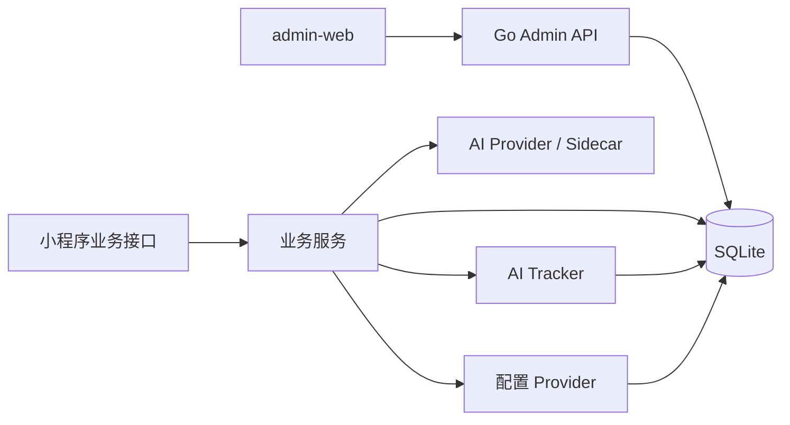

# 后台管理平台、AI 可观测性与动态配置中心设计方案

## 1. 背景

当前 `caipu-miniapp` 已具备以下能力：

- 后端使用 `Go + chi + SQLite`
- AI 相关链路已接入自动解析、流程图生成、标题精修
- 小程序端已有隐藏设置页，可维护全局 `Bilibili SESSDATA`
- 后端已有受保护的设置接口、配置加密存储和权限校验基础

但当前仍存在几个明显缺口：

- 只能看到任务最终状态，无法准确统计每次 AI / sidecar 调用的成功率、耗时和失败原因
- 大多数 AI 配置仍依赖启动时环境变量，无法通过后台页面在线调整
- 缺少统一的 PC 管理后台，排查问题、查看趋势和修改配置都不够高效

本方案目标是补齐一版可快速上线的后台系统，同时为后续接入更标准的观测体系预留空间。

## 2. 目标与非目标

### 2.1 目标

- 提供一套简单但可用的后台管理平台
- 能在仪表盘中快速查看 AI 任务成功率、失败率、超时率和最近失败记录
- 能查看 AI 调用明细，包括模型、耗时、HTTP 状态、错误信息
- 能在线维护 AI 相关动态配置，例如 `baseURL`、`apiKey`、`model`、`timeout`
- 能记录配置变更审计，避免“谁改了配置”无法追溯
- 在当前单机部署条件下尽量少引入额外基础设施

### 2.2 非目标

- 一期不把 `Grafana` 作为主后台系统
- 一期不引入完整的 `Prometheus + Loki + Tempo` 体系
- 一期不实现完整的多角色后台 RBAC
- 一期不把所有环境变量都做成热更新配置

## 3. 当前现状

当前仓库已经具备可复用的基础能力：

- 配置加载入口：`backend/internal/config/config.go`
- 设置接口与保护路由：`backend/internal/app/router.go`
- 设置服务与加密存储：`backend/internal/appsettings/*`
- 小程序隐藏设置页：`pages/app-settings/index.vue`
- `SQLite + WAL` 单机数据库：`backend/internal/db/db.go`

现有设置中心目前只覆盖 `Bilibili SESSDATA`，但模式已经成立：

- 单例配置表
- 受保护接口
- 服务端加密存储
- 前端设置页面

因此本方案不建议推翻重做，而是基于现有 `appsettings` 继续扩展。

## 4. 设计原则

- 先解决“看不到真实 AI 调用情况”的问题，再做漂亮仪表盘
- 先做应用内自管埋点和查询，二期再考虑接入外部观测平台
- 任务级统计和调用级统计必须分离，避免统计口径混乱
- 动态配置优先覆盖真正需要在线修改的 AI / sidecar 参数
- 敏感配置必须加密存储，页面只显示掩码值
- 方案必须贴合当前仓库，不引入明显超出项目规模的基础设施

## 5. 总体方案

推荐采用三块能力组合：

1. 后端 AI 可观测性
2. 后端动态配置中心
3. 独立 Web 管理后台

整体架构如下：



核心思路：

- 业务服务发起 AI 调用时，统一写入调用日志和任务结果
- 配置不再完全依赖进程启动时加载的环境变量，而是通过运行时配置读取
- 管理后台通过独立的 `/api/admin/*` 接口读取统计、查询日志和维护配置

## 6. 模块拆分

推荐代码落位：

```text
/srv/caipu-miniapp
├── admin-web/                         # 新的网页管理后台
│   ├── src/
│   │   ├── api/
│   │   ├── components/
│   │   ├── pages/
│   │   │   ├── dashboard/
│   │   │   ├── ai-jobs/
│   │   │   ├── ai-calls/
│   │   │   └── settings/
│   │   └── router/
├── backend/
│   ├── internal/
│   │   ├── admin/                    # 后台登录、仪表盘、管理接口
│   │   ├── appsettings/              # 动态配置中心
│   │   ├── audit/                    # AI 任务记录、调用记录、聚合查询
│   │   └── ...
│   └── migrations/
```

说明：

- `admin-web/` 用于 PC 端后台，不建议继续塞进小程序页面
- `appsettings/` 继续负责动态配置与密钥加密
- `audit/` 独立负责 AI 任务与调用观测，避免和业务模块互相污染
- `admin/` 负责后台专属接口、仪表盘聚合和后台登录

## 7. 数据模型设计

### 7.1 `ai_job_runs`

用途：

- 记录一条业务级 AI 任务的最终结果
- 统计“最终成功率”

建议字段：

| 字段 | 类型 | 说明 |
| --- | --- | --- |
| `id` | INTEGER PK | 主键 |
| `scene` | TEXT | 场景：`parse_summary`、`flowchart`、`title_refine` |
| `target_type` | TEXT | 目标类型，如 `recipe` |
| `target_id` | TEXT | 目标业务 ID |
| `trigger_source` | TEXT | 触发来源，如 `worker`、`manual`、`preview` |
| `status` | TEXT | `success`、`failed`、`timeout`、`fallback` |
| `final_provider` | TEXT | 最终提供方 |
| `final_model` | TEXT | 最终模型 |
| `fallback_used` | INTEGER | 是否使用降级 |
| `error_message` | TEXT | 最终错误摘要 |
| `started_at` | TEXT | 开始时间 |
| `finished_at` | TEXT | 结束时间 |
| `duration_ms` | INTEGER | 总耗时 |
| `meta_json` | TEXT | 补充信息 |

建议索引：

- `(scene, status, started_at DESC)`
- `(target_type, target_id, started_at DESC)`

### 7.2 `ai_call_logs`

用途：

- 记录每一次实际的上游调用
- 统计“真实 API 成功率”

建议字段：

| 字段 | 类型 | 说明 |
| --- | --- | --- |
| `id` | INTEGER PK | 主键 |
| `job_run_id` | INTEGER | 关联 `ai_job_runs.id` |
| `scene` | TEXT | 场景 |
| `provider` | TEXT | 提供方，如 `openai-compatible`、`linkparse-sidecar` |
| `endpoint` | TEXT | 调用端点 |
| `model` | TEXT | 模型名 |
| `status` | TEXT | `success`、`failed`、`timeout` |
| `http_status` | INTEGER | 上游状态码 |
| `latency_ms` | INTEGER | 调用耗时 |
| `error_type` | TEXT | 错误分类 |
| `error_message` | TEXT | 错误摘要 |
| `request_id` | TEXT | 请求链路标识 |
| `meta_json` | TEXT | 扩展元信息 |
| `created_at` | TEXT | 记录时间 |

建议索引：

- `(scene, status, created_at DESC)`
- `(job_run_id)`

### 7.3 `app_runtime_settings`

用途：

- 在线管理运行时配置

建议字段：

| 字段 | 类型 | 说明 |
| --- | --- | --- |
| `key` | TEXT PK | 配置键 |
| `group_name` | TEXT | 分组 |
| `value_text` | TEXT | 明文值 |
| `value_ciphertext` | TEXT | 密文值 |
| `value_type` | TEXT | `string`、`int`、`bool`、`float` |
| `is_secret` | INTEGER | 是否敏感 |
| `is_restart_required` | INTEGER | 是否需要重载/重启 |
| `description` | TEXT | 配置说明 |
| `updated_by` | INTEGER | 操作人 |
| `updated_at` | TEXT | 更新时间 |

说明：

- 敏感值只写入 `value_ciphertext`
- 非敏感值写入 `value_text`
- 页面读取时返回掩码值，避免明文回显

### 7.4 `app_setting_audits`

用途：

- 配置变更审计

建议字段：

| 字段 | 类型 | 说明 |
| --- | --- | --- |
| `id` | INTEGER PK | 主键 |
| `setting_key` | TEXT | 配置键 |
| `action` | TEXT | `create`、`update`、`delete`、`test` |
| `old_value_masked` | TEXT | 旧值掩码 |
| `new_value_masked` | TEXT | 新值掩码 |
| `operator_id` | INTEGER | 操作人 |
| `request_id` | TEXT | 请求 ID |
| `created_at` | TEXT | 操作时间 |

## 8. 埋点口径

必须明确区分两种成功率：

### 8.1 任务成功率

定义：

- 一次业务任务最终是否成功

示例：

- 一条菜谱自动解析最终写回成功，记为任务成功
- 中途如果 AI 失败但规则兜底成功，任务可记为 `fallback`

### 8.2 API 成功率

定义：

- 一次实际调用 AI provider / sidecar 是否成功

示例：

- 请求 `chat/completions` 超时，记为 API 失败
- sidecar 返回 502，记为 API 失败

如果不分开统计，会导致以下问题：

- 规则兜底把任务救回来后，看上去“成功率很好”，但实际 AI 调用失败很多
- 重新解析覆盖旧状态后，很难还原真实故障情况

## 9. 埋点接入点

建议优先接入以下位置：

- `backend/internal/recipe/auto_parse_worker.go`
- `backend/internal/recipe/flowchart_worker.go`
- `backend/internal/linkparse/service.go`
- `backend/internal/linkparse/xiaohongshu.go`

建议抽一个统一接口：

```go
type Tracker interface {
    StartJob(ctx context.Context, input JobInput) (jobID int64, finish func(JobResult))
    LogCall(ctx context.Context, input CallLogInput) error
}
```

接入方式：

- worker 开始处理任务时创建 `job_run`
- 每次上游请求前后记录 `call_log`
- 最终成功、失败或兜底时更新 `job_run`

## 10. 动态配置范围

### 10.1 一期建议动态化

建议优先支持以下分组：

| 分组 | 配置键 |
| --- | --- |
| `ai.summary` | `base_url`、`api_key`、`model`、`timeout_seconds` |
| `ai.flowchart` | `base_url`、`api_key`、`model`、`timeout_seconds` |
| `ai.title` | `enabled`、`base_url`、`api_key`、`model`、`stream`、`temperature`、`max_tokens`、`timeout_seconds` |
| `sidecar.linkparse` | `enabled`、`base_url`、`api_key`、`timeout_seconds` |
| `bilibili.session` | 继续复用现有全局 SESSDATA 存储 |

### 10.2 一期不建议动态化

- `APP_ADDR`
- `SQLITE_PATH`
- `UPLOAD_DIR`
- `MIGRATION_DIR`
- worker 的 `interval` / `batchSize`

原因：

- 这些参数当前属于启动期配置
- 强行改成完全热更新，会明显增加实现复杂度和测试成本

## 11. 运行时配置读取方案

为避免所有服务继续只读启动期环境变量，建议引入：

- `RuntimeConfigProvider`

职责：

- 从 `app_runtime_settings` 读取动态配置
- 提供默认值回退
- 对敏感值执行解密
- 提供短时缓存，减少每次请求都打 DB

建议行为：

- 普通读操作使用 10 到 30 秒本地缓存
- 更新配置后主动失效缓存
- 区分“立即生效”和“需重载”

建议页面提示：

- `立即生效`
- `保存后需重启服务`

## 12. 后台 API 设计

> 说明（2026-04-18 同步）：
> 本节最初是一期设计草案，当前仓库中的后台接口和页面已经落地。
> 为避免继续误导后续开发，这里统一按当前实现口径更新；若和更早提交中的
> 描述冲突，以 `backend/internal/app/router.go`、`admin-web/src/api/admin.ts`
> 和 `docs/cloud-server-config-overview.md` 为准。

当前已落地的后台接口主体位于 `/api/admin/*`：

### 12.1 认证

- `POST /api/admin/auth/login`
- `POST /api/admin/auth/logout`
- `GET /api/admin/auth/me`

MVP 认证建议：

- 使用单独后台账号
- 环境变量提供 `ADMIN_USERNAME`
- 环境变量提供 `ADMIN_PASSWORD_HASH`
- 登录后签发独立 admin JWT

说明：

- 不建议直接复用小程序登录作为 PC 后台认证
- 后续若需要，再扩成更完整的后台账号体系

### 12.2 仪表盘

- `GET /api/admin/dashboard/overview`
- `GET /api/admin/dashboard/failures`
- `GET /api/admin/dashboard/trends`
- `GET /api/admin/server-health/overview`

当前实现补充说明：

- `GET /api/admin/dashboard/overview` 支持可选 `windowHours` 查询参数
- 当前后台首页已经把概览指标、趋势图和服务健康摘要聚合到同一工作台里

### 12.3 AI 记录

- `GET /api/admin/ai/jobs`
- `GET /api/admin/ai/jobs/{id}`
- `GET /api/admin/ai/calls`

当前实现已支持的常见筛选维度：

- `scene`
- `status`
- `triggerSource`
- `targetId`
- `provider`
- `model`
- `requestId`
- `timeFrom / timeTo`

### 12.4 AI Provider 路由

- `GET /api/admin/ai-routing/scenes`
- `GET /api/admin/ai-routing/scenes/{scene}`
- `PUT /api/admin/ai-routing/scenes/{scene}`
- `POST /api/admin/ai-routing/scenes/{scene}/test`

当前实现说明：

- 场景维度已落地 `summary`、`title`、`flowchart`
- 支持多 Provider 节点顺序、熔断、重试类型和单场景草稿测试
- 当前后台前端已提供独立 `AI Provider` 页面承载这组能力

### 12.5 配置中心

- `GET /api/admin/runtime-settings`
- `PUT /api/admin/runtime-settings/groups/{group}`
- `POST /api/admin/runtime-settings/groups/{group}/test`
- `GET /api/admin/runtime-settings/audits`

`test` 接口建议做的事：

- 校验 URL 和 token
- 发起一次最小化探测请求
- 返回连接结果、耗时和错误摘要

当前实现说明：

- 配置中心仍保留旧单节点 AI / sidecar 兼容入口
- AI 多 Provider 正式入口已迁移到 `AI Provider` 页面
- B 站 `SESSDATA` 以 `bilibili.session` 分组形式并入后台运行时配置

### 12.6 访问前缀与部署口径

- 后端服务原生路由口径仍然是 `/api/*`
- `admin-web` 本地开发默认通过 `/api` 访问后台
- 当前共享域名现网通过 nginx 把 `/caipu-api/*` 转发到后端 `/api/*`
- `backend/scripts/bootstrap-server.sh` 当前默认已切到共享域名前缀模式；
  如需兼容旧的独占站点 `/api` 模板，可显式带 `NGINX_SITE_MODE=standalone`

## 13. 仪表盘页面设计

当前已落地页面：

### 13.1 概览页

展示内容：

- 24h / 7d / 30d 时间窗切换
- 任务总数
- 任务成功率
- API 成功率
- 超时率
- 平均耗时
- P95 耗时
- 服务健康摘要
- 趋势图
- 按场景分布
- Provider 热点
- 按模型分布
- 最近失败记录

### 13.2 AI Provider 页

展示内容：

- 路由场景卡片
- 场景开关、策略、熔断和请求参数
- Provider 节点排序、启停、复制、删除
- API Key 更换 / 清空草稿
- 场景级与单节点测试结果
- 兼容模式提示与未保存草稿保护

### 13.3 服务健康页

展示内容：

- 主机 CPU / 内存 / 磁盘 / Load
- `systemd` 服务状态
- HTTP 健康检查
- 统一状态汇总与检查时间

### 13.4 AI 任务页

展示内容：

- 任务列表
- 任务状态
- 目标业务对象
- 最终模型 / provider
- 是否走了 fallback
- 失败原因
- 开始 / 完成时间

### 13.5 API 调用页

展示内容：

- 每次调用明细
- provider / endpoint / model
- 状态码
- 耗时
- 错误分类和错误摘要

### 13.6 配置中心页

展示内容：

- 配置分组列表
- 当前值掩码
- 在线修改
- 测试连接
- 审计记录

## 14. 前端技术选型

推荐：

- `Vue 3`
- `Vite`
- `Element Plus`
- `Apache ECharts`

原因：

- 上手快，适合内部后台
- 表格、表单、抽屉、分页等基础组件齐全
- ECharts 足够覆盖趋势图、柱状图、饼图和错误分布
- 不会和现有小程序端栈强耦合

不推荐一期继续用 `uni-app` 做 PC 管理后台：

- 组件和交互语义不够顺手
- 桌面后台的筛选、表格、分页、密集表单体验较差

## 15. 后端技术选型

推荐继续使用：

- `Go + chi`
- 当前 `SQLite`

原因：

- 当前业务量级不大
- 已有后端基础设施齐全
- 新增模块可直接复用现有鉴权、日志、中间件和 DB 连接

### 15.1 一期为什么不以 Grafana 为主后台

`Grafana` 适合：

- 看仪表盘
- 查时序数据
- 做告警

但不适合直接承担：

- API Key 管理
- 配置分组编辑
- 配置变更审计主交互
- 业务日志筛选和联动操作

因此推荐：

- 一期：自建简单后台
- 二期：按需接 `OpenTelemetry + Grafana`

## 16. 分阶段实施建议

### 阶段一：AI 埋点与查询底座

目标：

- 让系统先“看得见”

内容：

- 新增 `ai_job_runs`
- 新增 `ai_call_logs`
- 接入自动解析、流程图、标题精修埋点
- 提供基础聚合查询接口

预估：

- `2 ~ 3` 人天

### 阶段二：动态配置中心

目标：

- 让系统“改得动”

内容：

- 新增 `app_runtime_settings`
- 新增 `app_setting_audits`
- 提供配置读写、掩码、加密、审计
- 新增 `RuntimeConfigProvider`
- 把 AI / sidecar 调用切到运行时配置

预估：

- `2 ~ 3` 人天

### 阶段三：简单管理后台

目标：

- 让系统“查得快、配得顺手”

内容：

- 新建 `admin-web/`
- 完成后台登录
- 完成概览、任务记录、调用记录、配置中心 4 个页面

预估：

- `3 ~ 5` 人天

### 总体预估

- 标准 MVP：`7 ~ 11` 人天
- 极简版 MVP：`5 ~ 7` 人天

## 17. 风险与约束

### 17.1 风险

- 如果把“完全热更新”范围放太大，一期复杂度会明显失控
- 如果调用日志存完整 prompt / response，SQLite 容量会快速增长
- 如果只统计任务结果而不记录 API 调用，后续仍无法定位真实问题
- 如果后台认证沿用小程序登录态，PC 使用体验会很差

### 17.2 约束

- 当前数据库是单机 `SQLite`
- 当前服务对象很多是启动时注入配置
- 当前项目还没有独立 PC 端后台代码目录

## 18. 验收标准

完成一期后，应满足：

- 能按天查看自动解析、流程图、标题精修的任务成功率
- 能查看每次 API 调用成功/失败、耗时和错误摘要
- 能在线修改 AI 基础配置并保存
- 能查看配置最后修改时间和修改人
- 能通过后台页面快速定位最近失败记录

## 19. 建议结论

建议采用：

- `Go + chi + SQLite` 继续作为后台服务底座
- `Vue 3 + Vite + Element Plus + ECharts` 作为独立 `admin-web`
- `appsettings` 扩为动态配置中心
- 新增 `audit` 模块承接 AI 任务与调用埋点
- 二期再评估是否接入 `OpenTelemetry + Grafana`

这套路线最符合当前仓库体量，也最容易做出真正可用的第一版后台系统。
