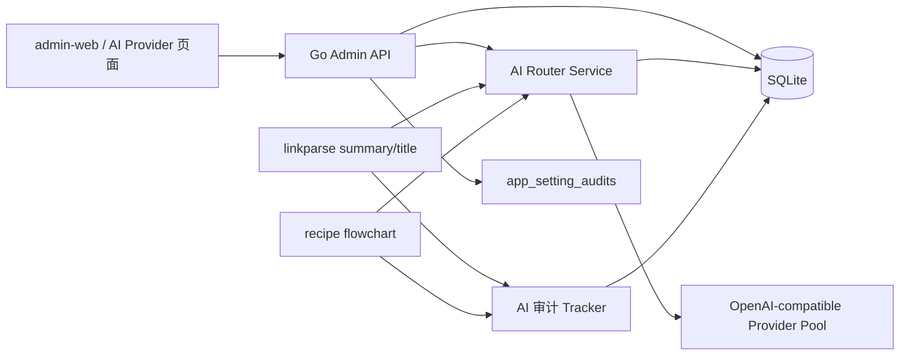

# AI 多 Provider 配置与调度设计方案

## 1. 背景

当前项目已经具备以下 AI 相关基础能力：

- 后端已有 `AI 总结`、`标题精修`、`流程图生成` 三条 AI 调用链路
- 后端已有运行时配置中心、配置加密存储和配置审计
- 后台管理端 `admin-web` 已有独立登录、配置中心和 AI 调用审计页面
- 调用审计表里已经具备 `provider`、`final_provider`、`fallback_used`
  等字段，便于后续扩展多 Provider 观测

但当前实现仍然以“单场景单 Provider 配置”为主，主要限制包括：

- `ai.summary / ai.title / ai.flowchart` 仍是单组
  `base_url + api_key + model + timeout`
- `admin-web` 当前配置中心只适合编辑固定数量的标量字段，不适合维护
  可增删、可排序的 Provider 列表
- AI 调用日志里的 `provider` 仍是固定文案，无法真实区分多个上游
- 业务层虽然已有“AI 失败后回退规则整理”的能力，但还没有“在多个
  AI Provider 间自动切换”的通用调度层

本方案目标是在不破坏现有业务链路的前提下，为 `summary / title /
flowchart` 三个场景补齐：

- `admin-web` 可配置的多 Provider 池
- 运行时热更新的路由策略
- 轮询与失败切换能力
- 更准确的 Provider 级审计和排障信息

## 2. 目标与非目标

### 2.1 目标

- 支持在 `admin-web` 中为每个 AI 场景配置多个 Provider
- 支持 `priority failover` 与 `round robin + failover` 两种调度策略
- 支持运行时热更新，不要求重启后端生效
- 支持对每个 Provider 独立启停、排序、测试和密钥更新
- 保留现有业务级降级逻辑：
  - `summary / title` 在 AI 池全部失败后，仍可回退到规则结果
  - `flowchart` 在 AI 池失败后保持失败，不伪造结果
- 在现有审计表基础上准确记录：
  - 起始尝试的 Provider
  - 最终成功的 Provider
  - 是否发生了 Provider 级切换
  - 每次上游调用的失败原因

### 2.2 非目标

- V1 不做并行竞速请求（hedged requests）
- V1 不做跨机场或跨实例的一致性轮询状态同步
- V1 不做复杂的多租户配额、账单统计和成本中心
- V1 不引入完整的权重路由、A/B 实验平台和策略 DSL
- V1 不改造 `linkparse-sidecar` 的 Provider 路由逻辑，本次只聚焦
  `summary / title / flowchart`

## 3. 当前现状与约束

结合当前仓库实现，存在以下约束：

### 3.1 配置模型仍是标量结构

当前运行时配置读取接口本质上返回的是单个场景的一组标量字段：

- `SummaryAIConfig`
- `TitleAIConfig`
- `FlowchartAIConfig`

这类结构适合单 Provider，不适合表达“一个场景下多个 Provider 节点”。

### 3.2 `admin-web` 通用设置页不适合做可变长列表编辑

当前配置中心的表单模型是“按字段渲染输入框”，适合：

- `string`
- `int`
- `bool`
- `float`

但不适合：

- Provider 节点的增删改
- 列表排序
- 单节点测试
- 局部保留旧密钥

因此多 Provider 配置不建议继续硬塞在当前通用设置页里。

### 3.3 调用审计表已具备复用基础

当前已存在以下表：

- `ai_job_runs`
- `ai_call_logs`
- `app_setting_audits`

这意味着本次设计不需要重做审计底座，重点是把原来写死的
`provider=openai-compatible` 改为真实的逻辑 Provider 标识。

### 3.4 当前部署环境以单实例为主

现阶段项目的后端部署口径仍偏单机、单实例、`SQLite`。这决定了：

- `round robin` 的起始游标可以先放在内存里
- 熔断状态也可以先做内存态
- 不需要一开始就引入 `Redis` 做全局状态同步

如果未来扩展成多实例，再评估把轮询游标和熔断状态外置。

## 4. 方案选型

### 4.1 方案 A：继续复用 `app_runtime_settings`，把 Provider 列表塞进 JSON

做法：

- 保留 `ai.summary / ai.title / ai.flowchart` 三个分组
- 把 `providers_json`、`strategy`、`retry_policy_json` 等字段直接存在
  `app_runtime_settings`

优点：

- 后端改动面最小
- 复用现有配置加密和审计能力最快

缺点：

- 当前通用设置页不适合编辑复杂 JSON
- 敏感字段和非敏感字段混在一个 JSON 里，掩码、局部更新和审计粒度都差
- Provider 列表排序、单项测试、保留旧密钥等交互会很别扭
- 后续如果要做“某个 Provider 最近测试结果”或“单节点启停”，很快会继续
  长出额外补丁逻辑

### 4.2 方案 B：新增结构化路由表和独立的 AI Provider 页面

做法：

- 新增场景级配置表，保存策略与熔断参数
- 新增 Provider 节点表，保存节点列表与密钥
- `admin-web` 新增独立的 `AI Provider` 页面
- 复用现有后台鉴权、审计、加密工具和 AI 调用日志表

优点：

- 模型清晰，能自然表达一个场景下多个 Provider
- 密钥可以按节点单独加密和更新
- 交互上更适合做列表、排序、测试、启停
- 后续扩展新的调度策略、节点状态或测试结果更顺手

缺点：

- 需要新增迁移和专用管理接口
- 后端模块会比纯 JSON 方案稍大

### 4.3 推荐结论

推荐采用方案 B。

原因：

- 这个需求本质上已经不是“多几个配置项”，而是“多节点路由配置”
- 当前仓库已经有后台管理端和 AI 审计体系，继续往结构化方向走更稳
- 如果现在为了省事用 JSON 糊过去，后续实现排序、局部更新和节点测试时，
  仍然要付出二次重构成本

## 5. 总体架构

整体推荐架构如下：



核心思路：

1. 配置管理和运行时调度分开建模
2. 业务模块不再自己构造“唯一 AI client”，而是向 `AI Router`
   请求一个“按场景可路由的调用器”
3. `AI Router` 负责：
   - 读取场景配置
   - 选择 Provider
   - 处理失败切换
   - 维护内存态熔断
   - 把真实命中的 Provider 写入审计
4. `summary / title / flowchart` 继续保留各自的业务级兜底策略

## 6. 模块落位建议

推荐新增和调整的代码落位如下：

```text
backend/internal/
├── admin/
│   └── ...                         # 继续承接后台接口聚合
├── airouter/
│   ├── model.go                    # 场景、Provider、策略模型
│   ├── repository.go               # 路由配置读写
│   ├── service.go                  # 场景配置、测试、审计
│   ├── selector.go                 # priority / round robin 选择器
│   ├── breaker.go                  # 内存熔断状态
│   └── client_openai_compat.go     # OpenAI-compatible 调用适配
├── appsettings/
│   └── ...                         # 保留 B 站 SESSDATA 和通用标量配置
├── audit/
│   └── ...                         # 继续复用任务/调用审计
├── linkparse/
│   └── ...                         # 接入 airouter 代替单 aiClient
└── recipe/
    └── ...                         # flowchart 接入 airouter
```

前端推荐落位：

```text
admin-web/src/
├── api/admin.ts
├── components/ai-routing/
│   ├── SceneStrategyCard.vue
│   ├── ProviderListEditor.vue
│   └── ProviderTestResult.vue
└── pages/
    └── AIProvidersPage.vue
```

设计决策：

- 现有 `配置中心` 页面继续承接通用标量设置
- 多 Provider 路由新增独立页面，不和通用表单混用

## 7. 数据模型设计

### 7.1 `ai_route_scenes`

用途：

- 保存每个 AI 场景的调度策略与熔断参数

建议字段：

| 字段 | 类型 | 说明 |
| --- | --- | --- |
| `scene` | TEXT PK | 场景标识：`summary`、`title`、`flowchart` |
| `enabled` | INTEGER | 是否启用该场景的多 Provider 路由 |
| `strategy` | TEXT | `priority_failover` / `round_robin_failover` |
| `max_attempts` | INTEGER | 单次请求最多尝试次数 |
| `retry_policy_json` | TEXT | 允许切换到下一个节点的错误类型集合 |
| `breaker_failure_threshold` | INTEGER | 连续失败多少次后熔断 |
| `breaker_cooldown_seconds` | INTEGER | 熔断冷却时间 |
| `request_options_json` | TEXT | 场景级请求参数，例如 `stream / temperature / maxTokens` |
| `updated_by_subject` | TEXT | 最近修改人 |
| `updated_at` | TEXT | 最近修改时间 |

建议索引：

- 主键 `scene`

说明：

- `request_options_json` 只承载场景级参数，不承载节点级密钥
- `title` 场景的 `stream / temperature / maxTokens` 放在这里最自然

### 7.2 `ai_route_providers`

用途：

- 保存某个场景下的 Provider 节点列表

建议字段：

| 字段 | 类型 | 说明 |
| --- | --- | --- |
| `id` | TEXT PK | 全局唯一的 Provider ID，审计与日志使用 |
| `scene` | TEXT | 归属场景 |
| `name` | TEXT | 页面展示名 |
| `adapter` | TEXT | V1 固定为 `openai-compatible` |
| `enabled` | INTEGER | 是否启用 |
| `priority` | INTEGER | 优先级，数值越小越靠前 |
| `weight` | INTEGER | 预留字段，V1 暂不生效 |
| `base_url` | TEXT | 上游地址 |
| `api_key_ciphertext` | TEXT | 加密后的 API Key |
| `model` | TEXT | 节点模型 |
| `timeout_seconds` | INTEGER | 节点超时 |
| `extra_json` | TEXT | 预留扩展字段 |
| `updated_by_subject` | TEXT | 最近修改人 |
| `updated_at` | TEXT | 最近修改时间 |

建议索引：

- `(scene, enabled, priority ASC)`
- `(scene, id)`

说明：

- `id` 必须稳定，因为它会进入 `ai_call_logs.provider` 与
  `ai_job_runs.final_provider`
- API Key 只以密文存储，不回显明文

### 7.3 `app_setting_audits`

本次不建议新增独立审计表，继续复用现有 `app_setting_audits`。

建议约定：

- `group_name` 使用：
  - `ai.routing.summary`
  - `ai.routing.title`
  - `ai.routing.flowchart`
- `setting_key` 使用：
  - `ai.routing.summary.scene`
  - `ai.routing.summary.provider.summary-main`
  - `ai.routing.summary.provider.summary-backup`

优点：

- 不重复造审计轮子
- 可以直接沿用现有后台审计页的查询与展示能力

## 8. 场景配置模型

建议 `Admin API` 对外返回的场景配置结构如下：

```json
{
  "scene": "summary",
  "enabled": true,
  "strategy": "priority_failover",
  "maxAttempts": 2,
  "retryOn": [
    "timeout",
    "network",
    "rate_limit",
    "upstream",
    "auth",
    "invalid_response"
  ],
  "breaker": {
    "failureThreshold": 3,
    "cooldownSeconds": 60
  },
  "requestOptions": {
    "temperature": 0.2
  },
  "providers": [
    {
      "id": "summary-main",
      "name": "主总结节点",
      "adapter": "openai-compatible",
      "enabled": true,
      "priority": 10,
      "baseURL": "https://api.example.com/v1",
      "apiKeyMasked": "sk-12...89ab",
      "model": "gpt-4.1-mini",
      "timeoutSeconds": 30
    },
    {
      "id": "summary-backup",
      "name": "备用总结节点",
      "adapter": "openai-compatible",
      "enabled": true,
      "priority": 20,
      "baseURL": "https://backup.example.com/v1",
      "apiKeyMasked": "",
      "model": "deepseek-chat",
      "timeoutSeconds": 35
    }
  ]
}
```

场景定义建议：

| 场景 | 作用 | 当前对应链路 |
| --- | --- | --- |
| `summary` | 菜谱正文总结 | `linkparse` 里的 AI 总结 |
| `title` | 标题精修 | `linkparse` 里的标题清洗 |
| `flowchart` | 步骤图生成 | `recipe/flowchart` |

## 9. 调度策略设计

### 9.1 `priority_failover`

规则：

1. 先按 `priority ASC` 取启用节点
2. 从优先级最高的健康节点开始调用
3. 如果命中可切换错误，则按顺序尝试下一个节点
4. 第一个成功节点即为最终节点

适用场景：

- 希望稳定走主节点
- 只有主节点异常时才切备用
- 适合 `summary` 和 `flowchart`

### 9.2 `round_robin_failover`

规则：

1. 先按 `priority ASC` 得到启用节点列表
2. 使用每个场景一个内存游标，决定本次的起始节点
3. 若起始节点失败，再按环形顺序切下一个
4. 本次请求成功后，下一次请求从新的游标位置开始

实现建议：

- V1 使用单实例内存游标即可
- 不强求进程重启后保序
- 如果未来部署成多实例，再评估把游标搬到 `Redis`

适用场景：

- 希望把流量均匀打散到多个节点
- 适合 `title` 这类调用量更高、单次请求更轻的场景

### 9.3 熔断器

建议为每个 `scene + providerID` 维护内存态熔断状态：

- `consecutiveRetryableFailures`
- `openUntil`

规则：

1. 连续出现可切换错误时累加失败计数
2. 达到 `failureThreshold` 后熔断
3. 熔断期间该节点直接跳过，不参与本次选择
4. `cooldownSeconds` 到期后允许再次试探
5. 任意一次成功调用会重置连续失败计数

说明：

- V1 不持久化熔断状态
- 应用重启后熔断状态清空是可接受的

### 9.4 错误分类与是否切换

推荐默认口径如下：

| 错误类型 | 示例 | 是否默认切下一个节点 |
| --- | --- | --- |
| `timeout` | 上游超时、`context deadline exceeded` | 是 |
| `network` | 连接失败、TLS/握手失败 | 是 |
| `rate_limit` | `429` | 是 |
| `auth` | `401/403`，节点密钥失效 | 是 |
| `upstream` | `5xx`、网关错误 | 是 |
| `invalid_response` | 空响应、JSON 结构异常 | 是 |
| `bad_request` | 明显请求参数非法 | 否，默认停止 |
| `business_validation` | 本地业务校验失败 | 否，默认停止 |

说明：

- 实际是否允许切换，最终由 `retryOn` 配置决定
- 默认不建议对 `bad_request` 重试，避免无意义烧额度

### 9.5 `fallbackUsed` 的语义

建议统一口径如下：

- 起始节点第一次就成功：`fallbackUsed = false`
- 起始节点失败，后续备用节点成功：`fallbackUsed = true`
- AI 池全部失败，最终退回规则/启发式结果：`fallbackUsed = true`

这样后台看板中的 `fallbackUsed` 同时表达两层含义：

1. 发生了 Provider 级切换
2. 或发生了业务级降级

## 10. 业务链路接入方案

### 10.1 `summary`

当前行为：

- 调用一个 `summary aiClient`
- 失败后回退到启发式整理

改造建议：

- 由 `AI Router` 负责执行多节点尝试
- 成功时返回最终 Provider 的模型与节点 ID
- 所有节点都失败时，继续沿用现有启发式整理

### 10.2 `title`

当前行为：

- 调用一个 `title aiClient`
- 失败时继续保留规则清洗后的标题

改造建议：

- 场景级配置承接 `stream / temperature / maxTokens`
- Provider 池只负责节点选择
- AI 池全部失败时，保留当前规则标题，不中断预览链路

### 10.3 `flowchart`

当前行为：

- 调用一个 `flowchartClient`
- 无 AI 级降级结果，失败即任务失败

改造建议：

- 由 `AI Router` 执行多节点尝试
- 最终成功则记录真实 Provider
- 全部失败保持失败，不生成伪结果

## 11. 审计与观测口径

### 11.1 `ai_job_runs`

延续现有表结构，不强制新增字段。

写入规则建议：

- `final_provider` 写最终成功节点 ID，或写 `rule / heuristic`
- `final_model` 写最终成功模型
- `fallback_used` 按第 9.5 节口径写入
- `meta_json` 增加：
  - `route_strategy`
  - `attempt_count`
  - `started_provider`
  - `scene`

### 11.2 `ai_call_logs`

延续现有表结构，但要改变 `provider` 的写法：

- 不再写死 `openai-compatible`
- 改为写真实的逻辑 Provider ID，例如：
  - `summary-main`
  - `summary-backup`
  - `title-rotor-a`

`meta_json` 建议补充：

- `scene`
- `route_strategy`
- `attempt`
- `provider_adapter`
- `is_fallback_attempt`
- `skipped_by_breaker`
- `breaker_open_until`

### 11.3 与现有 `linkparse-sidecar` 口径保持一致

当前 sidecar 已有：

- `providerRequested`
- `providerUsed`

AI 路由建议继续沿用相似心智模型：

- 起始命中的节点类似 `providerRequested`
- 最终成功节点类似 `providerUsed`

这样后台在看 AI 路由与 sidecar 路由时，观测口径更统一。

## 12. 后台接口设计

推荐新增以下接口：

### 12.1 查询场景列表

`GET /api/admin/ai-routing/scenes`

返回：

- 场景摘要
- 策略
- 启用节点数
- 最近修改时间

### 12.2 查询单个场景详情

`GET /api/admin/ai-routing/scenes/{scene}`

返回：

- 场景级策略
- Provider 列表
- 掩码后的 API Key
- 最近测试结果摘要

### 12.3 保存场景配置

`PUT /api/admin/ai-routing/scenes/{scene}`

建议按“整场景覆盖保存”处理，便于：

- 排序变更
- 删除节点
- 批量启停

请求示例：

```json
{
  "enabled": true,
  "strategy": "priority_failover",
  "maxAttempts": 2,
  "retryOn": ["timeout", "network", "rate_limit", "upstream", "auth"],
  "breaker": {
    "failureThreshold": 3,
    "cooldownSeconds": 60
  },
  "requestOptions": {
    "temperature": 0.2
  },
  "providers": [
    {
      "id": "summary-main",
      "name": "主总结节点",
      "adapter": "openai-compatible",
      "enabled": true,
      "priority": 10,
      "baseURL": "https://api.example.com/v1",
      "apiKey": "sk-xxx",
      "clearApiKey": false,
      "model": "gpt-4.1-mini",
      "timeoutSeconds": 30
    }
  ]
}
```

密钥处理规则建议：

- `apiKey` 为空且 `clearApiKey=false`：保留旧值
- `apiKey` 非空：更新为新值
- `clearApiKey=true`：清空旧值

### 12.4 测试场景草稿

`POST /api/admin/ai-routing/scenes/{scene}/test`

用途：

- 支持“未保存先测试”
- 支持“只保留一个节点做单节点测试”
- 支持返回每次尝试的详情

返回示例：

```json
{
  "ok": true,
  "message": "route test succeeded",
  "finalProvider": "summary-backup",
  "finalModel": "deepseek-chat",
  "attempts": [
    {
      "providerId": "summary-main",
      "status": "failed",
      "httpStatus": 429,
      "errorType": "rate_limit",
      "latencyMs": 842
    },
    {
      "providerId": "summary-backup",
      "status": "success",
      "httpStatus": 200,
      "latencyMs": 915
    }
  ]
}
```

## 13. `admin-web` 页面设计

推荐在后台新增独立页面：`AI Provider`

页面结构建议：

### 13.1 场景切换

- `AI 总结`
- `标题精修`
- `流程图生成`

### 13.2 场景策略卡片

展示并编辑：

- 是否启用
- 路由策略
- 最大尝试次数
- 熔断阈值
- 熔断冷却时间
- 可切换错误类型
- 场景级请求参数

### 13.3 Provider 列表编辑器

每个节点支持：

- 启用/停用
- 名称
- Base URL
- Model
- Timeout
- API Key 更新/清空
- 优先级排序
- 单节点测试

### 13.4 页面级动作

- 测试当前草稿
- 保存当前场景
- 查看最近测试结果
- 查看审计记录

设计决策：

- 不建议把这套交互继续塞进现有 `配置中心`
- `配置中心` 保留通用设置，`AI Provider` 负责多节点路由

## 14. 兼容性与迁移策略

为了避免一次性切换风险，建议采用以下兼容顺序：

### 14.1 运行时读取优先级

1. 新的 `ai_route_scenes + ai_route_providers`
2. 现有 `app_runtime_settings` 里的旧单 Provider 配置
3. 启动时环境变量

这样可以实现：

- 新功能未上线前，现网行为完全不变
- 新页面先只配置某个场景，其他场景仍走旧逻辑
- 回滚时只需停用新场景配置，立即退回旧链路

### 14.2 场景兼容建议

- `summary`
  - 兼容旧 `AI_BASE_URL / AI_API_KEY / AI_MODEL / AI_TIMEOUT_SECONDS`
- `title`
  - 兼容旧 `AI_TITLE_*`
  - 若旧标题专用配置为空，可继续沿用当前“回退到 summary 配置”的口径
- `flowchart`
  - 兼容旧 `AI_FLOWCHART_*`
  - 若旧 `baseURL / apiKey` 为空，保留当前回退到通用 AI 配置的口径

### 14.3 旧配置页面处理

在新页面正式上线后：

- 旧 `ai.summary / ai.title / ai.flowchart` 通用配置页建议标记为“兼容模式”
- 页面上明确提示：若场景已启用新的多 Provider 路由，旧配置只作为兜底源

## 15. 分阶段实施建议

### Phase 1：后端配置与测试接口

- 新增 `airouter` 模块
- 新增路由配置表迁移
- 新增管理接口：
  - 查询场景
  - 查询详情
  - 保存
  - 测试草稿
- 复用现有审计表记录配置变更

### Phase 2：运行时调度接入

- `summary` 接入 `AI Router`
- `title` 接入 `AI Router`
- `flowchart` 接入 `AI Router`
- 调整 `ai_call_logs.provider` 为真实 Provider ID
- 在 `meta_json` 里补充 attempt 与 strategy 信息

### Phase 3：`admin-web` 页面与兼容收口

- 新增 `AI Provider` 页面
- 补齐场景测试结果展示
- 对旧单 Provider 配置页加兼容提示
- 补齐 README 与运维文档

## 16. 风险与注意事项

### 16.1 成本上升

多节点切换会带来额外调用成本。

控制建议：

- 默认 `maxAttempts=2`
- 默认不对 `bad_request` 重试
- 标题精修保持低 `maxTokens`

### 16.2 不同 Provider 输出风格不一致

不同模型可能导致：

- 标题风格变化
- 总结字段粒度变化
- 流程图图片风格差异

控制建议：

- 同一场景尽量选输出风格接近的模型
- 在后台明确区分场景，不要跨场景混用节点

### 16.3 单实例内存态轮询不保证跨实例一致

当前这是可接受的。

如果未来变成多实例：

- 轮询游标与熔断状态再外置到 `Redis`

### 16.4 `flowchart` 没有业务级兜底

这一点要在文档和后台页面里明确表达：

- `flowchart` 可以做 Provider 级切换
- 但 AI 池全部失败后仍然是失败，不会像 `summary / title` 一样回退到规则结果

## 17. 结论

本需求不建议继续沿用“单场景单配置”的思路做补丁，而应升级为：

- 场景级路由策略
- Provider 节点池
- 后台专用编辑页面
- 统一的 Provider 级调度与审计口径

推荐落地路径是：

1. 新增 `ai_route_scenes + ai_route_providers`
2. 引入 `airouter` 运行时调度模块
3. `summary / title / flowchart` 三条链路逐步接入
4. `admin-web` 新增独立 `AI Provider` 页面
5. 保留旧环境变量与旧运行时配置作为兼容兜底

这样可以在尽量少打扰现有业务链路的前提下，把“多 API 配置 + 轮询 /
失败切换”做成后续可持续维护的正式能力，而不是一次性的局部补丁。
