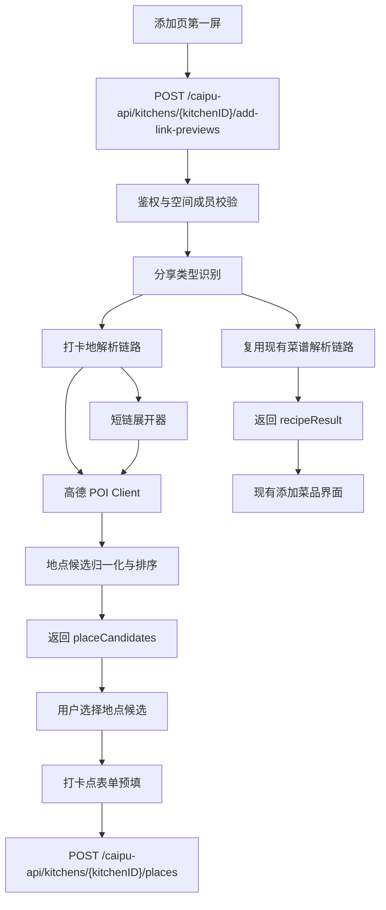

# 分享链接智能添加产品设计（V1.1）

修改时间：2026-06-24 15:30:00 +0800 CST
适用范围：`caipu-miniapp` 添加入口、打卡点模式、菜品新增、微信小程序前端、Go 后端
调研基础：`scripts/probe-meituan-place-link.mjs` 美团 / 大众点评分享文案与高德 POI
探测结果

**V1.1 变更**：菜品添加入口也采用与打卡点相同的智能识别第一屏交互，提供统一的用户体验

## 1. 结论

V1 建议做成“从分享链接添加”的智能填充能力，而不是自动创建菜品或打卡点。

推荐主链路：

1. 用户进入添加第一屏，点击 `点击粘贴分享链接`。
2. 系统读取剪贴板或让用户粘贴分享文案 / 链接，并展示 `内容解析中`。
3. 后端统一识别内容类型：菜谱或打卡地。
4. 如果是菜谱，复用现有菜谱解析能力，进入现有添加菜品界面并预填菜谱名等字段。
5. 如果是打卡地，解析名称、地址、电话、来源链接和美团 `poiId`，再调用高德
   WebService POI 搜索补全候选地点、经纬度、评分、人均和图片。
6. 前端展示 1 到 3 个地点候选卡片，用户选择后预填现有打卡点表单。
7. 用户确认或手动修正后，继续走现有菜品或打卡点保存接口。

设计原则是“自动填 80%，最后一步由用户确认”。本能力不做爬虫验证码绕过，不依赖
美团登录态，不把高德 Key 下发给小程序端，也不破坏现有菜谱解析接口契约。

## 2. 背景与问题

当前打卡点已经支持手动创建、编辑、删除、想去 / 去过、地图选点和图片上传。但用户
从美团 / 大众点评发现一家店时，仍需要手动复制名称、地址、价格、图片和链接，录入
成本偏高。

样例分享文案：

```text
【旺记碳烤肥牛·烤肉大排档（北滘悦然里店）】快来试试这家餐厅吧！
【地址：顺德区人昌路2号（华美达和悦然里中间停车场）】
【电话：17303028852】@美团 http://dpurl.cn/4zWiEohz
```

调研结论：

- 分享文案可稳定提取店名、地址、电话、来源链接。
- `dpurl.cn` 可展开并拿到美团 `poiId` 和 `poiIdEncrypt`。
- 无登录态 / cookie 时，美团真实移动店铺页会进入身份核实页，不能稳定获取美团图片、
  评分、人均。
- 高德 POI 可以补全图片、评分、人均、经纬度，但候选可能出现商场、停车场、同品牌
  异地门店或同商圈相邻餐厅。

因此 V1 的产品形态应是“候选确认 + 表单预填”，而不是“链接导入即创建”。

## 3. 目标与非目标

### 3.1 目标

- 降低新增打卡点时的录入成本。
- 支持从美团 / 大众点评分享文案中提取基础字段。
- 用地图 POI 补全位置、图片、评分、人均等展示信息。
- 保持用户可控，避免错误地点静默落库。
- 与现有 `places` 数据模型和新增表单兼容，尽量不做大规模迁移。

### 3.2 非目标

- 不绕过美团 / 大众点评验证码、风控和登录限制。
- 不承诺获取美团官方评分、人均和宣传图。
- 不做后台批量抓取、店铺库沉淀或点评内容聚合。
- 不在 V1 自动创建打卡点。
- 不让前端直接持有高德 WebService Key。

## 4. 用户交互设计

### 4.1 添加页第一屏布局

**V1.1 统一设计**：打卡点和菜品添加都采用相同的智能识别第一屏交互。

#### 4.1.1 打卡点添加第一屏

新增打卡点时，第一屏先展示”添加方式选择”，再进入具体表单。该布局不直接展示完整
表单字段，先让用户在”粘贴识别”和”手动填写”之间做选择。

建议布局：

```text
添加打卡点

[ 点击粘贴分享链接 ]
  支持大众点评 / 美团 / 小红书
  自动提取地点 / 食谱信息

支持解析的内容与平台

[ 打卡地 ]
  大众点评 / 美团

[ 菜谱灵感 ]
  小红书 / 抖音

[ 手动填写信息 ]
```

#### 4.1.2 菜品添加第一屏（V1.1 新增）

新增菜品时，也采用相同的第一屏交互模式，提供统一的用户体验。

建议布局：

```text
添加菜品

[ 点击粘贴菜谱链接 ]
  支持小红书、B站
  自动提取菜名、食材、步骤

支持解析的平台

[ 小红书 ]
  图文菜谱 / 视频教程

[ B站 ]
  视频字幕提取 / 菜谱整理

[ 手动填写菜谱信息 ]
```

#### 4.1.3 布局规则（统一）

- 顶部主区域是主要操作入口，点击后读取剪贴板或进入粘贴输入。
- 中部展示能力卡片，用于解释当前支持的平台和内容类型。
  - 打卡点：展示 `打卡地` 和 `菜谱灵感` 两类
  - 菜品：展示 `小红书`、`B站` 两个平台（V1.1 暂不支持抖音）
- 底部提供 `手动填写信息`，用户不想识别或识别失败时可直接进入原手动表单。
- 该第一屏仅在新增模式展示；编辑模式仍直接进入编辑表单。
- 菜品和打卡点的智能识别面板完全独立，互不干扰。

### 4.2 入口行为

点击 `点击粘贴分享链接`：

- 若剪贴板中存在可识别分享文案或链接，直接带入识别输入并进入内容解析中状态。
- 若剪贴板为空或读取失败，展示粘贴输入框。
- 若识别出美团 / 大众点评打卡地，进入打卡点候选链路。
- 若识别出小红书 / 抖音菜谱内容，进入菜谱灵感链路；V1 可先提示“菜谱灵感暂按现有
  添加菜谱入口处理”。
- 若无法判断类型，展示平台选择或提示用户手动填写。

入口规则：

- 支持用户手动粘贴，也支持点击 `读取剪贴板` 后自动填入识别框。
- 微信小程序读取剪贴板需由用户点击触发，失败时允许手动粘贴。
- 当用户从第一屏进入手动填写后，展示现有完整 `PlaceEditSheet` 表单。
- 当用户已在手动表单中填写内容后再次触发识别，需要提示“识别结果会覆盖部分字段，
  是否继续”。

### 4.3 内容解析中状态

用户点击主入口并成功读取到剪贴板内容后，立即展示解析中反馈。该状态用于承接外部
接口耗时，避免用户误以为点击无响应。

```text
内容解析中
正在提取分享链接信息...

（加载中）
```

动态文案规则：

| 阶段 | 文案 |
| --- | --- |
| 刚读取剪贴板 | `正在提取分享链接信息...` |
| 判断为打卡地 | `正在提取地点信息...` |
| 查询地图 POI | `正在匹配可能的地点...` |
| 判断为菜谱 | `正在提取菜谱信息...` |
| 图片或补充信息处理中 | `正在整理图片和补充信息...` |

展示规则：

- 解析中状态展示加载动画和当前阶段文案。
- 解析期间不展示完整表单，避免用户在字段尚未返回时误操作。
- 若 3 秒内未完成，可补充弱提示：`可能需要几秒，请稍等`。
- 若接口超时或失败，展示失败原因和 `手动填写信息` 入口。

### 4.4 解析结果分流

智能解析完成后，根据识别类型进入不同结果页。

```text
分享链接
  -> 内容解析中
    -> 菜谱结果
      -> 打开现有添加菜品界面，并填入菜谱名 / 链接 / 图片等字段
    -> 打卡地结果
      -> 展示推测地点候选
      -> 用户选择候选
      -> 打开打卡点表单并填入地点信息
    -> 部分成功
      -> 用已提取字段进入对应手动表单
    -> 失败
      -> 提示手动填写
```

菜谱结果：

- 直接进入现有 `添加菜品` 界面。
- 至少填入菜谱名和来源链接。
- 如果解析到图片、摘要或平台信息，按现有添加菜品字段继续预填。
- 用户仍需点击保存，解析完成不自动创建菜品。

打卡地结果：

- 不直接进入保存表单，先展示根据分享文案和地图查询推测出的地点候选。
- 用户选择候选后，再进入打卡点表单并预填名称、地址、经纬度、费用、来源和图片。
- 如果只有一个高置信候选，也仍展示候选卡，由用户点击确认。

### 4.5 识别输入兜底

```text
从分享链接添加
[ 粘贴美团 / 大众点评分享文案或链接                         ]

[读取剪贴板] [开始识别]
```

识别中状态：

```text
正在识别地点...
```

成功后展示候选：

```text
找到 3 个可能的地点

┌ 图片 ┐ 旺记碳烤肥牛(多丰喜市园区北滘店)
│      │ 人昌路2号(华美达广场旁)
└──────┘ 评分 4.7 · ¥79/人
         名称接近 · 地址匹配 · 餐饮类目
         [使用这个]

┌ 图片 ┐ 彩虹大排档(悦然里店)
│      │ 北滘新城人昌路3号...
└──────┘ 评分 4.5 · ¥88/人
         同商圈 · 餐饮类目
         [使用这个]

[没有合适的，手动填写]
```

### 4.6 候选卡片字段

候选卡片展示字段：

| 字段 | 来源 | 说明 |
| --- | --- | --- |
| 封面图 | 高德 `photos[0]` | 图片加载失败时展示占位 |
| 名称 | 高德 POI `name` | 优先展示候选真实名称 |
| 地址 | 高德 POI `address` | 超过两行截断 |
| 评分 | 高德 `biz_ext.rating` | 没有则隐藏 |
| 人均 | 高德 `biz_ext.cost` | 显示为 `¥79/人` |
| 匹配理由 | 后端排序解释 | 如 `名称接近`、`地址匹配`、`餐饮类目` |
| 电话 | 高德或分享文案 | 可折叠或小字展示 |

### 4.7 使用候选后的预填规则

点击 `使用这个` 后，不立即保存，只填入新增表单。

| 表单字段 | 预填来源 | 规则 |
| --- | --- | --- |
| 名称 | 高德候选名称，兜底分享文案名称 | 用户可改 |
| 类型 | 高德类目 | 餐饮类目填 `food`，景点类填 `attraction`，其他填 `other` |
| 地址 | 高德候选地址，兜底分享文案地址 | 用户可改 |
| 经纬度 | 高德候选 `location` | 用于打开地图 |
| 费用 | 高德 `cost` | 格式化为 `¥79/人` |
| 来源 | 分享来源 | 美团文案填 `meituan`，大众点评填 `dianping` |
| 来源链接 | 分享链接 | 保留原始短链即可 |
| 图片 | 高德候选图片 | 默认取前 3 张，最多不超过现有 `MAX_PLACE_IMAGES=6` |
| 状态 | 当前表单默认值 | 默认 `want` |
| 备注 | 不自动填 | 可追加“来自分享链接识别”不推荐，避免噪音 |
| 标签 | 可选 | V1 可不自动填 |

预填完成后在表单顶部显示轻量提示：

```text
已根据分享链接填入，可继续修改后保存
```

### 4.8 分支与异常

| 场景 | 交互 |
| --- | --- |
| 唯一高置信候选 | 展示顶部候选卡，按钮文案 `使用这个地点`；不自动保存 |
| 多个相近候选 | 展示 Top 3，让用户选择 |
| 只解析出文案，无 POI | 直接填入名称、地址、电话和来源链接，图片 / 坐标留空 |
| 完全无法解析 | 显示“没识别出来，可以手动填写”，保留输入内容 |
| 高德接口超时 | 展示“地图信息暂时没补全”，允许仅使用文案字段 |
| 菜谱解析成功 | 进入现有添加菜品界面并预填菜谱名等字段 |
| 打卡地解析成功 | 展示地点候选，用户选择后再预填打卡点表单 |
| 用户已有手填内容 | 覆盖前确认，已填图片不自动清空，除非用户选择覆盖 |
| 图片加载失败 | 候选卡降级为无图卡，保存时跳过失败图片 |

### 4.9 状态机

```text
idle
  -> inputting
  -> parsing
  -> recipeResult
  -> placeCandidates
  -> applied
  -> saving
  -> saved

parsing
  -> partial
  -> failed

placeCandidates
  -> manual
  -> applied
```

状态说明：

- `idle`：未打开识别区域。
- `inputting`：用户粘贴或读取剪贴板。
- `parsing`：展示内容解析中状态，调用后端预览接口。
- `recipeResult`：菜谱解析完成，进入现有添加菜品界面并预填字段。
- `placeCandidates`：打卡地点解析完成，有地点候选，需要用户选择。
- `partial`：只得到基础字段，直接预填。
- `applied`：已应用到表单，但未保存。
- `manual`：用户放弃候选，回到手填。

## 5. 后端设计

### 5.1 总体架构

**V1.1 调整**：菜品和打卡点都有独立的智能添加第一屏，但后端接口设计保持统一。

新增一个独立的”智能添加解析”服务，作为添加页第一屏的统一入口。该服务负责识别
分享内容类型，并在内部复用现有菜谱解析能力或新建打卡地解析能力。

结论：

- 不建议直接改造或破坏现有 `POST /caipu-api/link-parsers/preview`、
  `POST /caipu-api/link-parsers/bilibili`、`POST /caipu-api/link-parsers/xiaohongshu`
  的接口契约；这些接口继续服务现有添加菜品链路。
- 新增统一智能添加接口 `POST /caipu-api/kitchens/{kitchenID}/add-link-previews`，
  负责”菜谱 / 打卡地”类型识别和结果分流。
- **V1.1**：前端菜品添加也使用该统一接口，只是入口面板和交互独立。
- 当识别为菜谱时，统一接口内部调用现有菜谱解析服务并转换为 `recipeDraft`。
- 当识别为打卡地时，统一接口调用美团 / 大众点评分享解析与高德 POI 候选排序。
- 保存仍分别复用现有菜品保存链路和现有打卡点 `place.Create` 链路。



### 5.2 API 契约

新增接口：

```http
POST /caipu-api/kitchens/{kitchenID}/add-link-previews
Authorization: Bearer <token>
Content-Type: application/json
```

请求：

```json
{
  "text": "【旺记碳烤肥牛·烤肉大排档（北滘悦然里店）】...",
  "city": "佛山",
  "latitude": 22.929808,
  "longitude": 113.218528,
  "limit": 3
}
```

字段说明：

| 字段 | 必填 | 说明 |
| --- | --- | --- |
| `text` | 是 | 分享文案或 URL，建议限制 2000 字以内 |
| `city` | 否 | 城市名；默认可用用户最近位置、空间城市或空字符串 |
| `latitude` / `longitude` | 否 | 用户当前位置，用于后续距离排序；V1 可先不启用 |
| `limit` | 否 | 返回候选数，默认 3，最大 5 |

响应：

```json
{
  "previewId": "plp_xxx",
  "status": "place_candidates",
  "contentType": "place",
  "source": "meituan",
  "extracted": {
    "name": "旺记碳烤肥牛·烤肉大排档（北滘悦然里店）",
    "address": "顺德区人昌路2号（华美达和悦然里中间停车场）",
    "phone": "17303028852",
    "sourceUrl": "http://dpurl.cn/4zWiEohz",
    "poiId": "1280169388",
    "poiIdEncrypt": "..."
  },
  "draft": {
    "name": "旺记碳烤肥牛·烤肉大排档（北滘悦然里店）",
    "type": "food",
    "address": "顺德区人昌路2号（华美达和悦然里中间停车场）",
    "latitude": 0,
    "longitude": 0,
    "price": "",
    "source": "meituan",
    "sourceUrl": "http://dpurl.cn/4zWiEohz",
    "imageUrls": [],
    "status": "want",
    "tags": [],
    "note": ""
  },
  "candidates": [
    {
      "candidateId": "amap:B0JUN7FVJK",
      "provider": "amap",
      "providerPoiId": "B0JUN7FVJK",
      "name": "旺记碳烤肥牛(多丰喜市园区北滘店)",
      "type": "food",
      "address": "人昌路2号(华美达广场旁)",
      "latitude": 22.927688,
      "longitude": 113.218424,
      "phone": "13760678135",
      "price": "¥79/人",
      "rating": "4.7",
      "imageUrls": [
        "https://..."
      ],
      "matchScore": 219,
      "matchReasons": [
        "名称接近",
        "地址匹配",
        "餐饮类目"
      ],
      "placeDraft": {
        "name": "旺记碳烤肥牛(多丰喜市园区北滘店)",
        "type": "food",
        "address": "人昌路2号(华美达广场旁)",
        "latitude": 22.927688,
        "longitude": 113.218424,
        "price": "¥79/人",
        "source": "meituan",
        "sourceUrl": "http://dpurl.cn/4zWiEohz",
        "imageUrls": [
          "https://..."
        ],
        "status": "want",
        "tags": [],
        "note": ""
      }
    }
  ],
  "warnings": [
    {
      "code": "candidate_requires_confirmation",
      "message": "识别结果可能存在同商圈或同品牌门店偏差，请确认后保存"
    }
  ]
}
```

`status` 取值：

| 值 | 说明 |
| --- | --- |
| `parsing` | 前端本地状态，后端通常不返回；用于展示内容解析中 |
| `place_candidates` | 打卡地解析成功，有 POI 候选 |
| `recipe_result` | 菜谱解析成功，可进入现有添加菜品界面 |
| `partial` | 仅解析出基础字段，需要进入对应手动表单 |
| `failed` | 无法解析 |

当返回菜谱结果时，响应可使用同一个接口结构：

```json
{
  "previewId": "plp_xxx",
  "status": "recipe_result",
  "contentType": "recipe",
  "source": "xiaohongshu",
  "recipeDraft": {
    "title": "番茄牛肉饭",
    "link": "https://...",
    "images": [
      "https://..."
    ],
    "note": ""
  },
  "warnings": []
}
```

V1 后端可以先只完整实现 `contentType=place`，但接口设计应允许前端用同一个入口承接
菜谱和打卡地两类结果。

### 5.3 与现有菜谱解析接口的关系

当前后端已有菜谱解析相关接口：

| 接口 | 当前职责 | 是否调整 |
| --- | --- | --- |
| `POST /caipu-api/link-parsers/preview` | 菜谱链接轻量预览 | 不改契约 |
| `POST /caipu-api/link-parsers/bilibili` | B 站菜谱解析 | 不改契约 |
| `POST /caipu-api/link-parsers/xiaohongshu` | 小红书菜谱解析 | 不改契约 |

原因：

- 现有添加菜品界面已经依赖这些接口，直接改会带来回归风险。
- 新增入口需要同时承接菜谱和打卡地，语义上已经超过 `link-parsers` 的单一菜谱预览。
- 保持旧接口稳定，可以让新智能入口逐步灰度；出现问题时仍可回退到旧添加菜品流程。

统一智能添加接口需要新增的能力：

| 能力 | 说明 |
| --- | --- |
| 类型识别 | 根据分享文案、URL 域名和提取字段判断 `recipe` / `place` |
| 菜谱适配 | 识别为菜谱时调用现有 `linkparse.Service`，输出统一 `recipeDraft` |
| 打卡适配 | 识别为打卡地时走高德 POI 候选，输出 `placeDraft` / `candidates` |
| 统一状态 | 输出 `recipe_result`、`place_candidates`、`partial`、`failed` |

### 5.4 服务分层

建议新增包：

```text
backend/internal/addpreview/
├── handler.go
├── service.go
├── model.go
├── classifier.go
├── recipe_adapter.go
├── place_parser.go
├── share_parser.go
├── meituan.go
├── amap_client.go
├── ranker.go
└── service_test.go
```

职责：

| 模块 | 职责 |
| --- | --- |
| `handler.go` | 鉴权后的请求解析、响应输出 |
| `service.go` | 编排类型识别、菜谱适配、打卡地解析、候选排序 |
| `classifier.go` | 判断分享内容类型：菜谱、打卡地或未知 |
| `recipe_adapter.go` | 复用现有菜谱解析服务并转换为统一 `recipeDraft` |
| `place_parser.go` | 组织打卡地解析流程 |
| `share_parser.go` | 从复制文案提取名称、地址、电话、URL、来源 |
| `meituan.go` | 展开 `dpurl.cn`，提取 `poiId` / `poiIdEncrypt` |
| `amap_client.go` | 调用高德 WebService POI 搜索 |
| `ranker.go` | 候选合并、打分、解释 |

V1 不建议把它塞进现有 `place` 包，避免 CRUD 逻辑和外部服务解析逻辑混在一起。

### 5.5 高德 POI 调用

基于调研脚本和高德 WebService 关键字搜索能力，V1 使用：

```http
GET https://restapi.amap.com/v3/place/text
```

参数建议：

| 参数 | 建议值 | 说明 |
| --- | --- | --- |
| `key` | 后端配置 | 不下发前端 |
| `keywords` | 多轮关键词 | 店名、清洗店名、店名 + 地址、电话、地址 |
| `city` | 用户传入或默认 | 如 `佛山` |
| `citylimit` | `true` | 尽量限制城市 |
| `offset` | `10` | 单轮最多取 10 条；官方单页上限不应超过 25 |
| `page` | `1` | V1 只查第一页 |
| `extensions` | `all` | 返回评分、人均、图片等扩展字段 |
| `output` | `json` | JSON 响应 |

关键词顺序：

1. 原始店名。
2. 清洗后的店名。
3. 去掉括号分店名后的主体店名。
4. 店名 + 地址。
5. 电话。
6. 地址。

为避免 QPS 限制，建议：

- 单次预览最多 4 轮高德查询。
- 每轮间隔 300 到 500ms。
- 接口整体超时 6 到 8 秒。
- 高德失败时降级为 `partial`，不阻塞手动添加。

### 5.6 候选排序逻辑

候选排序需要可解释，不能只取高德第一条。

建议打分维度：

| 维度 | 说明 |
| --- | --- |
| 名称相似度 | 分享店名与 POI 名称相似 |
| 地址相似度 | 分享地址与 POI 地址相似 |
| 类目 | `餐饮服务` 加分，停车场、商场、汽车服务等降分 |
| 电话一致 | 如果分享电话与 POI 电话一致，大幅加分 |
| 分店 / 商圈词 | 如 `北滘`、`悦然里`、`华美达` |
| 门牌 / 道路 | 如 `人昌路2号`、`人昌路` |
| 图片可用 | 有图片小幅加分 |
| 评分可用 | 有评分小幅加分 |

返回前需要合并不同关键词命中的同一 POI，并保留 `sourceKeywords` 便于调试。

候选阈值建议：

| 阈值 | 产品处理 |
| --- | --- |
| 第一名分数明显高于第二名 40 分以上 | 可置顶显示“推荐” |
| 第一名与第二名差距小于 40 分 | 展示多个候选，不标“已确定” |
| 第一名低于 120 分 | 降级提示“可能不准确” |
| 无餐饮候选但有商场候选 | 不自动套用商场，提示手动填写 |

### 5.7 配置与密钥

新增后端环境变量或运行时配置：

```text
AMAP_PLACE_PREVIEW_ENABLED=true
AMAP_WEB_SERVICE_KEY=...
AMAP_PLACE_PREVIEW_DEFAULT_CITY=佛山
AMAP_PLACE_PREVIEW_TIMEOUT_SECONDS=8
AMAP_PLACE_PREVIEW_MAX_ATTEMPTS=4
AMAP_PLACE_PREVIEW_QPS_DELAY_MS=400
```

建议先用环境变量落地，后续如需要后台可视化，再纳入现有 Runtime Settings。

密钥策略：

- 高德 Key 只保存在后端环境变量或加密运行时配置中。
- 日志中禁止打印完整 Key。
- 错误日志只记录高德 `info`、HTTP 状态、耗时、关键词摘要，不记录用户完整分享文案。

### 5.8 缓存与限流

V1 可以先做内存级短缓存，降低重复点击成本。

缓存 Key：

```text
sha256(normalizedText + city)
```

缓存内容：

- `extracted`
- `candidates`
- `warnings`
- 创建时间

策略：

- TTL：10 分钟。
- 单用户每分钟最多 10 次预览。
- 单空间每分钟最多 30 次预览。
- 失败结果可缓存 1 分钟，避免连续重试打满外部接口。

如果后续需要跨实例部署，再考虑 SQLite 表或 Redis。V1 单机内存缓存足够。

### 5.9 图片处理策略

候选预览阶段可以直接返回高德图片 URL，用于用户确认。但保存时建议避免长期依赖
高德图片外链。

推荐 V1.1 增强：

- 用户选择候选并保存前，由后端复用现有 `upload.Service.SaveRemoteImage` 将前 1 到
  3 张候选图片镜像到自己的 `/uploads/`。
- 镜像失败不阻塞保存，只跳过失败图片。
- 小程序最终展示自有上传域名，避免高德外链 HTTP、域名白名单和防盗链风险。

V1 若先不做镜像，至少要接受以下风险：

- 部分高德图片是 `http://store.is.autonavi.com/...`，微信小程序线上可能无法加载。
- 外链图片可用性不由本项目控制。
- 后续需要配置小程序 `downloadFile` / 图片域名白名单。

### 5.10 数据模型影响

现有 `places` 表已经能承接大部分预填字段：

| 现有字段 | 用法 |
| --- | --- |
| `name` | 候选名称 |
| `type` | `food` / `attraction` / `other` |
| `address` | 候选地址 |
| `latitude` / `longitude` | 高德坐标 |
| `price` | 人均价，如 `¥79/人` |
| `source` | `meituan` / `dianping` |
| `source_url` | 分享链接 |
| `image_urls_json` | 候选图片或镜像图片 |
| `status` | 默认 `want` |

V1 不要求迁移数据库。

可选增强字段，暂不建议 V1 强行增加：

| 字段 | 价值 | V1 建议 |
| --- | --- | --- |
| `external_provider` | 记录来源 POI 平台 | 可放后续 |
| `external_poi_id` | 记录高德 POI ID | 可放后续 |
| `rating` | 展示高德评分 | 可先不入库，只用于候选预览 |
| `phone` | 保存电话 | 当前 Place 无电话字段，V1 可不保存 |

如果产品希望详情页长期展示评分 / 人均 / 电话，再另起一次模型扩展，不混入本次 V1。

### 5.11 安全与合规

- 不绕过第三方验证码、风控和登录态限制。
- 不抓取点评内容、用户评论或商户详情页隐私数据。
- 仅使用用户主动粘贴的分享文案和地图开放接口。
- 分享文案属于用户输入，后端需要限制长度并清理控制字符。
- 外部 URL 展开只允许 `http` / `https`，设置超时和最大响应体，避免 SSRF 风险。
- 短链展开应拒绝内网地址、`localhost`、`169.254.169.254` 等特殊地址。

## 6. 前端实现建议

### 6.1 文件影响

**V1.1 调整**：菜品和打卡点分别有独立的智能添加面板。

建议新增：

```text
utils/add-preview-api.js
utils/add-preview-store.js
pages/index/components/add-link-preview-panel.vue      # 打卡点智能添加面板
pages/index/components/add-recipe-preview-panel.vue    # 菜品智能添加面板（V1.1）
pages/index/components/place-candidate-sheet-v2.vue    # 打卡点候选展示
```

建议改动：

```text
pages/index/components/place-edit-sheet.vue
pages/index/index.vue
utils/place-store.js
utils/recipe-store.js          # V1.1 菜品添加也需要支持智能预填
```

### 6.2 前端接口

`utils/add-preview-api.js`：

```js
export function previewAddLink(kitchenId, payload) {
  return request({
    url: `/caipu-api/kitchens/${kitchenId}/add-link-previews`,
    method: 'POST',
    data: payload
  })
}
```

**V1.1 说明**：菜品添加和打卡点添加都使用同一个后端接口，但前端面板和交互流程独立。

### 6.3 表单合并规则

#### 6.3.1 打卡点预填规则

在 `pages/index/index.vue` 中新增：

- `isSmartParsing`
- `smartParsingText`
- `smartParseContentType`
- `placeLinkPreviewText`
- `isPreviewingPlaceLink`
- `placeLinkPreviewCandidates`
- `placeLinkPreviewWarnings`
- `handleSmartParseResult(result)`
- `applyPlacePreviewCandidate(candidate)`

合并策略：

- `handleSmartParseResult` 根据 `contentType` / `status` 分流：菜谱结果打开现有
  添加菜品界面，打卡地结果展示候选列表。
- 候选 `placeDraft` 覆盖空字段。
- 用户已有图片时，默认保留用户图片并追加候选图片，超出 `MAX_PLACE_IMAGES` 截断。
- 用户已有名称、地址、费用时，点击候选才覆盖；仅自动识别完成不直接覆盖。
- 每次应用候选后保留一个 `lastAppliedPreview`，便于显示提示和后续埋点。

#### 6.3.2 菜品预填规则（V1.1 新增）

菜品智能添加面板的状态管理：

- `showAddRecipePreviewPanel`：控制菜品智能添加面板显示
- `isRecipeParsing`：菜品解析中状态
- `handleRecipeParseResult(result)`：处理菜品解析结果

菜品预填策略：

- 解析成功后直接打开现有添加菜品表单
- 预填字段：`title`（菜谱名）、`link`（来源链接）、`images`（封面图）、`ingredient`（食材）、`parsedContent`（步骤）
- 用户可以在表单中继续编辑后保存
- 保存仍走现有 `recipe-store.js` 的 `createRecipe` 流程

## 7. 埋点与运营指标

**V1.1 调整**：菜品和打卡点分别记录埋点事件。

### 7.1 打卡点埋点事件

| 事件 | 触发 |
| --- | --- |
| `place_preview_opened` | 打开打卡点识别入口 |
| `place_preview_submitted` | 点击开始识别 |
| `place_preview_parsing_shown` | 展示内容解析中状态 |
| `place_preview_succeeded` | 后端返回候选或部分结果 |
| `place_preview_failed` | 无法解析或接口失败 |
| `place_preview_candidate_applied` | 用户选择候选 |
| `place_created_from_preview` | 使用预填内容保存成功 |

### 7.2 菜品埋点事件（V1.1 新增）

| 事件 | 触发 |
| --- | --- |
| `recipe_preview_opened` | 打开菜品识别入口 |
| `recipe_preview_submitted` | 点击开始识别 |
| `recipe_preview_parsing_shown` | 展示内容解析中状态 |
| `recipe_preview_succeeded` | 解析成功进入添加菜品界面 |
| `recipe_preview_failed` | 无法解析或接口失败 |
| `recipe_created_from_preview` | 使用预填内容保存成功 |

### 7.3 关键指标

- 识别入口点击率（分打卡点和菜品）
- 识别成功率（分打卡点和菜品）
- 候选应用率（仅打卡点）
- 应用候选后的保存率
- 用户手动修改名称 / 地址的比例，用于衡量候选准确性

## 8. 验收标准

### 8.1 打卡点智能添加验收

- [ ] 用户可在新增打卡点时粘贴美团 / 大众点评分享文案并发起识别。
- [ ] 新增打卡点第一屏先展示 `点击粘贴分享链接`、`打卡地 / 菜谱灵感` 能力说明和
  `手动填写信息` 入口。
- [ ] 点击主入口后先展示 `内容解析中` 状态、加载动画和当前提取阶段文案。
- [ ] 解析为菜谱时进入现有添加菜品界面，并预填菜谱名、来源链接等已识别字段。
- [ ] 后端不暴露高德 Key 给前端。
- [ ] 样例文案可解析出名称、地址、电话、来源链接和美团 `poiId`。
- [ ] 样例文案可返回高德候选，首位候选应接近
  `旺记碳烤肥牛(多丰喜市园区北滘店)`。
- [ ] 候选卡展示名称、地址、评分、人均、图片和匹配理由。
- [ ] 用户点击候选后仅预填表单，不自动创建打卡点。
- [ ] 高德失败时可降级为手动填写，不影响原有新增流程。
- [ ] 未登录用户点击识别时，按现有登录策略触发登录，不在首页首次进入时强制授权。
- [ ] 保存仍走现有 `createPlaceFromDraft` 和 `POST /places` 链路。

### 8.2 菜品智能添加验收（V1.1 新增）

- [ ] 用户可在新增菜品时粘贴小红书 / B站链接并发起识别。
- [ ] 新增菜品第一屏先展示 `点击粘贴菜谱链接`、小红书和B站平台能力卡片、
  `手动填写菜谱信息` 入口。
- [ ] V1.1 暂不支持抖音平台。
- [ ] 点击主入口后先展示 `内容解析中` 状态、加载动画和当前提取阶段文案。
- [ ] 解析成功后打开现有添加菜品表单，并预填菜谱名、来源链接、封面图、食材、步骤等字段。
- [ ] 用户可以在表单中继续编辑后保存。
- [ ] 保存仍走现有 `recipe-store.js` 的 `createRecipe` 流程。
- [ ] 菜品和打卡点的智能添加面板完全独立，互不干扰。

## 9. 分期建议

### V1：智能预填（打卡点）

- 新增预览接口。
- 新增前端识别入口和候选选择。
- 高德候选排序。
- 不改数据库。
- 图片先直接预览外链，保存时仍走现有图片列表。

### V1.1：菜品智能添加（本次更新）

- **前端**：新增 `add-recipe-preview-panel.vue` 菜品智能添加面板。
- **前端**：复用统一智能添加接口 `POST /caipu-api/kitchens/{kitchenID}/add-link-previews`。
- **交互**：菜品和打卡点分别有独立的第一屏面板，提供统一的用户体验。
- **后端**：菜谱解析结果通过统一接口返回，内部复用现有菜谱解析服务。
- 菜品添加仍走现有 `recipe-store.js` 保存流程。

### V1.2：图片镜像与稳定化

- 后端镜像被选候选图片到 `/uploads/`。
- 增加内存缓存、限流和更完整日志。
- 后台配置高德 Key 和默认城市。

### V2：地点数据增强

- 扩展 `places` 表，保存 `external_provider`、`external_poi_id`、`rating`、`phone`。
- 详情页展示评分、电话、外部 POI 来源。
- 支持腾讯地图 POI 作为备选 Provider。

## 10. 待确认问题

- 是否需要在 V1 保存评分和电话，还是仅用于候选确认。
- 默认城市从哪里来：固定佛山、用户最近定位、空间配置，还是识别时手动选择。
- 候选图片保存时是否必须镜像到本项目，还是允许先用外链。
- 大众点评链接与美团链接是否统一视为 `source=dianping` / `meituan`，还是按分享域名判断。
- 是否允许未登录游客使用识别能力；建议不允许，保持与新增打卡点一致。
